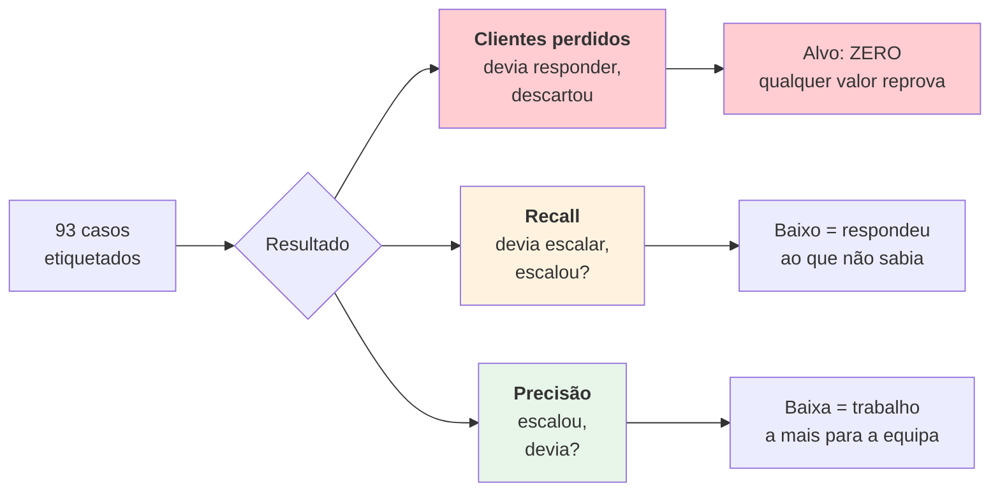

# Problema e solução

> **Pergunta que este documento responde:** que problema resolve, e porque foi desenhado desta
> forma e não de outra?

## O problema

Uma PME de comércio eletrónico com **um operador único** a responder aos emails de apoio. Três
características tornam esse trabalho caro:

### 1. Repetitivo na forma, variável no conteúdo

A maioria das perguntas cai num punhado de temas — estado da encomenda, devolução, defeito — mas
cada uma exige ir buscar dados diferentes: qual é a encomenda, em que estado está, o que já foi
prometido nesta conversa.

### 2. Exige memória de políticas que mudam

> "Capas personalizadas não se devolvem por arrependimento, mas devolvem-se por defeito."
> "Fones usados só têm direito a troca, nunca a reembolso — é contacto com a pele."

São regras reais desta loja ([[knowledge-base|base de conhecimento]]). O operador tem de as ter
na cabeça, e elas mudam.

### 3. O custo do erro é assimétrico

Esta é a característica que molda todo o desenho:

| Erro | Custo |
|---|---|
| Responder mal sobre uma política | Cria uma obrigação ou uma disputa |
| Escalar algo que sabia responder | Trabalho a mais, chato mas seguro |
| **Ignorar um email de cliente** | **Perde uma venda e não deixa rasto nenhum** |

## A solução

Não é um chatbot. É um **assistente de redação com poder de decisão limitado**: decide o que
sabe e o que não sabe, escreve só o primeiro, e prepara o segundo para uma pessoa.

O produto não é "a IA responde aos emails". É **o rascunho já estar escrito quando o operador
abre o Outlook**, e o caso difícil já vir preparado quando ele chega a ele.

### A assimetria está escrita no prompt

**Implemented** — `assistente.py:799` (dentro de `PROMPT`):

```text
Na dúvida genuína entre "rascunhar" e "escalar", escala. Na dúvida entre
"escalar" e "saltar", escala — um email de cliente descartado não deixa rasto
nenhum e custa uma venda.
```

As duas fronteiras inclinam para o mesmo lado. Isto não é conservadorismo genérico: é a
tradução direta da tabela de custos acima.

### E está medida nas métricas

O [[evaluation|banco de ensaio]] não tem uma métrica de "acerto". Tem três, e **não valem o
mesmo** (`eval.py:11-23`):



> [!TIP] Porque é que esta separação importa
> Na comparação Sonnet vs. Haiku de 26/08/2026, o modelo mais pequeno teve **o mesmo recall**
> (91%) mas precisão bastante pior (77% vs 91%). Uma métrica agregada teria dito apenas "8
> pontos pior". A estrutura assimétrica revelou o que realmente mudava: o Haiku **não piorava as
> respostas ao cliente, piorava a poupança de trabalho à equipa**. São decisões de negócio
> diferentes.

## Objetivos e como se medem

| Objetivo | Métrica | Onde |
|---|---|---|
| Nenhum email de cliente perdido | "clientes perdidos" = 0 | `eval.py:203` |
| Reduzir trabalho manual | % rascunhado vs. escalado | [[operations\|metricas.py]] |
| Nunca inventar uma política | Casos dedicados no banco de ensaio | [[evaluation\|eval]] |
| Nunca expor dados do cliente errado | Confiança de identidade em código | [[identity-resolution\|Resolução de identidade]] |
| Saber quando deixou de servir | Rascunho vs. resposta real enviada | [[qa\|medir_deriva.py]] |

## Porque não outras soluções

| Alternativa | Porque não |
|---|---|
| **Resposta automática** (envia sozinho) | O custo do erro sobre políticas é alto e irreversível. Sem revisão humana, uma alucinação chega ao cliente |
| **Chatbot no site** | Não resolve o canal onde o trabalho está (email), nem tem contexto do fio |
| **Macros / respostas-tipo** | Não resolvem o problema real: ir buscar os dados certos e decidir que política se aplica |
| **RAG sobre a base** | A base cabe inteira na janela de contexto. RAG adicionaria um modo de falha silencioso (o chunk certo não ser recuperado) sem ganho. Ver [[knowledge-base\|Base de conhecimento]] |
| **Fine-tuning** | O mecanismo de melhoria tem de ser legível por um humano. Um facto novo escreve-se em Markdown, não se treina |

## O ciclo de melhoria é humano por construção

**Implemented** — `lacunas.py:12-13`:

```text
Nunca transformar a resposta do modelo em facto: o modelo escalou precisamente
por não saber. O que ele produz aqui é a pergunta, não a resposta.
```

O sistema não aprende sozinho. Quando não sabe, produz uma **pergunta acionável** (tema + o que
falta em concreto), que alguém leva ao lojista, e a resposta é escrita à mão na base de
conhecimento. Ver [[knowledge-base|Base de conhecimento]].

## Related

- [[project-overview|Visão geral do projeto]]
- [[capabilities|Capacidades]] — o que daqui resultou, em concreto
- [[escalation|Escalação]] — como a assimetria se materializa
- [[evaluation|Banco de ensaio]] — como os objetivos são medidos
- [[technical-decisions|Decisões técnicas]] — as escolhas de engenharia
