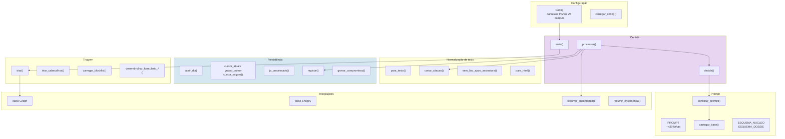

# Componentes

> **Pergunta que este documento responde:** que peças existem, o que faz cada uma, e de que
> depende?

Todos os componentes do caminho de produção vivem em `assistente.py`. As referências de linha
são do commit auditado — o **nome da função é a âncora fiável**, os números derivam.

## Mapa por camada

## Configuração

| Componente | Responsabilidade | Notas |
|---|---|---|
| `Config` | 26 campos, `dataclass(frozen=True)` | Imutável depois de carregada |
| `carregar_config()` | Lê `.env`, valida obrigatórios, aplica omissões | Sai com erro se faltar um segredo |

Sete campos controlam funcionalidades e podem ser desligados sem *deploy*: 5 `ENABLE_*`
(`resolver_identidade`, `pre_dossies`, `registo_compromissos`, `respostas_parciais`,
`processar_imagens`) mais `DRY_RUN` e `DRAFT_PREFIX`.

## Normalização de texto

| Componente | Responsabilidade | Porquê existe |
|---|---|---|
| `_Texto(HTMLParser)` | HTML → texto simples | O corpo do Outlook chega em HTML |
| `para_texto()` | Achata, normaliza espaços e quebras | Com *fallback* por regex se o parser falhar |
| `cortar_citacao()` | Deita fora a conversa citada | *"A maior poupança de tokens da passagem toda"* |
| `sem_lixo_apos_assinatura()` | Corta texto colado à assinatura | Rede de segurança para um *glitch* raro de geração |
| `para_html()` | Texto → HTML escapado | O modelo devolve texto; o HTML constrói-se aqui |

> [!NOTE] `cortar_citacao()` e a decisão de deixar lixo
> Um dos 6 padrões não consegue distinguir `"Lara Gonçalves escreveu"` de
> `"Por mim tudo bem tripat3s escreveu"`. O comentário no código resolve o dilema:
> *"comer palavras da mensagem do cliente é pior do que deixar duas palavras de lixo"*.

## Triagem

| Componente | Responsabilidade |
|---|---|
| `triar()` | 7 regras sobre metadados: categoria, remetente, domínio, destinatários |
| `triar_cabecalhos()` | 4 regras sobre cabeçalhos e corpo, após ir buscar o detalhe |
| `carregar_blocklist()` | 13 domínios base + `blocklist.txt` do cliente |
| `eh_formulario_contacto()` / `eh_formulario_devolucao()` | Deteta os dois falsos positivos conhecidos |
| `desembrulhar_formulario_contacto()` / `_devolucao()` | Recupera o cliente real de dentro do reencaminhamento |

Ver [[decision-making|Tomada de decisão]] e [[web-forms|Formulários do site]].

## Prompt e esquemas

| Componente | Responsabilidade |
|---|---|
| `PROMPT` | ~430 linhas de instruções + placeholder da base |
| `carregar_base()` | Junta `knowledge/*.md` em blocos `<documento nome="…">` |
| `construir_prompt()` | Interpola empresa, assinatura e base |
| `ESQUEMA_NUCLEO` | 11 propriedades, 4 obrigatórias — chamada 1 |
| `ESQUEMA_DOSSIE` | 6 propriedades, 0 obrigatórias — chamada 2, só ao escalar |
| `CATEGORIAS` | 9 categorias fixas de escalação |
| `TIPOS_COMPROMISSO` / `ESTADOS_COMPROMISSO` | Vocabulário do registo de compromissos |

Ver [[prompts|Prompts]] e [[knowledge-base|Base de conhecimento]].

## Persistência

| Componente | Responsabilidade |
|---|---|
| `abrir_db()` | Cria as 3 tabelas; migrações aditivas por `ALTER TABLE` |
| `cursor_atual()` / `gravar_cursor()` | Marca temporal da caixa |
| `cursor_seguro()` | Até onde o cursor pode avançar sem saltar uma mensagem falhada |
| `ja_processado()` | Deduplicação por `internetMessageId` |
| `registar()` | Grava a decisão (19 colunas) e avança o cursor |
| `compromissos_do_fio()` / `gravar_compromisso()` | Estado atual de promessas por conversa |
| `resumir_compromissos()` | Formata os compromissos para o prompt |

Ver [[data-flow|Fluxo de dados]].

## Integrações

### `class Graph`

| Método | Endpoint | Uso |
|---|---|---|
| `novas()` | `GET /mailFolders/inbox/messages` | Lote de 25, filtro por cursor |
| `detalhe()` | `GET /messages/{id}` | Cabeçalhos + corpo |
| `historico()` | `GET /messages` (por `conversationId`) | Fio, só `bodyPreview` |
| `anexos()` | `GET /messages/{id}/attachments` | Metadados, sem conteúdo |
| `conteudo_anexo()` | `GET …/$value` | Bytes, só após aprovação |
| `criar_rascunho()` | `POST …/createReply` | Rascunho encadeado |
| `marcar()` | `PATCH /messages/{id}` | Acrescenta categoria |
| `_converter()` | — | Normaliza a forma do Graph para a forma interna |

### `class Shopify`

| Método | Uso |
|---|---|
| `_obter_token()` | Client credentials; cache por instância |
| `_procurar()` | `GET /orders.json` com `fields` restritos |
| `por_numero()` / `por_email()` | As duas formas de procura |
| `encomenda()` | Modo de compatibilidade (número + email exato) |
| `data_entrega()` | `fulfillment_events` — a data real, não a da etiqueta |

### Identidade e resumo

| Componente | Responsabilidade |
|---|---|
| `Correspondencia` | O resultado da procura, com nível de confiança e `pode_revelar` |
| `resolver_encomenda()` | O algoritmo de 4 níveis |
| `_sinais_de_identidade()` | Indícios além do email: nome completo, telefone, código postal |
| `emails_iguais()` / `e_da_loja()` | Comparações normalizadas |
| `resumir_encomenda()` | Só os factos seguros, para o prompt |
| `link_admin()` | Link para o admin da Shopify — só no registo, nunca no rascunho |

Ver [[email|Email]], [[shopify|Shopify]], [[identity-resolution|Resolução de identidade]].

## Anexos

| Componente | Responsabilidade |
|---|---|
| `selecionar_anexos_de_imagem()` | Filtra: só `fileAttachment`, não-inline, 4 formatos, ≤5 MB, ≤4 |
| `nota_anexos_ignorados()` | Texto ao modelo sobre o que não foi visto; vídeo tem nota própria |

## Decisão e orquestração

| Componente | Responsabilidade | Complexidade |
|---|---|---|
| `decidir()` | Monta o pedido, faz 1-2 chamadas, valida a saída | ~145 linhas |
| `processar()` | O caminho completo de um email | ~280 linhas, **10 pontos de retorno** |
| `main()` | Cursor, lote, ciclo, recuo do cursor | ~60 linhas |

> [!WARNING] Concentração de risco
> `processar()` é a função com mais ramos do sistema e **não tem testes unitários**. É o
> Finding H-2 em [[technical-debt|Dívida técnica]].

### Os 10 resultados de `processar()`

| Resultado | Quando |
|---|---|
| `repetido` | Já está no registo |
| `saltado` | Triagem (5 caminhos distintos) ou decisão do modelo |
| `falhado` | A chamada ao modelo levantou |
| `rascunhado` | Rascunho completo criado |
| `rascunhado-parcial` | Rascunho criado, mas com `por_responder` preenchido |
| `escalado` | Marcado para humano, com ou sem dossiê |

## Related

- [[system-architecture|Arquitetura do sistema]] — a visão de conjunto
- [[end-to-end-flow|Fluxo ponta a ponta]] — estes componentes em sequência
- [[operations|Ferramentas de operação]] — os satélites fora do caminho crítico
- [[data-flow|Fluxo de dados]] — o modelo de dados
