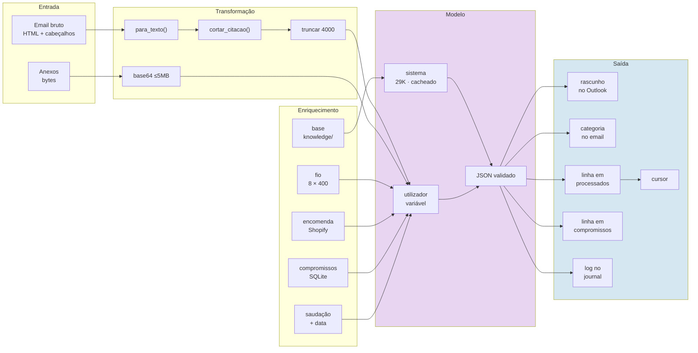
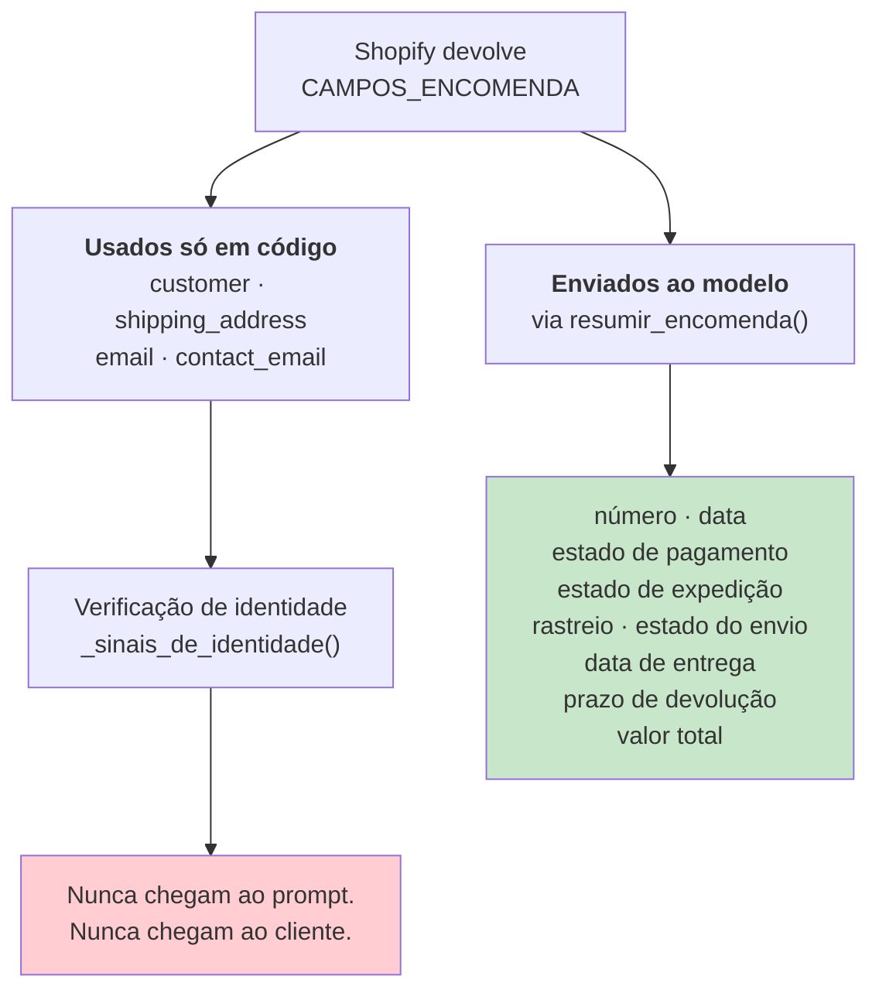
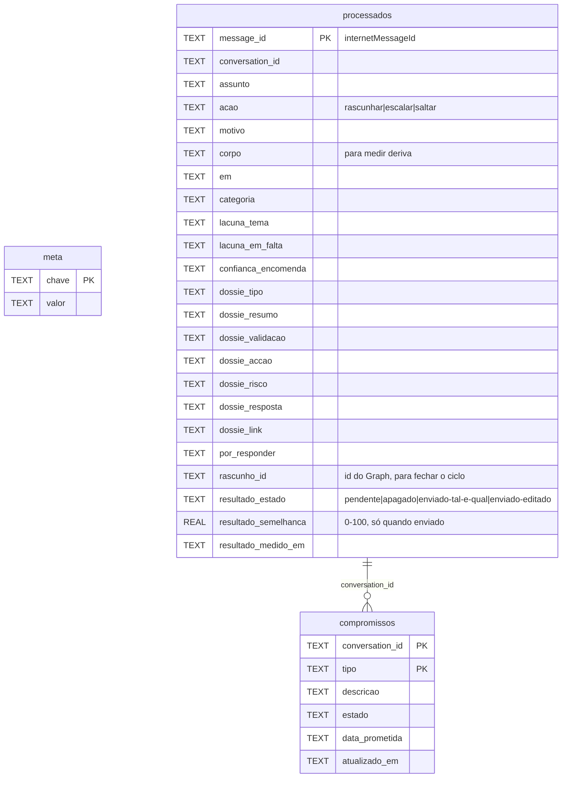
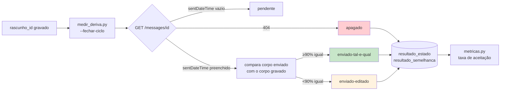
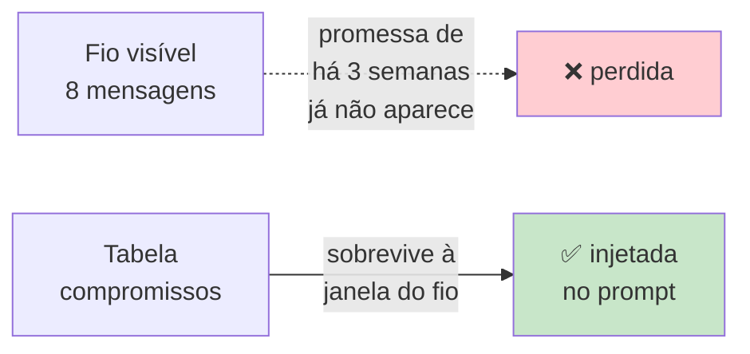

# Fluxo de dados

> **Pergunta que este documento responde:** que dados existem, de onde vêm, como se transformam,
> e o que fica gravado?

## O pipeline



## Orçamento de contexto

O que ocupa espaço no pedido, e porquê está onde está.

| Bloco | Tamanho | Cacheado? | Porquê |
|---|---|---|---|
| Instruções do prompt | ~430 linhas | ✅ | Nunca muda |
| Base de conhecimento | ~29K tokens | ✅ | Muda raramente, e só por commit |
| Saudação + data atual | 2 linhas | ❌ | **Muda ao longo do dia** |
| Compromissos registados | Variável | ❌ | Por conversa |
| Fio da conversa | ≤8 × 400 chars | ❌ | Por conversa |
| Email novo | ≤4000 chars | ❌ | Por email |
| Dados da encomenda | ~10 linhas | ❌ | Por email |
| Imagens | ≤4 × 5 MB | ❌ | Por email |

> [!IMPORTANT] Porque é que a saudação não está no prompt de sistema
> **Implemented** — `decidir()`: a saudação muda de "Bom dia" para "Boa tarde" às 13h. Se
> estivesse no bloco de sistema, **invalidava o cache da base de conhecimento inteira** a cada
> mudança. Fica na mensagem do utilizador, que não é cacheada.

## Dados que entram no modelo — e os que não entram

Esta é a distinção mais importante do fluxo de dados.



**Implemented** — `Shopify.CAMPOS_ENCOMENDA` traz `customer` e `shipping_address` precisamente
para a verificação de identidade, e `resumir_encomenda()` **não os inclui** na saída. Nem morada
completa, nem telefone, nem email do comprador, nem dados de pagamento.

Ver [[identity-resolution|Resolução de identidade]] e [[security|Segurança]].

## Modelo de dados — SQLite

Três tabelas. O ficheiro é local (`assistente.db`) e está no `.gitignore`.



### `meta` — o cursor

Uma linha, chave `cursor`. Marca temporal da mensagem mais recente processada com segurança.

### `processados` — uma linha por email

23 colunas. As 7 primeiras são originais; as restantes foram acrescentadas ao longo do tempo por
`ALTER TABLE` — as quatro últimas (`rascunho_id`, `resultado_*`) a 27/08/2026, para fechar o
ciclo do draft (ver abaixo).

> [!TIP] Migrações aditivas e `INSERT` nomeado
> **Implemented** — `abrir_db()` acrescenta cada coluna em falta com `ALTER TABLE`, em vez de
> recriar a base. A razão está no comentário do código: *o cursor vive na mesma base, e apagá-la
> faria o assistente reprocessar tudo desde o início*.
>
> E `registar()` usa colunas **nomeadas**, nunca posicionais — *"a tabela ganha colunas com o
> tempo, e um INSERT posicional passa a gravar valores na coluna errada sem dar erro"*.

O campo `corpo` guarda o texto do rascunho. Existe para uma coisa só: comparar mais tarde com o
que o lojista realmente enviou. Ver [[qa|QA e testes]].

### Fecho de ciclo do draft — `rascunho_id` e `resultado_*`

**Implemented** a 27/08/2026. `criar_rascunho()` sempre devolveu o id do Graph do rascunho
criado; até aqui, `processar()` descartava-o assim que o log era escrito. Passou a gravar-se em
`rascunho_id` — o mesmo id que o Graph mantém depois de alguém enviar o rascunho (só
`sentDateTime` passa a vir preenchido), o que permite verificar mais tarde, **pelo próprio id**,
sem ambiguidade, o que aconteceu:



Mais preciso do que a heurística anterior (procurar "a próxima resposta da loja na conversa",
que ainda existe em `medir_deriva.py` para casos anteriores a esta data, sem `rascunho_id`): não
depende de a conversa ter só uma troca, e distingue "apagado sem enviar" de "ainda por rever" —
coisas que a heurística por conversa não conseguia separar.

Não chama o Claude — só lê o Graph. `metricas.py` lê `resultado_estado` já gravado, sem repetir
estas chamadas. Ver [[qa|QA e testes]] e [[operations|Ferramentas de operação]].

### `compromissos` — estado, não histórico

Chave composta `(conversation_id, tipo)`. Um `ON CONFLICT DO UPDATE` substitui sempre o registo
anterior do mesmo tipo.

**Implemented** — `gravar_compromisso()`:

> Não é um histórico de tudo o que já foi prometido, é o estado atual: se a loja prometeu um
> reembolso e depois disse que já foi feito, o que importa ao próximo email é "concluído", não
> as duas mensagens.

Só compromissos com estado `pendente` são injetados no prompt seguinte.



## Onde ficam os dados

| Dado | Onde | Retenção | No git? |
|---|---|---|---|
| Cursor, decisões, compromissos | `assistente.db` (local) | Indefinida (classificação) | Não |
| Corpo dos rascunhos e dossiês | `processados` | **90 dias**, depois purgado | Não |
| Logs de passagem | journal do systemd | Política do systemd | Não |
| Base de conhecimento | `knowledge/*.md` | Versionada | **Sim** |
| Casos de teste | `eval/casos.json` | Versionada | **Sim** |
| Emails reais anonimizados | `eval/real-*.json` | Local | Não (`.gitignore`) |
| Corpos de email | Enviados à API da Anthropic | Política da Anthropic | Não |

**Implemented** desde 27/08/2026 — `manutencao.py` trata das duas responsabilidades:

| | |
|---|---|
| **Cópia de segurança** | API de backup do SQLite (não um `cp`: a base pode estar a ser escrita), rotação das últimas 14, em `backups/` |
| **Purga** | Esvazia o texto livre com mais de 90 dias; mantém a classificação, que é o que as métricas leem |

> [!IMPORTANT] A purga não apaga linhas
> A chave `message_id` é o que impede o assistente de responder duas vezes ao mesmo email.
> Apagar a linha devolveria a mensagem ao estado de "nunca vista".

Ver [[operations|Ferramentas de operação]].

## Fluxo de saída — o HTML

O modelo devolve **texto simples**. O HTML é construído em código:

```python
# para_html() — assistente.py
paragrafos = [p.strip() for p in re.split(r"\n\s*\n", texto.strip()) if p.strip()]
return "".join(
    "<p>" + html.escape(p, quote=False).replace("\n", "<br>") + "</p>"
    for p in paragrafos
)
```

> [!NOTE] Porquê construir e não sanitizar
> O corpo da resposta deriva de um email não confiável. O comentário no código:
> *"escapar texto é uma linha, enquanto sanitizar HTML de terceiros são cinquenta e nunca fica
> fechado"*.

## Related

- [[end-to-end-flow|Fluxo ponta a ponta]] — a sequência que move estes dados
- [[identity-resolution|Resolução de identidade]] — porque é que alguns dados nunca passam
- [[ai-architecture|Arquitetura de IA]] — o orçamento de contexto em detalhe
- [[security|Segurança]] — dados pessoais e RGPD
- [[technical-debt|Dívida técnica]] — retenção e backup
