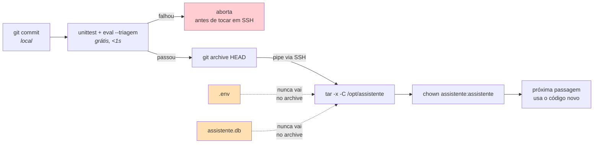

# Deployment e operação

> **Pergunta que este documento responde:** onde é que isto corre, como é agendado, e como se
> atualiza?

## Ambientes

| Ambiente | Onde | Agendamento | Uso |
|---|---|---|---|
| **Produção** | Debian, `/opt/assistente` | systemd timer, 2 min | A caixa real da loja |
| **Testes (Windows)** | Máquina de trabalho | Agendador de Tarefas, 2 min | Fase de testes |
| **Desenvolvimento** | Local, `.venv` | Manual | Testes e eval |

## Produção — systemd

Duas units em `deploy/`, instaladas em `/etc/systemd/system/`.

### O serviço

```ini
[Service]
Type=oneshot                     # uma passagem e sai; quem agenda é o timer
User=assistente                  # utilizador dedicado, sem shell
WorkingDirectory=/opt/assistente # o DB_FILE é relativo
ExecStart=/opt/assistente/.venv/bin/python /opt/assistente/assistente.py
TimeoutStartSec=600              # uma passagem demora segundos; 10 min = encravou
```

### O timer

```ini
[Timer]
OnBootSec=2min
OnUnitActiveSec=2min      # conta do FIM da passagem anterior
RandomizedDelaySec=30s
```

> [!IMPORTANT] `OnUnitActiveSec`, não `OnCalendar`
> A escolha impede que **duas passagens se sobreponham** se uma demorar mais do que o intervalo.
> Com `OnCalendar`, uma passagem lenta seria apanhada pela seguinte, e as duas competiriam pelo
> mesmo lote de mensagens.

### Endurecimento

```ini
NoNewPrivileges=true        PrivateTmp=true
ProtectSystem=strict        ProtectHome=true
ProtectKernelTunables=true  ProtectControlGroups=true
RestrictSUIDSGID=true       ReadWritePaths=/opt/assistente
```

Oito diretivas de restrição. A única coisa que o processo precisa de escrever é o SQLite.
Ver [[security|Segurança]].

## O processo de deploy

**Implemented** — `deploy/enviar.sh`, sem CI/CD hospedado mas com gate de qualidade local.



```bash
deploy/enviar.sh
```

Corre `python -m unittest test_assistente -q` e `python eval.py --triagem` — ambos grátis,
juntos com menos de 2 segundos — e só chega ao `git archive HEAD | ssh ...` se os dois passarem.
Corrigido 27/08/2026 (Finding M-5); antes disso o deploy era o `git archive` direto, sem nenhuma
verificação.

**Importante:** `git archive HEAD` exporta o que está **commitado**, não o *working tree* — um
`enviar.sh` corrido antes do `git commit` envia código antigo para o servidor sem avisar. O
`.env` e o `assistente.db` estão no `.gitignore`, logo nunca são sobrescritos pelo archive.

Não é preciso reiniciar nada: o serviço é `oneshot` e lê tudo do disco em cada passagem — a
base de conhecimento incluída. Se as dependências mudarem, é preciso correr `pip install` no
venv do servidor.

### Um deploy que mexe no prompt custa dinheiro

O passo 3/4 compara uma impressão digital do `PROMPT` e da `knowledge/` entre o local e o
servidor, e diz qual dos dois casos é este:

| | Custo | Porquê |
|---|---|---|
| Prompt inalterado (docs, testes, satélites) | **grátis** | O prefixo em cache não muda |
| Prompt alterado (`PROMPT` ou `knowledge/*.md`) | **~0,21 $** | Reescreve as ~36K tokens do prefixo. Valor de 04/09/2026, ao preço de $3,00/M que entrou a 01/09 — o `deploy/enviar.sh` avisa e diz o mesmo número |

> [!TIP] Agrupa as alterações à base de conhecimento num só deploy
> O custo é por *deploy*, não por alteração: três regras novas publicadas juntas pagam uma vez;
> publicadas à medida que ficam prontas pagam três. A 31/08/2026, seis deploys espalhados pelo
> dia custaram **0,77 $ — um quarto da fatura desse dia**.
>
> Isto não é um *gate*: uma correção urgente para o lojista publica-se na hora e o custo é
> irrelevante ao lado de um cliente mal respondido. É só para não fatiar trabalho não urgente
> em seis publicações quando uma chegava. Ver [[cost-optimization|Auditoria de custo]].

## Instalação de raiz

1. Utilizador `assistente` e pacotes de sistema
2. `git archive` para `/opt/assistente`
3. `python3 -m venv .venv` + `pip install -r requirements.txt`
4. `.env` com os segredos, `chmod 600`, dono `assistente`
5. **`python verificar.py --outra-caixa <endereço real>`** ← o passo crítico
6. Instalar e ativar as units systemd

> [!IMPORTANT] O passo 5 não é opcional
> `verificar.py` testa **ativamente** que a aplicação não consegue ler outra caixa do
> inquilino. `Mail.ReadWrite` como permissão de aplicação dá acesso a **todas** as caixas; o que
> a limita a uma é uma política do Exchange aplicada fora deste repositório.
> Ver [[security|Segurança]] e [[email|Email]].

## Windows — a alternativa de testes

Dois scripts em `deploy/`:

| Ficheiro | Faz |
|---|---|
| `agendar-windows.ps1` | Regista a tarefa no Agendador (correr como Administrador) |
| `correr.ps1` | O que a tarefa executa: corre a passagem e escreve o log |

Duas notas de implementação, ambas com razão explicada no código:

- **A tarefa executa `correr.ps1`, não o Python diretamente.** O `pythonw.exe` descarta o stdout
  (perdia-se o log) e o `python.exe` faz piscar uma janela de consola de 2 em 2 minutos, *"o que
  é insuportável numa máquina de trabalho"*.
- **O gatilho é `-Once` com `-RepetitionInterval`.** O Agendador não tem gatilho "de N em N
  minutos".

## Observar

```bash
# Acompanhar em tempo real
journalctl -u tripat3s-assistente -f

# Estado do timer e próxima execução
systemctl list-timers tripat3s-assistente.timer

# Correr uma passagem à mão
cd /opt/assistente && sudo -u assistente .venv/bin/python assistente.py
```

### Eventos no log

| Evento | Significa |
|---|---|
| `passagem` | Fim de passagem, com contagem por resultado |
| `rascunho` / `rascunho-sugerido` | Rascunho criado |
| `escalado` | Marcado para humano, com categoria e motivo |
| `lacuna` | Lacuna de conhecimento registada |
| `cursor-inicial` | Primeira execução de sempre |
| `cursor-recuado` | Uma mensagem falhou; o cursor recuou para a voltar a ver |
| `erro-*` | Falha isolada e absorvida (shopify, historico, anexos, modelo) |

> [!NOTE] Alertas via `OnFailure=`
> `tripat3s-assistente.service` dispara `tripat3s-assistente-alerta.service` sempre que falha —
> escreve o contexto no journal e, se `ALERTA_WEBHOOK_URL` estiver no `.env`, envia também um
> POST para fora da máquina. Corrigido 27/08/2026 (Finding M-6).
>
> Exige o utilizador `assistente` no grupo `systemd-journal` (`usermod -aG systemd-journal
> assistente`) — sem isso, `journalctl` recusa-se a ler mesmo os próprios logs da unidade.

## Reverter

Duas formas, por ordem de agressividade:

1. **Desligar uma funcionalidade** — mudar um `ENABLE_*` para `false` no `.env`. Sem deploy,
   efeito na passagem seguinte.
2. **Voltar ao modo seco** — `DRY_RUN=true`. Decide e regista, não escreve nada na caixa.
3. **Parar tudo** — `systemctl stop tripat3s-assistente.timer`. Mais nada quebra.

## Related

- [[system-architecture|Arquitetura do sistema]]
- [[security|Segurança]] — o passo de verificação obrigatório
- [[operations|Ferramentas de operação]] — o que correr depois de instalado
- [[error-handling|Tratamento de erros]] — o que os eventos `erro-*` significam
- [[technical-debt|Dívida técnica]] — o que ainda falta (P0-2, M-3)
