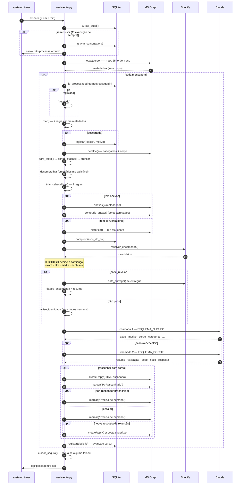
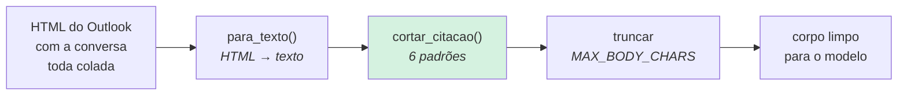
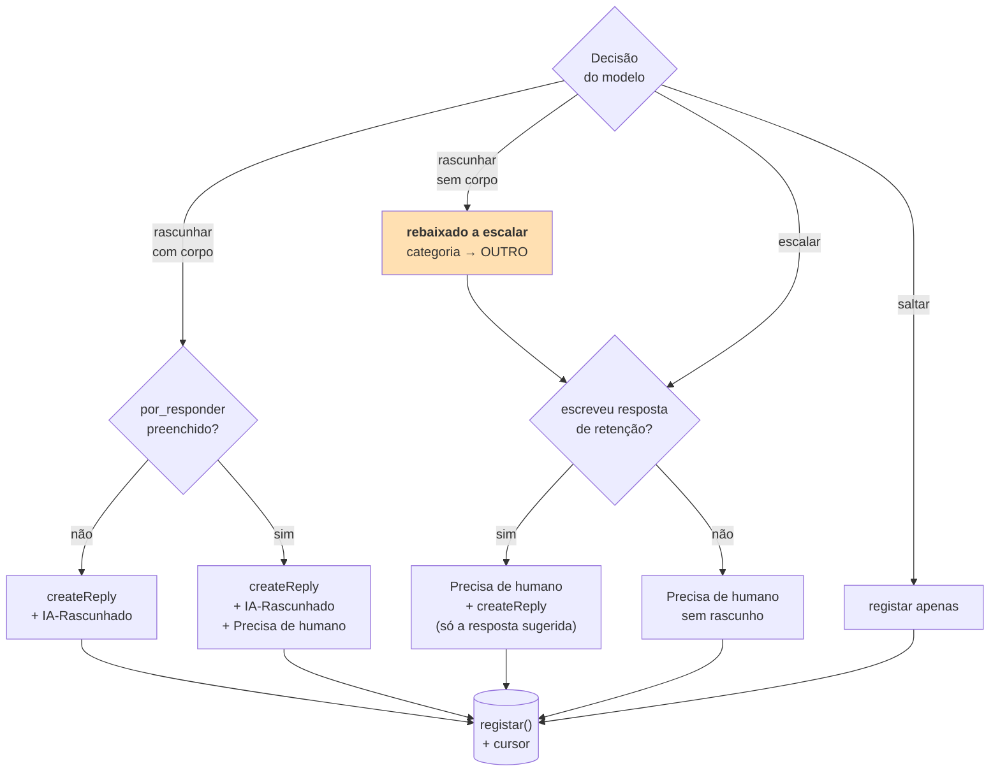

# Fluxo ponta a ponta

> **Pergunta que este documento responde:** o que acontece, exatamente, desde que um email chega
> à caixa até haver um rascunho no Outlook?

## A sequência completa



## Etapa a etapa

### 1. Arranque e cursor

**Implemented** — `main()`.

Duas defesas independentes contra reprocessamento:

| Defesa | Mecanismo | Resolve |
|---|---|---|
| Cursor temporal | `meta.cursor`, filtro `receivedDateTime gt` | Não voltar a pedir o que já passou |
| Deduplicação | `processados.message_id` (PK) | O mesmo email visto duas vezes |

> [!IMPORTANT] Arranque a frio
> Na primeiríssima execução o cursor é gravado como "agora" e a passagem **termina sem
> processar nada** — nem se chega a falar com o Graph. Responder a um ano de arquivo seria caro
> e errado.

A chave de deduplicação é o `internetMessageId`, **não** o `id` do Graph: o `id` tem âmbito de
pasta e é reatribuído quando alguém arruma o email.

### 2. Triagem — o filtro grátis

**Implemented** — `triar()` e `triar_cabecalhos()`.

Descarta o que nunca é um cliente, **antes** de qualquer chamada paga. As regras completas
estão em [[decision-making|Tomada de decisão]].

Duas exceções cirúrgicas, ambas nascidas de bugs reais: os formulários do site chegam
disfarçados de notificação automática. Ver [[web-forms|Formulários do site]].

### 3. Normalização do corpo



`cortar_citacao()` é a maior poupança de tokens da passagem: a citação costuma ser mais longa
que a mensagem nova, e a pergunta do cliente está sempre no topo.

### 4. Enriquecimento de contexto

Quatro fontes, todas opcionais — se alguma falhar, a decisão degrada mas não se perde o email.

| Fonte | O que traz | Se falhar |
|---|---|---|
| `Graph.anexos` | Fotografias como prova | Decide sem imagens |
| `Graph.historico` | 8 mensagens do fio, marcadas LOJA/CLIENTE | Escala por falta de contexto |
| `compromissos_do_fio` | Promessas em aberto, fora da janela do fio | Segue sem elas |
| `resolver_encomenda` | Dados da encomenda **se a identidade se provar** | Escala por falta de dados |

Ver [[error-handling|Tratamento de erros]].

### 5. Decisão

Uma chamada sempre; uma segunda **só se escalar**. Ver [[ai-architecture|Arquitetura de IA]].

### 6. Aplicação



> [!NOTE] O rascunho de um caso escalado não leva nota nenhuma à volta
> Quando há resposta, o rascunho contém **apenas** o texto para o cliente — sem resumo,
> sem validação, sem link do admin. O cliente pediu explicitamente para tirar a nota interna.
> A triagem faz-se pelas etiquetas na lista de mensagens, não por texto dentro do rascunho.

### 7. Fecho da passagem

**Implemented** — `cursor_seguro()` + `main()`.

`registar()` avança o cursor mensagem a mensagem. Se alguma falhou a meio do lote, o cursor
pode ter passado à frente dela — e a passagem seguinte, que só pede o que veio **depois** do
cursor, nunca mais a veria.

Reprocessar as que correram bem não custa nada: `ja_processado()` apanha-as pelo Message-ID
antes de qualquer chamada ao modelo.

Corrigido a 27/08/2026 — era o Finding C-1. O diagrama antes/depois e a implementação estão em
[[error-handling|Tratamento de erros]], que é o documento que trata desta garantia em detalhe.

## O que o operador vê

No fim, no Outlook:

| Categoria | Significa | O que fazer |
|---|---|---|
| `IA-Rascunhado` | Há um rascunho completo à espera | Rever e enviar |
| `IA-Rascunhado` + `Precisa de humano` | Rascunho **parcial** — parte ficou por responder | Completar antes de enviar |
| `Precisa de humano` **com** rascunho | Caso escalado, mas com resposta sugerida pronta | Decidir, depois enviar |
| `Precisa de humano` **sem** rascunho | Escalado sem nada a sugerir | Investigar de raiz |

Cada rascunho leva no topo a linha de aviso configurada em `DRAFT_PREFIX`:

```
--- rascunho automático · rever e apagar esta linha ---
```

> [!TIP] Porque é que o aviso é útil mesmo sendo feio
> Se esta linha chegar a um cliente, ficamos a saber **no próprio dia** que ninguém está a
> rever. É um canário, não um enfeite. Esvaziar a variável desliga-o quando a revisão estiver
> estabelecida.

## Related

- [[system-architecture|Arquitetura do sistema]] — a visão de conjunto
- [[decision-making|Tomada de decisão]] — a lógica das etapas 2 e 5
- [[data-flow|Fluxo de dados]] — o que acontece aos dados em cada etapa
- [[escalation|Escalação]] — o caminho da direita no diagrama de aplicação
- [[error-handling|Tratamento de erros]] — o que acontece quando cada etapa falha
