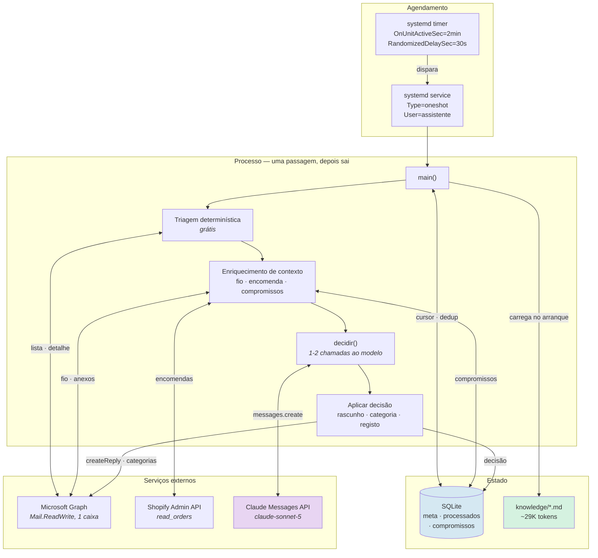
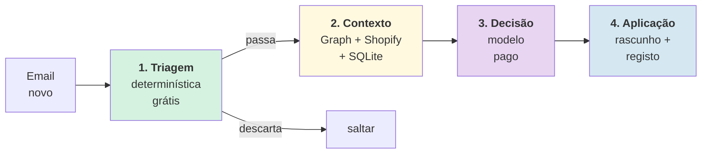
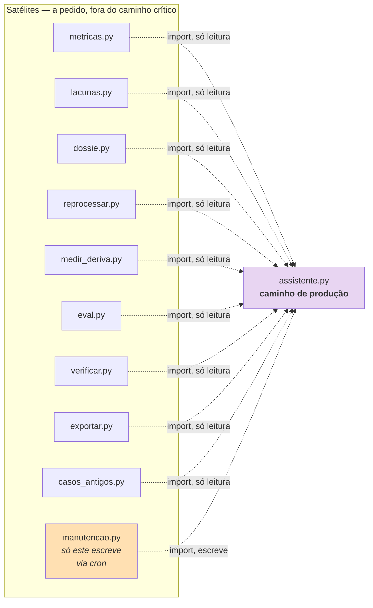
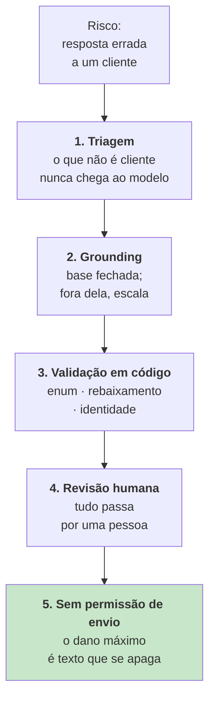

# Arquitetura do sistema

> **Pergunta que este documento responde:** como está construído o sistema, que peças o compõem
> e como comunicam entre si?

## Visão de conjunto

## As quatro camadas

O sistema organiza-se por **custo crescente**: cada camada só corre se a anterior deixar passar.

| Camada | Custo | Responsabilidade | Documento |
|---|---|---|---|
| 1 — Triagem | Zero | Descartar o que nunca é um cliente | [[decision-making\|Tomada de decisão]] |
| 2 — Contexto | Chamadas HTTP | Reunir tudo o que o modelo precisa de saber | [[data-flow\|Fluxo de dados]] |
| 3 — Decisão | Tokens | Julgamento: que política, que texto, que ação | [[ai-architecture\|Arquitetura de IA]] |
| 4 — Aplicação | Chamadas HTTP | Materializar a decisão na caixa e no registo | [[end-to-end-flow\|Fluxo ponta a ponta]] |

## Princípios estruturantes

### 1. Sem estado em memória entre passagens

**Implemented** — `assistente.py:11-14`:

> Não há ciclo interno nem processo permanente: um arranque limpo de dois em dois minutos é mais
> robusto do que um processo que tem de sobreviver a semanas, e o estado vive no SQLite.

Consequência prática: reiniciar é a operação normal, não a recuperação. Não há fugas de memória
nem reconexões a gerir. Um *crash* custa 2 minutos.

### 2. Monólito no caminho de produção, satélites à volta

`assistente.py` (2565 linhas) contém **todo** o caminho crítico. As 10 ferramentas de operação
importam-no como módulo; nenhuma corre no caminho de produção (o timer só chama `assistente.py`).
Nove só leem; o `manutencao.py` escreve, mas só no registo local, e só via cron, à parte da
passagem de 2 minutos.

Ver [[components|Componentes]] e [[operations|Ferramentas de operação]].

### 3. A fronteira código/modelo é explícita

O que é verificável fica em código; o que é julgamento vai ao modelo. Esta é a decisão
arquitetural mais importante do sistema e tem documento próprio:
[[decision-making|Tomada de decisão]].

### 4. Degradação por camadas

Cada fonte de contexto é opcional. Se falhar, a decisão **degrada** (o modelo escala por falta
de dados) mas nunca se perde um email. Ver [[error-handling|Tratamento de erros]].

## Comunicação e dependências

| De | Para | Protocolo | Autenticação | Falha isolada? |
|---|---|---|---|---|
| `main` | Microsoft Graph | HTTPS REST | MSAL, client credentials | Não — aborta a passagem |
| `processar` | Microsoft Graph | HTTPS REST | idem | Sim (anexos, fio) |
| `processar` | Shopify Admin | HTTPS REST | OAuth client credentials | Sim |
| `decidir` | Anthropic | HTTPS (SDK) | Chave de API | Sim (1ª chamada) / Sim (2ª) |
| tudo | SQLite | Ficheiro local | — | Não |

> [!NOTE] Porque é que a listagem inicial não é isolável
> `graph.novas()` é a única chamada sem a qual não há passagem nenhuma — se falhar,
> `main()` regista `erro-graph` e sai com código 1 (`assistente.py:2365`). O timer volta a
> tentar em 2 minutos.

## Decisões arquiteturais

Resumo. O detalhe, com trade-offs e alternativas rejeitadas, está em
[[technical-decisions|Decisões técnicas]].

| # | Decisão | Motivo curto |
|---|---|---|
| D1 | Passagem única, sem processo permanente | Robustez sem equipa de plantão |
| D2 | Monólito de 2565 linhas | Um mantenedor; navegabilidade |
| D3 | Base de conhecimento inteira no prompt, sem RAG | Elimina falhas de *retrieval* |
| D4 | Duas chamadas ao modelo, não uma | Esquema de 19 propriedades causava timeout |
| D5 | Identidade decidida em código | O erro mais caro é expor dados entre clientes |
| D6 | Enums fora do esquema, validados em Python | Contribuíam para o esquema pesado |
| D7 | Dossiê validado por conteúdo, não por etiqueta | Não deitar fora trabalho por um campo |
| D8 | Sem CI/CD | Um mantenedor, testes locais rápidos |

## Camadas de contenção de risco

Do mais barato ao mais forte:

Ver [[guardrails|Guardrails]] e [[security|Segurança]].

## Related

- [[components|Componentes]] — o inventário peça a peça
- [[end-to-end-flow|Fluxo ponta a ponta]] — o percurso de um email
- [[data-flow|Fluxo de dados]] — que dados existem e onde ficam
- [[deployment|Deployment]] — como isto corre na prática
- [[technical-decisions|Decisões técnicas]] — o porquê de cada escolha
- [[ai-architecture|Arquitetura de IA]] — a camada 3 em detalhe
