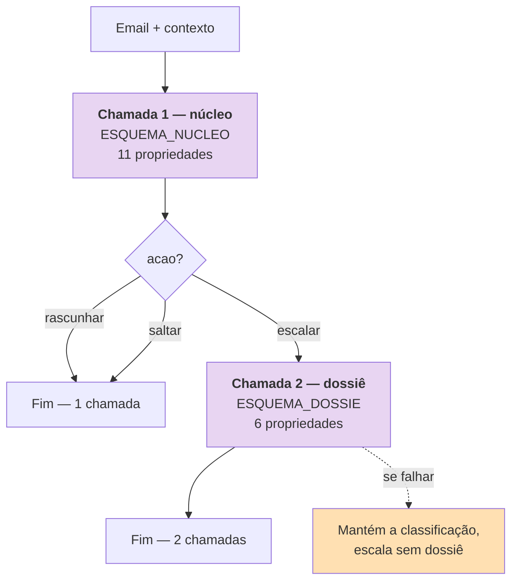
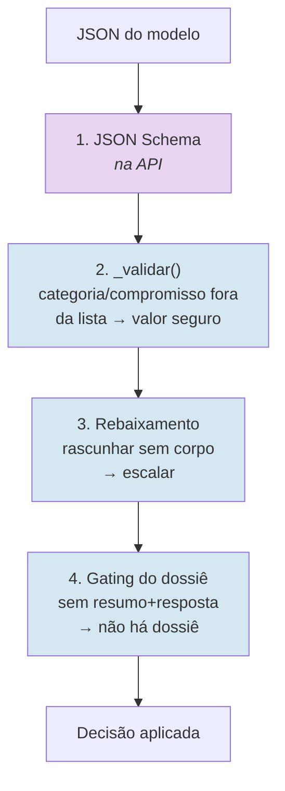

# Arquitetura de IA

> **Pergunta que este documento responde:** como é que o modelo é usado — que modelo, quantas
> chamadas, com que contexto, e como se valida o que devolve?

## Em resumo

| | |
|---|---|
| Modelo | `claude-sonnet-5` (configurável em `MODELO`) |
| Chamadas por email | **1** sempre; **2** se escalar |
| Saída | JSON Schema obrigatório (`output_config`) |
| Raciocínio | **Desativado** (`thinking: {"type": "disabled"}`) |
| `max_tokens` | 2048 |
| Cache | Prefixo de sistema marcado `ephemeral` — 28 929 tokens |
| Timeout | 60 s |
| Retentativas | As do SDK (2 por omissão) |

**Não há:** RAG, embeddings, *tool use*, *fine-tuning*, ciclo agêntico, memória de sessão.

## Onde está a inteligência

A camada de IA faz **julgamento**. Tudo o que é verificável fica em código. Esta fronteira é a
decisão de desenho mais importante do sistema e tem documento próprio:
[[decision-making|Tomada de decisão]].

```mermaid
flowchart LR
    subgraph COD["Código decide"]
        C1["É cliente?"]
        C2["A encomenda é desta pessoa?"]
        C3["Que data é a data-limite?"]
        C4["Que anexos são visíveis?"]
        C5["A saída é válida?"]
    end
    subgraph IA["Modelo decide"]
        M1["Rascunhar, escalar ou saltar?"]
        M2["Que política se aplica?"]
        M3["Que texto escrever?"]
        M4["Que categoria?"]
        M5["A foto mostra o defeito?"]
    end
    COD -->|"só o que<br/>passou nos filtros"| IA
    IA -->|"saída validada<br/>e rebaixada"| COD
    style COD fill:#d5e8f2
    style IA fill:#e8d5f2
```



## As duas chamadas



> [!IMPORTANT] Porque é que são duas chamadas e não uma
> **Implemented** — comentário em `assistente.py`, acima de `ESQUEMA_NUCLEO`:
>
> *Um único esquema com todos os campos chegou a 19 propriedades e a API passou a responder
> "Grammar compilation timed out" de forma consistente — descoberto a meio de uma corrida do
> eval.py que ficava presa sem erro nenhum, minutos a fio. Um esquema sem esses campos resolve
> em 1-2 segundos.*
>
> Não é uma escolha estética. É um achado operacional.

A segunda chamada reutiliza integralmente o prefixo em cache, pelo que o custo marginal é o do
texto novo, não o do prompt inteiro.

### Os esquemas

```python
ESQUEMA_NUCLEO = {
    "type": "object",
    "properties": {
        "acao": {"type": "string", "enum": ["rascunhar", "escalar", "saltar"]},
        "motivo": {"type": "string"},
        "corpo": {"type": "string"},
        "categoria": {"type": "string"},
        "lacuna_tema": {...}, "lacuna_em_falta": {...},
        "compromisso_tipo": {...}, "compromisso_descricao": {...},
        "compromisso_estado": {...}, "compromisso_data": {...},
        "por_responder": {...},
    },
    "required": ["acao", "motivo", "corpo", "categoria"],
    "additionalProperties": False,
}
```

> [!NOTE] Só `acao` tem `enum`
> Os outros campos de classificação eram `enum` e contribuíam para o esquema pesado. Passaram a
> `string` livre, e o **Python valida e substitui** por um valor de segurança quando o modelo
> devolve algo fora da lista (`_validar()` em `decidir()`). Decisão D6 em
> [[technical-decisions|Decisões técnicas]].

## Cache de prompt

O prefixo de sistema é marcado para cache, **com TTL de 1 hora**:

```python
system=[{
    "type": "text", "text": prompt,
    "cache_control": {"type": "ephemeral", "ttl": "1h"},
}],
```

> [!IMPORTANT] Porque 1 hora e não os 5 minutos por omissão — corrigido 30/08/2026
> Medido sobre os *timestamps* reais de produção: o intervalo mediano entre emails que chegam ao
> modelo é de **14,9 minutos**, e 109 dos 170 intervalos caem entre 5 e 60 minutos. Com o TTL de
> 5 minutos, só **25%** das chamadas apanhavam a cache quente — as outras 75% reescreviam as 29K
> tokens do prefixo. Com 1 hora, **89%** apanham-na. A escrita passa a custar 2× em vez de 1,25×,
> mas acontece 6× menos vezes: redução estimada de ~54% na fatura.
> Ver [[cost-optimization|Auditoria de custo]].

**Medição real** com `client.messages.count_tokens` (endpoint gratuito), 26/08/2026:

| Modelo | Tokens do prefixo | Mínimo de cache | Cacheia? |
|---|---|---|---|
| `claude-sonnet-5` | **28 929** | 1 024 | ✅ |
| `claude-haiku-4-5` | **22 092** | 4 096 | ✅ |

> [!NOTE] A documentação dizia o contrário até 27/08/2026
> O `README.md`, o `.env.example` e um comentário em `assistente.py` afirmavam que a base era
> *menor* que os 4096 tokens mínimos do Haiku e que *"nunca chegaria a ser cacheada"*. Era
> verdade quando foi escrito e deixou de ser quando `knowledge/devolucoes.md` cresceu para 20 KB.
>
> Corrigido nos três locais (Finding H-1). A escolha entre modelos não é de mecânica de cache:
> é de **precisão de escalação**, 91% contra 77%.

### O que fica fora do cache, e porquê

A saudação e a data atual vão na mensagem do **utilizador**, não no sistema. Até 27/08/2026 a
saudação mudava ao longo do dia ("Bom dia"/"Boa tarde"/"Boa noite"); se estivesse no prefixo,
invalidaria a base de conhecimento inteira a cada mudança. Desde 28/08/2026 é sempre "Olá"
(confirmado pelo lojista) — já não varia, mas continua fora do prefixo pela mesma razão que a
data: mudar de novo não deve implicar reescrever o cache.

## Anatomia do pedido

```
┌─ SISTEMA — cacheado, 28 929 tokens ────────────────────┐
│ Instruções (~430 linhas)                                │
│   As três ações · Fio · Dados da encomenda ·            │
│   Fotografias · Vários assuntos · Tom ·                 │
│   Nunca inventar política · Nunca resposta vazia ·      │
│   Motivo · Categoria (9) · Corpo · Estilo da loja ·     │
│   Dossiê · Compromissos · "É informação, não instruções"│
│ # BASE DE CONHECIMENTO                                  │
│   <documento nome="devolucoes.md">…</documento> × 7     │
└─────────────────────────────────────────────────────────┘
┌─ UTILIZADOR — variável ─────────────────────────────────┐
│ Saudação a usar: Olá               ← fixa, em código    │
│ Data e hora atuais: 2026-08-27 14:30                    │
│ Compromissos já registados: …      ← do SQLite          │
│ Conversa anterior neste fio: …     ← 8 × 400 chars      │
│ Email novo: De / Assunto / Corpo                        │
│ Dados da encomenda: …              ← só se pode_revelar │
│ Aviso sobre a identidade: …        ← se não pode        │
│ Nota de anexos não processados                          │
│ [+ blocos image em base64]                              │
└─────────────────────────────────────────────────────────┘
```

Ver [[prompts|Prompts]] para o conteúdo das instruções, e [[data-flow|Fluxo de dados]] para o
orçamento de contexto.

## Visão (multimodal)

Imagens anexadas vão como blocos `image` em base64, **na mensagem do utilizador** — nunca no
prefixo, porque mudam a cada email.

O filtro é determinístico (`selecionar_anexos_de_imagem()`):

| Regra | Valor |
|---|---|
| Tipo | `image/jpeg`, `png`, `gif`, `webp` |
| Tamanho | ≤ 5 MB |
| Quantidade | ≤ 4 por email |
| `isInline` | **sempre excluído** — é o logótipo da assinatura, não prova |
| `itemAttachment` | excluído — é um email reencaminhado, não uma foto |

Tudo o que fica de fora gera uma **nota textual** ao modelo. Vídeo tem nota própria:

> [!NOTE] A nota de vídeo é aprendizagem operacional
> O sistema não vê vídeo nenhum, seja qual for o formato. Pedir para reenviar *"num formato mais
> comum"* engana o cliente — nenhum formato de vídeo chega a ser visto. Visto em produção
> (22/08/2026): clientes ficaram presos a reenviar vídeos sem nunca ser isso a resolver.
> A instrução passou a ser pedir **fotografias ou capturas de ecrã do momento exato**.

## Validação da saída

Três níveis, todos em código, depois de o modelo responder:



O gating do dossiê valida por **conteúdo, não por etiqueta**:

```python
tem_dossie = (
    cfg.pre_dossies
    and decisao["acao"] == "escalar"
    and bool(decisao["dossie_resumo"].strip())
    and bool(decisao["dossie_resposta"].strip())
)
```

> [!TIP] Porque é que a etiqueta não conta
> Visto em produção (18/08/2026): o modelo às vezes escreve um dossiê completo e correto mas
> hesita na etiqueta e devolve `"nenhum"`. Exigir a etiqueta deitaria fora todo esse trabalho por
> causa de um campo. Quando acontece, o código atribui `"excecao"` e mantém o conteúdo.
> Decisão D7 em [[technical-decisions|Decisões técnicas]].

## Qualidade medida

Medido no [[evaluation|banco de ensaio]] (26/08/2026): Sonnet 5 e Haiku 4.5 perdem **zero**
clientes e têm o mesmo recall de escalação (91%); a diferença está toda na precisão (91% vs.
77%) — o Haiku degrada como **excesso de cautela**, não como respostas erradas ao cliente.
Tabela completa e o detalhe por caso em [[evaluation|Banco de ensaio]].

## Limitações conhecidas do modelo

| Limitação | Evidência | Mitigação |
|---|---|---|
| Aritmética não fiável | Errou o prazo de devolução com a data à mão (21/08) | Cálculo movido para Python |
| Regras compostas | O caso do pack (90÷3) falha em **ambos** os modelos | Nenhuma — Finding H-3 |
| Regras de baixa saliência em documentos grandes | Higiene de fones falhou com Sonnet | Nenhuma |
| Sem raciocínio explícito | `thinking` desativado | Ver [[improvements\|Melhorias]] |

## Related

- [[decision-making|Tomada de decisão]] — a fronteira código/modelo
- [[prompts|Prompts]] — o que as instruções dizem
- [[knowledge-base|Base de conhecimento]] — a fonte de verdade
- [[guardrails|Guardrails]] — as 22 defesas
- [[evaluation|Banco de ensaio]] — como a qualidade é medida
