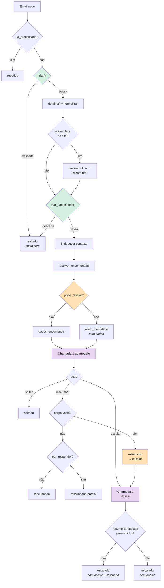

# Tomada de decisão

> **Pergunta que este documento responde:** quem decide o quê — o que é decidido por código
> determinístico e o que é confiado ao modelo, e porquê essa fronteira está onde está?

Este é o documento central da arquitetura de IA. A fronteira código/modelo é o que separa este
sistema de uma chamada a um LLM.

## A fronteira

```mermaid
flowchart TB
    subgraph DET["DECIDIDO POR CÓDIGO — determinístico, testável, auditável"]
        D1["É correspondência de cliente?<br/><i>triar() · triar_cabecalhos()</i>"]
        D2["A encomenda é mesmo desta pessoa?<br/><i>resolver_encomenda() · 4 níveis</i>"]
        D3["Estes dados podem ser revelados?<br/><i>Correspondencia.pode_revelar</i>"]
        D4["Qual é a data-limite de devolução?<br/><i>resumir_encomenda() · +14 dias</i>"]
        D5["Que anexos o modelo pode ver?<br/><i>selecionar_anexos_de_imagem()</i>"]
        D6["Há mesmo um dossiê preparado?<br/><i>tem_dossie · conteúdo, não etiqueta</i>"]
        D7["A categoria devolvida é válida?<br/><i>_validar() contra lista fixa</i>"]
        D8["Cria-se rascunho? Que categorias?<br/><i>processar()</i>"]
    end

    subgraph IA["DECIDIDO PELO MODELO — julgamento, dentro de limites"]
        M1["Rascunhar, escalar ou saltar?"]
        M2["Que política se aplica a este caso?"]
        M3["Que texto escrever ao cliente?"]
        M4["Que categoria de escalação?"]
        M5["A fotografia mostra o defeito?"]
        M6["Que compromisso foi assumido?"]
        M7["Que parte ficou por responder?"]
    end

    subgraph EXT["DADOS EXTERNOS — factos, nunca julgamento"]
        E1["Corpo e cabeçalhos · Graph"]
        E2["Estado da encomenda · Shopify"]
        E3["Fio da conversa · Graph"]
        E4["Compromissos · SQLite"]
        E5["Políticas · knowledge/"]
    end

    EXT -->|alimenta| DET
    DET -->|"só o que passou<br/>nos filtros"| IA
    IA -->|"saída validada<br/>e rebaixada"| DET

    style DET fill:#d5e8f2
    style IA fill:#e8d5f2
    style EXT fill:#d5f2e0
```



## O princípio

> [!IMPORTANT] A regra que governa tudo
> O modelo **nunca vê** dados de uma encomenda cuja titularidade o código não tenha provado.
> A decisão de revelar é do Python, não do prompt.

**Implemented** — `Correspondencia.pode_revelar`:

```python
@property
def pode_revelar(self) -> bool:
    """"media" não chega de propósito: é o nível em que há indícios mas não
    prova, e é exatamente aí que um engano mostra a encomenda de outra pessoa."""
    return self.encomenda is not None and self.confianca in ("exata", "alta")
```

## Como a fronteira foi desenhada

Não foi decidida à partida. Três decisões **saíram** do modelo depois de ele demonstrar que
falhava nelas:

| Decisão | Estava no modelo? | Porque saiu | Quando |
|---|---|---|---|
| Titularidade da encomenda | Nunca | O erro mais caro possível — expõe dados entre clientes | Desenho preventivo |
| Data-limite de devolução | Sim | Errou o cálculo **mesmo com a data de entrega à mão** | 21/08/2026 |
| Validade do dossiê | Sim (etiqueta) | Escrevia dossiês bons e hesitava na etiqueta | 18/08/2026 |

**Implemented** — o comentário que documenta a segunda, em `assistente.py` acima de
`PRAZO_DEVOLUCAO_DIAS`:

> Calculado aqui, não pelo modelo — contas de datas numa única passagem sem espaço de raciocínio
> dão erros (visto em produção, 21/08/2026: mesmo com a data de entrega certa à mão, a resposta
> ainda errou o cálculo). **O modelo só compara duas datas já prontas, não soma.**

> [!TIP] O padrão a aplicar no futuro
> Quando o modelo falha repetidamente numa classe de decisão **verificável**, a resposta não é
> apertar o prompt — é mover a decisão para código e dar-lhe o resultado já pronto. É assim que
> o Finding H-3 (o cálculo do pack) deveria ser resolvido. Ver [[improvements|Melhorias]].

## Camada 1 — Triagem determinística

**Implemented** — corre antes de qualquer chamada paga. ~90 linhas, custo zero.

### `triar()` — sobre metadados

| # | Regra | O que apanha |
|---|---|---|
| 1 | Categoria já aplicada | Emails já processados numa passagem anterior |
| 2 | Sem remetente | Malformados |
| 3 | A própria caixa | Anti-ciclo direto |
| 4 | Domínio próprio | Colegas, reencaminhamentos, o próprio rascunho a voltar |
| 5 | Local-part de robô | 14 padrões: `noreply`, `mailer-daemon`, `bounce`… |
| 6 | Domínio bloqueado | 13 plataformas base + `blocklist.txt` |
| 7 | Não endereçado | A caixa não está em Para nem Cc — chegou por Bcc ou lista |

### `triar_cabecalhos()` — após ir buscar o detalhe

| # | Regra | O que apanha |
|---|---|---|
| 8 | Cabeçalhos de massa | `List-Unsubscribe`, `List-Id`, `Feedback-ID`, `X-Campaign-ID`… |
| 9 | `Precedence` | `bulk`, `list`, `junk`, `auto_reply` |
| 10 | `Auto-Submitted` | Respostas automáticas |
| 11 | Corpo vazio | Email só com imagem, sem texto |

> [!WARNING] A proteção anti-ciclo é a regra 4
> Sem ela, um *out-of-office* de um fornecedor e este assistente responder-se-iam um ao outro
> indefinidamente.

Duas exceções cirúrgicas às regras 5, 6 e 8 existem para os formulários do site.
Ver [[web-forms|Formulários do site]].

## Camada 2 — Decisão do modelo

### As três ações

**Implemented** — definidas no `PROMPT`:

| Ação | Quando | `corpo` |
|---|---|---|
| `rascunhar` | É cliente **e** sabe responder pela base ou pelos dados da encomenda | Preenchido |
| `escalar` | É cliente **mas** não pode responder | Vazio |
| `saltar` | Não é correspondência de cliente | Vazio |

### A assimetria da dúvida

```text
Na dúvida genuína entre "rascunhar" e "escalar", escala. Na dúvida entre
"escalar" e "saltar", escala — um email de cliente descartado não deixa rasto
nenhum e custa uma venda.
```

Ambas as fronteiras inclinam para escalar. Ver [[problem-and-solution|Problema e solução]].

### Regras de decisão não óbvias

O prompt codifica várias distinções que exigem julgamento fino:

| Distinção | Regra |
|---|---|
| **Propor vs. comprometer** | Escrever o passo seguinte **em forma de pergunta** é resposta normal. Afirmá-lo como novidade com data é um compromisso, e escala |
| **Troca vs. reembolso** | A troca não move dinheiro → pode ser pergunta direta. O reembolso move → escala sempre, mesmo em pergunta |
| **Acusar receção vs. inventar** | Se o cliente diz "recebi o reembolso", confirmar que se ficou a par não é inventar nada — é rascunhável |
| **Ler vs. alterar** | Os dados da encomenda autorizam responder sobre estado. Cancelar, alterar ou reembolsar escala sempre |
| **Sem número vs. número que falhou** | Não deu número → pedir o número é resposta normal. Deu e a consulta falhou → escala |
| **Parte do email vs. o email todo** | Sabe responder a uma parte → rascunha essa e assinala o resto em `por_responder` |

Ver [[prompts|Prompts]] para o texto completo.

## O fluxo de decisão completo



## Onde o julgamento ainda falha

**Implemented** — medido no [[evaluation|banco de ensaio]], 26/08/2026:

| Caso | Sonnet 5 | Haiku 4.5 | Natureza |
|---|---|---|---|
| Higiene: fones usados só têm troca | ❌ | ✅ | Regra de baixa saliência num documento de 20 KB |
| Pack: valor = total ÷ nº artigos | ❌ | ❌ | **Aritmética** — devia sair do modelo |
| Bateria inchada: avisar antes de pedir prova | ✅ | ❌ | Ordem de passos numa regra composta |
| Foto ilegível: pedir outra, não escalar | ✅ | ❌ | Julgamento sobre prova insuficiente |

> [!NOTE] Os dois tipos de falha não valem o mesmo
> Escalar o que sabia resolver custa **trabalho manual**. Responder ao que não sabia custa uma
> **política inventada**. Nenhum dos modelos testados cometeu o segundo tipo nos casos avaliados.

## Related

- [[ai-architecture|Arquitetura de IA]] — o mecanismo das chamadas
- [[guardrails|Guardrails]] — as defesas que enquadram o julgamento
- [[identity-resolution|Resolução de identidade]] — a decisão de código mais importante
- [[escalation|Escalação]] — o que acontece quando decide escalar
- [[prompts|Prompts]] — o texto que codifica estas regras
