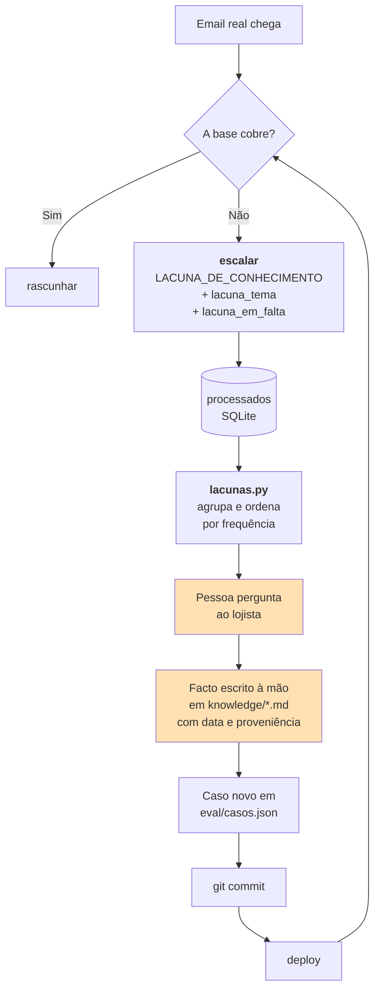

# Base de conhecimento

> **Pergunta que este documento responde:** onde vive o conhecimento sobre a loja, como chega ao
> modelo, e como se mantém atualizado?

## Onde está

Sete ficheiros Markdown em `knowledge/`, 805 linhas, ~40 700 caracteres.

| Ficheiro | Tamanho | Secções | Domínio |
|---|---|---|---|
| `devolucoes.md` | 20,7 KB | 20 | Devoluções, reembolsos, garantia, cancelamento |
| `provas-e-defeitos.md` | 8,2 KB | 11 | Que provas pedir, ordem de solução preferida |
| `produtos-detalhe.md` | 3,6 KB | 4 | Especificações por família de produto |
| `entregas.md` | 3,1 KB | 7 | Prazos, custos, destinos, entrega falhada |
| `produtos.md` | 2,5 KB | 4 | Disponibilidade, compatibilidade |
| `pagamentos.md` | 2,3 KB | 6 | Métodos, descontos, faturação |
| `empresa.md` | 1,6 KB | 5 | Identificação, contactos, campanhas |

Há ainda `politicas.md.template` — um formulário de perguntas por responder, para arrancar uma
loja nova.

> [!NOTE] O template não é carregado
> **Implemented** — `carregar_base()` filtra por `.md` e `.txt`; a extensão é `.md.template`.
> **Inference:** é intencional, e é uma forma elegante de manter o modelo de onboarding no
> repositório sem o injetar no prompt.

## Como chega ao modelo

**Implemented** — `carregar_base()`:

```python
ficheiros = sorted(
    (p for p in pasta.glob("**/*") if p.suffix.lower() in {".md", ".txt"}),
    key=lambda p: p.as_posix().lower(),
)
partes.append(f'<documento nome="{caminho.name}">\n{texto}\n</documento>')
```

A base **inteira** vai em **todas** as chamadas, delimitada por tags XML, dentro do bloco de
sistema marcado para cache.

> [!IMPORTANT] Não há RAG
> Sem embeddings, sem *chunking*, sem *retrieval*, sem base vetorial. 28 929 tokens numa janela
> de 1M, cacheados.

### Porquê sem RAG

**Inference** — a justificação não está escrita no código, mas decorre do desenho:

| | Base inteira no prompt | RAG |
|---|---|---|
| Falha de *retrieval* | **Impossível** | O chunk certo pode não ser recuperado — a causa mais comum de alucinação em apoio ao cliente |
| Custo | Linear no tamanho da base; absorvido pelo cache | Menor, mas com infra adicional |
| Regras que se cruzam | O modelo vê todas ao mesmo tempo | Pode recuperar uma e falhar a exceção |
| Teto | Centenas de milhares de tokens, ou multi-cliente | Muito mais alto |

Para esta dimensão, a escolha é clara. Deixa de o ser em [[scalability|escala]].

## Qualidade da base

A base tem uma característica invulgar: **quase todas as regras têm proveniência e data**.

```markdown
(Confirmado diretamente pela loja, 15 de agosto de 2026.)
(Confirmado num caso real, 3 de agosto de 2026.)
(Confirmado diretamente pelo cliente, 18 de agosto de 2026.)
```

E — notavelmente — correções explícitas de enganos anteriores:

> corrige um erro anterior na base: o cabo é sempre da mesma cor que a powerbank, não fica
> sempre branco (confirmado 17/08/2026, corrigindo nota errada de sessão anterior)

> [!TIP] Isto transforma a base num registo auditável
> Quando uma resposta sai errada, é possível saber **quando** a regra entrou, **quem** a
> confirmou, e se já foi corrigida antes. Numa base sem proveniência, cada regra é uma afirmação
> órfã.

## O ciclo de melhoria



### O modelo produz a pergunta, nunca a resposta

**Implemented** — `lacunas.py`:

> Nunca transformar a resposta do modelo em facto: o modelo escalou precisamente por não saber.
> O que ele produz aqui é a pergunta, não a resposta.

O prompt força uma lacuna **acionável**, não um "não sei" vago:

| Campo | Exemplo |
|---|---|
| `lacuna_tema` | "prazo de entrega Madeira" (2-3 palavras) |
| `lacuna_em_falta` | "se o prazo das ilhas é diferente do continente, e qual" (uma frase) |

`lacunas.py` agrupa temas escritos de formas diferentes (normalização com remoção de
*stopwords*) e marca como `coberta?` as que já parecem estar na base — sinal de que o registo é
antigo.

> [!WARNING] O passo humano é obrigatório por desenho
> O sistema **não aprende sozinho**. `README.md` da raiz: *"o mecanismo de melhoria tem de ser
> legível por um humano"*. Ver [[problem-and-solution|Problema e solução]].

## Riscos e ambiguidades identificados

| Observação | Onde | Risco |
|---|---|---|
| `devolucoes.md` concentra as regras mais entrelaçadas (prazo × estado × tipo de produto × motivo) | 20 secções, 20,7 KB | É onde **ambos** os modelos testados falharam mais |
| Regra do pack (total ÷ nº artigos) está escrita mas falha na aplicação | `devolucoes.md` | Finding H-3 — ver [[technical-debt]] |
| Higiene (fones usados só têm troca) é de alto impacto e baixa saliência | `devolucoes.md` | Sonnet falhou este caso |
| Fronteira `INVENTARIO_INDISPONIVEL` vs. `LACUNA_DE_CONHECIMENTO` precisou de regra de prioridade no prompt | — | Resolvido, mas indica sobreposição natural |

> [!WARNING] Sem verificação de contradições
> Nada deteta se duas secções se contradizem. À medida que a base cresce, o risco aumenta.
> Proposta em [[improvements|Melhorias]] (P2-6).

## Como se edita

1. **Confirmar o facto com o lojista.** Nunca a partir do que o modelo supôs.
2. **Escrever no ficheiro certo**, com a proveniência e a data entre parênteses.
3. **Acrescentar um caso ao `eval/casos.json`** que falharia sem a regra nova.
4. **Correr o eval** — subconjunto primeiro.
5. **Commit e deploy.** Não é preciso reiniciar nada: a base é lida do disco em cada passagem.

> [!TIP] Um facto sem caso de teste desaparece
> Regras acrescentadas sem um caso correspondente no banco de ensaio não têm proteção contra
> regressão. Quando o prompt for afinado seis meses depois, ninguém saberá que a regra existia.

## Escala

**Implemented** — `KNOWLEDGE_DIR` é configurável, e o `.gitignore` já prevê `clients/`. Uma
segunda loja funcionaria hoje com uma pasta e um `.env` próprios.

O que quebra a partir de ~50-100 lojas: cada base distinta é um prefixo de cache distinto, e com
tráfego esparso paga-se a escrita repetidamente. Ver [[scalability|Escalabilidade]].

## Related

- [[prompts|Prompts]] — como a base é interpolada nas instruções
- [[ai-architecture|Arquitetura de IA]] — o cache e o orçamento de contexto
- [[escalation|Escalação]] — a categoria `LACUNA_DE_CONHECIMENTO`
- [[operations|Ferramentas de operação]] — `lacunas.py`
- [[evaluation|Banco de ensaio]] — onde os factos novos ganham proteção
