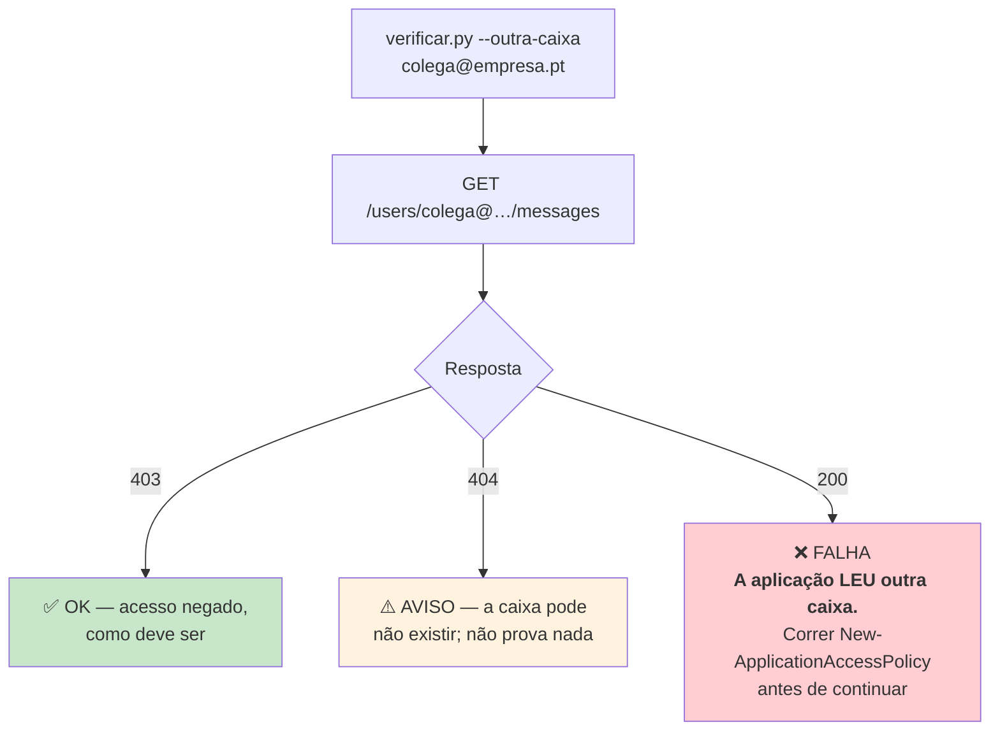
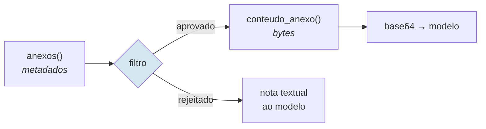

# Email — Microsoft Graph

> **Pergunta que este documento responde:** como é que o sistema lê a caixa, cria rascunhos, e o
> que impede que leia caixas que não devia?

## Configuração

| | |
|---|---|
| API | Microsoft Graph v1.0 |
| Autenticação | MSAL `ConfidentialClientApplication`, *client credentials* |
| Âmbito | `https://graph.microsoft.com/.default` (permissões de **aplicação**) |
| Permissão | `Mail.ReadWrite` — **sem `Mail.Send`** |
| Restrição | `New-ApplicationAccessPolicy` limita a **uma** caixa |
| Cliente HTTP | `httpx.Client(timeout=30.0)` |

> [!IMPORTANT] A restrição a uma caixa é o ponto de segurança mais importante do projeto
> `Mail.ReadWrite` como permissão de **aplicação** dá acesso a **todas** as caixas do inquilino.
> O que a limita a uma é uma política do Exchange, aplicada **fora deste repositório**.
>
> Se essa política for removida ou nunca aplicada, a aplicação passa a poder ler o correio de
> toda a empresa, e nada no código o assinala.

### Como é verificada

**Implemented** — `verificar.py` existe essencialmente para isto, e o teste é **ativo**: tenta
ler outra caixa e **exige um 403**.



O próprio ficheiro documenta a sua razão de existir:

> É o passo mais importante do projeto e o mais fácil de esquecer, e um aviso no README não é um
> travão. Aqui é.

> [!WARNING] Só corre quando alguém se lembra
> A verificação é manual. Não corre em cada passagem, nem periodicamente. Se a política do
> Exchange for removida seis meses depois, nada avisa. É o Finding P0-2 em
> [[improvements|Melhorias]].

## Operações

| Operação | Endpoint | Campos | Nota |
|---|---|---|---|
| Listar novas | `GET /mailFolders/inbox/messages` | `CAMPOS_LISTA` | `$top=25`, filtro por cursor, ordem asc |
| Detalhe | `GET /messages/{id}` | `internetMessageHeaders,body` | Só quando passa a triagem |
| Fio | `GET /messages` | `bodyPreview` + remetente | Filtro por `conversationId` |
| Anexos (meta) | `GET /messages/{id}/attachments` | `id,name,contentType,size,isInline` | Sem conteúdo |
| Anexo (bytes) | `GET …/attachments/{id}/$value` | — | Só após aprovação pelos metadados |
| Criar rascunho | `POST /messages/{id}/createReply` | — | Encadeado na conversa |
| Marcar | `PATCH /messages/{id}` | `categories` | Preserva as existentes |

### Detalhes de implementação

> [!NOTE] Sem filtro de "não lidas" — deliberado
> **Implemented** — `Graph.novas()`:
>
> *"Numa caixa que está a ser trabalhada, o operador abre o email minutos depois de chegar, e um
> filtro de não lidas faria desaparecer precisamente os emails em que alguém está a trabalhar
> agora."*
>
> E o produto é justamente o rascunho já estar lá quando ele abre o Outlook. O SQLite garante
> que não se repete.

> [!NOTE] A ordenação do fio é feita em Python
> O `$orderby` combinado com filtro por `conversationId` é recusado pelo Graph com
> `InefficientFilter`. `Graph.historico()` pede `$top = max(quantas*2, 10)` e ordena localmente.

### Anexos em duas fases



Separado de propósito: *"só se pede depois de já se saber, pelos metadados, que vale a pena"* —
evita descarregar um ficheiro de 20 MB que ia ser rejeitado na mesma.

## Identificação de mensagens

Duas chaves diferentes, para dois usos diferentes:

| Chave | Uso | Porquê |
|---|---|---|
| `id` (do Graph) | Operações na API (detalhe, rascunho, marcar) | É o que a API aceita |
| `internetMessageId` | **Chave do registo local** | O `id` tem âmbito de pasta e é reatribuído quando alguém arruma o email |

> [!IMPORTANT] Se o registo fosse indexado pelo `id` do Graph
> Deixaria silenciosamente de fazer correspondência assim que alguém arrumasse a caixa de
> entrada — e o assistente reprocessaria emails já respondidos.

## Distinguir quem falou no fio

**Implemented** — `e_da_loja()`:

```python
def e_da_loja(endereco: str, caixa: str) -> bool:
    endereco = (endereco or "").strip().lower()
    if not endereco or "@" not in endereco:
        return True          # nome distinto do Exchange
    if endereco == caixa:
        return True
    return endereco.partition("@")[2] == caixa.partition("@")[2]
```

> [!WARNING] O caso do nome distinto do Exchange
> Nas mensagens enviadas pela própria loja, o Graph devolve por vezes
> `/O=EXCHANGELABS/OU=...` em vez do endereço SMTP. Sem apanhar esse caso, **respostas da loja
> apareciam ao modelo como se fossem do cliente** — e o modelo podia atribuir ao cliente
> compromissos que a loja assumiu.
>
> Daí o `return True` quando não há `@`: na dúvida, é da loja.

## Falhas e degradação

| Falha | Comportamento |
|---|---|
| Token inválido | `sys.exit()` — falha imediata e visível |
| Listagem inicial falha | `erro-graph`, sai com código 1; retentado em 2 min |
| Detalhe devolve 404 | Mensagem apagada/movida a meio — **salta só essa**, regista |
| Fio falha | `erro-historico`, decide sem contexto |
| Anexos falham | `erro-anexos`, decide sem imagens |
| 429 / 5xx em GET | ✅ Repete até 3× com espera exponencial (`_com_retentativa`) |
| 429 / 5xx em POST/PATCH | Sem retentativa, de propósito — `createReply`/`marcar` não são idempotentes |

Ver [[error-handling|Tratamento de erros]].

## Autenticação de email do domínio

`verificar.py` termina com um lembrete que **não é verificável pela API**:

```
O SPF e o DKIM não são verificáveis daqui. No DNS do domínio:
  nslookup -type=txt tripat3s.com
  nslookup -type=cname selector1._domainkey.tripat3s.com
```

**Inference:** relevante porque um rascunho enviado de um domínio sem SPF/DKIM corretos pode ir
para spam — o que anularia o valor do sistema sem qualquer erro visível.

## Related

- [[security|Segurança]] — a restrição de caixa no contexto geral
- [[web-forms|Formulários do site]] — emails que chegam disfarçados de notificação
- [[data-flow|Fluxo de dados]] — o que se faz com o corpo depois de o obter
- [[error-handling|Tratamento de erros]] — degradação quando o Graph falha
- [[deployment|Deployment]] — o passo de verificação obrigatório
