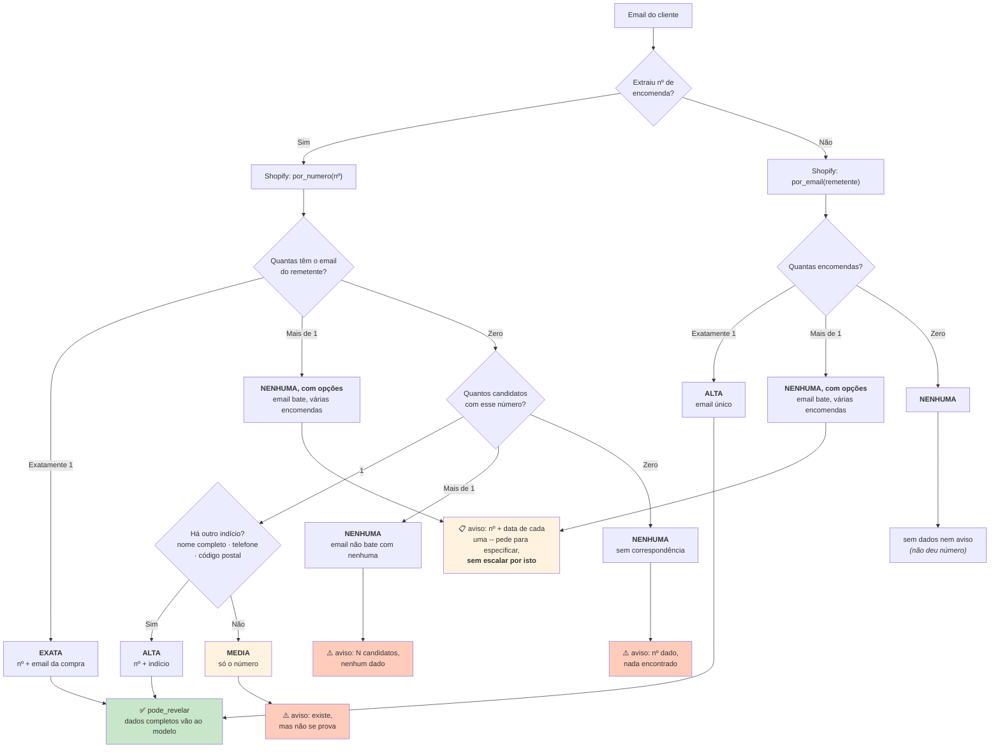
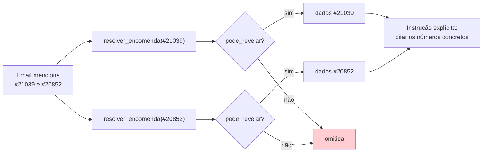

# Resolução de identidade

> **Pergunta que este documento responde:** como é que o sistema decide se a encomenda que
> encontrou é mesmo da pessoa que escreveu — e o que faz quando não consegue provar?

Este é o mecanismo de segurança mais importante do sistema. Protege contra o erro mais caro
possível: **mostrar os dados de um cliente a outro**.

## O princípio

**Implemented** — docstring de `Correspondencia`:

> A confiança é decidida aqui, no código, e não pelo modelo: o modelo recebe só o resultado.
> "Adivinhar" uma encomenda é o erro mais caro possível deste sistema, porque expõe dados de um
> cliente a outro.

> [!IMPORTANT] Um número de encomenda não é segredo
> É a premissa que justifica todo o algoritmo. Um número aparece em emails de confirmação, em
> capturas de ecrã, em conversas. Qualquer pessoa pode citar um número que viu. **Citar um
> número não prova nada.**

## Os quatro níveis



| Nível | Condição | Revela? |
|---|---|---|
| **exata** | Número + email do remetente igual ao da compra | ✅ |
| **alta** | Número + outro indício de identidade | ✅ |
| **alta** | Sem número, mas o email tem **exatamente uma** encomenda | ✅ |
| **media** | Só o número, sem mais nada | ❌ |
| **nenhuma**, com opções | Email do remetente bate com **mais do que uma** encomenda | ❌ (dados completos) — mas número + data de cada uma vão no aviso |
| **nenhuma** | Vários candidatos sem nenhum email a bater, ou nada encontrado | ❌ |

> [!TIP] "Nenhuma, com opções" não é o mesmo risco que "nenhuma" — corrigido 27/08/2026
> Antes desta correção, um cliente recorrente sem o número à mão (email a bater com 2+
> encomendas) escalava sempre como `IDENTIDADE_NAO_VERIFICADA`, tratado exatamente como o caso em
> que o email **nem sequer bate**. Isso é sobrecautela: o email já prova a titularidade (é o
> mesmo nível de confiança que revela tudo quando há só uma correspondência); só falta saber qual
> das compras. `Correspondencia.opcoes` leva o número e a data de cada uma (não são segredo — ver
> abaixo) para o modelo pedir diretamente ao cliente para especificar, **sem escalar por causa
> disto**. Ver Finding "identidade — várias encomendas do mesmo email" em
> [[technical-debt|Dívida técnica]] e o caso `cliente-com-duas-encomendas-mesmo-email-pergunta-qual`
> no [[evaluation|banco de ensaio]].

## O nível `media` — a decisão mais importante

```python
@property
def pode_revelar(self) -> bool:
    """"media" não chega de propósito: é o nível em que há indícios mas não
    prova, e é exatamente aí que um engano mostra a encomenda de outra pessoa."""
    return self.encomenda is not None and self.confianca in ("exata", "alta")
```

> [!IMPORTANT] Porque é que `media` não chega
> `media` significa: existe uma encomenda com aquele número, mas quem escreve não é o comprador
> registado e não há nenhum outro indício. Pode ser o cliente a escrever de outro email — ou
> pode ser alguém a citar um número que viu.
>
> **É exatamente o nível em que um engano é caro.** Não se revela nada.

### O que acontece em `media`

Não se revela — mas também não se ignora. O modelo recebe um aviso que o instrui a **pedir
confirmação**:

> Existe uma encomenda com o número {numero}, mas não foi possível confirmar que pertence a quem
> escreveu (…). Não reveles nada sobre essa encomenda — nem o nome, nem o email, nem o telefone
> associados a ela. No dossiê, sugere uma resposta que diga ao cliente que o número de encomenda
> indicado está associado a um email diferente do que escreveu, e que para confirmar (…) precisa
> de indicar o email e o número de telefone que usou no momento da compra.

> [!NOTE] Este texto foi definido pelo cliente, a partir de um caso real
> 21 de agosto de 2026: uma cliente deu um número de encomenda que pertencia a outra pessoa. O
> texto do pedido de confirmação foi escrito pelo lojista, não inferido.

## Os indícios de identidade

**Implemented** — `_sinais_de_identidade()`. Compara a encomenda contra o **nome do remetente** e
contra **o texto que ele escreveu** (corpo + assunto + histórico).

| Indício | Regra | Porquê assim |
|---|---|---|
| Nome completo | Exige **nome e apelido**, ambos presentes no nome do remetente | *"Um primeiro nome sozinho é fraco de mais para contar: há muitos 'João'"* |
| Telefone | ≥9 dígitos; compara os **últimos 9**, ignorando separadores | Apanha `+351 912 345 678` escrito de qualquer forma |
| Código postal | ≥7 caracteres, presente no texto | Formato `1234-567` |

> [!TIP] O que isto resolve
> Um cliente que escreve de outro email (do trabalho, de um endereço novo) mas que dá o telefone
> ou o código postal da compra **identifica-se**. Sem esta camada, esses casos escalavam sempre.

## Múltiplas encomendas no mesmo email

**Implemented** — `processar()`.

Cada número extra passa pela **mesma verificação completa e independente**. Nunca se junta uma
encomenda que não se prove ser desta pessoa, mesmo que o número apareça no email.



> [!WARNING] Ter os dados não bastou
> Bug corrigido a 22/08/2026: `extrair_numero_encomenda()` usava `.search()` e só via o primeiro
> número. Corrigido com `.finditer()` — mas **em teste o modelo continuava a responder só à
> primeira**, sem se aperceber de que havia uma segunda encomenda.
>
> Foi preciso acrescentar uma instrução explícita ao bloco de dados a pedir para citar os
> números concretos e perguntar qual, quando não for claro. Ter o contexto não garante que ele
> seja usado.

## Modo de compatibilidade

`ENABLE_ORDER_IDENTITY_RESOLUTION=false` volta ao comportamento anterior: `Shopify.encomenda()`,
que exige **número + email exato**. Sem níveis, sem indícios, sem procura por email.

**Inference:** existe como via de reversão rápida, coerente com os outros `ENABLE_*` — se a
resolução por níveis produzisse um falso positivo em produção, desliga-se sem *deploy*.

## Cobertura de teste

**Implemented** — `test_assistente.py`, classe `ResolucaoDeIdentidade`, com uma `ShopifyFalsa`.
Cobre os quatro níveis, os casos de vários candidatos, e que `opcoes` só se preenche quando o
email já bateu (`test_varios_candidatos_com_email_a_bater_leva_opcoes` e o par
`test_varios_candidatos_sem_email_a_bater_nao_leva_opcoes`). A nível de `processar()`, a classe
`Processar` confirma que o aviso construído nunca inclui mais do que número e data.

E no [[evaluation|banco de ensaio]], quatro casos dedicados:

| Caso | Testa |
|---|---|
| `identidade-nao-verificada-nao-revela-nada` | Não revelar em `media`, categoria correta |
| `identidade-por-confirmar-nao-prepara-dossie` | Não preparar dossiê sem identidade |
| `identidade-nao-confirmada-pede-email-e-telefone` | Sugerir o pedido de confirmação certo |
| `cliente-com-duas-encomendas-mesmo-email-pergunta-qual` | Responder direto, sem escalar, citando as duas encomendas — verificação manual do texto, ainda não corrida contra o modelo real |

## Related

- [[shopify|Shopify]] — de onde vêm os candidatos
- [[guardrails|Guardrails]] — este é o guardrail #19
- [[security|Segurança]] — exposição de dados entre clientes
- [[decision-making|Tomada de decisão]] — porque é que esta decisão é do código
- [[escalation|Escalação]] — a categoria `IDENTIDADE_NAO_VERIFICADA`
