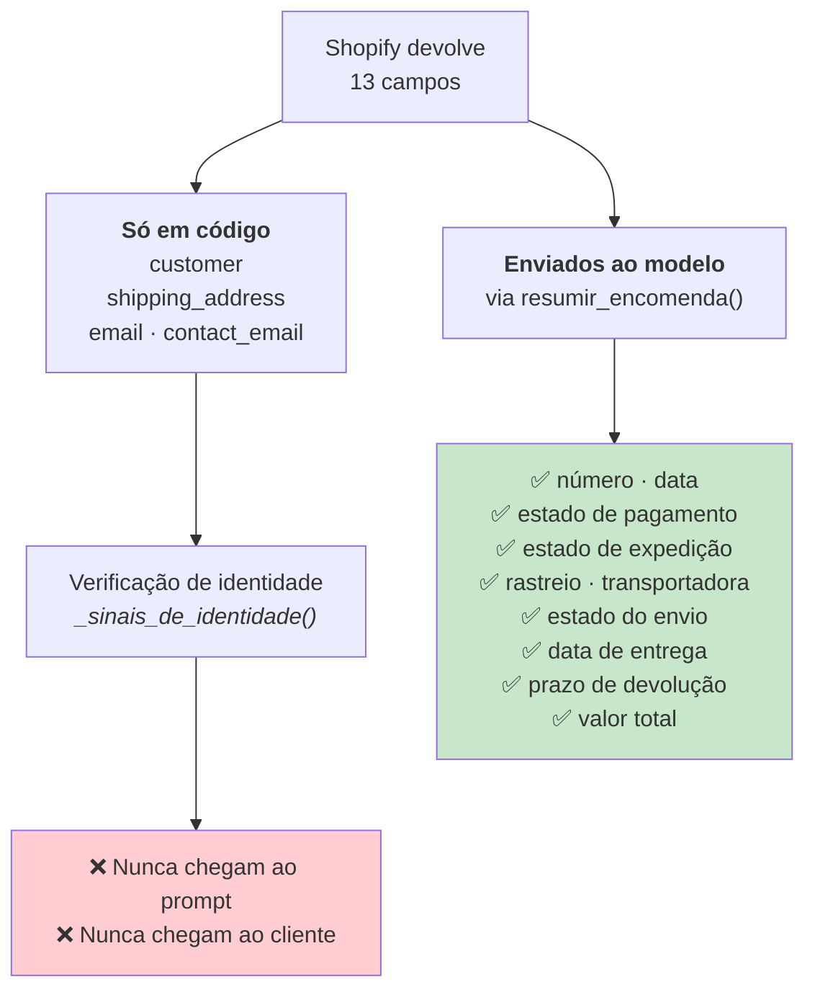
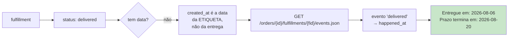

# Shopify

> **Pergunta que este documento responde:** que informação o sistema consegue obter da Shopify,
> o que faz com ela, e quais são os limites?

## Configuração

| | |
|---|---|
| API | Shopify Admin REST, versão `2026-01` |
| Autenticação | *Client credentials grant* |
| Âmbito | `read_orders` — **só leitura** |
| Cache de token | Por instância; validade 24 h |
| Cliente HTTP | `httpx.Client(timeout=15.0)` |

> [!NOTE] Porque é que o *client credentials grant* funciona aqui
> **Implemented** — comentário em `class Shopify`: *"só funciona porque a app e a loja pertencem
> à mesma organização Shopify"*. Não há fluxo OAuth interativo nem *redirect URL*.

## O que se obtém

**Implemented** — `Shopify.CAMPOS_ENCOMENDA`:

```
id, name, email, contact_email, created_at, cancelled_at,
financial_status, fulfillment_status, fulfillments, customer,
shipping_address, current_total_price, currency
```

### Dados obtidos ≠ dados usados

Esta distinção é central e fácil de perder de vista.



**Implemented** — o comentário no código é explícito: os campos de identidade *"servem para
confirmar que a encomenda é de quem escreveu, e nunca são mostrados ao cliente nem enviados ao
modelo"*.

Nunca saem: morada completa, telefone, email do comprador, dados de pagamento.

### Tradução de estados

O modelo recebe português, não os enums da API.

| Categoria | Nº de estados | Exemplos |
|---|---|---|
| Pagamento | 6 | `paid` → "pago", `partially_refunded` → "parcialmente reembolsado" |
| Expedição | 3 | `fulfilled` → "expedida", `unfulfilled` → "ainda não expedida" |
| Envio | 9 | `in_transit` → "em trânsito", `attempted_delivery` → "tentativa de entrega falhada" |

> [!NOTE] O estado do envio nem sempre vem
> Depende de a Shopify reconhecer a transportadora. Quando falta, `resumir_encomenda()` cai só
> no código e no link de rastreio — e o prompt instrui explicitamente a **não adivinhar** um
> estado que não foi dado.

### A data de entrega exige uma chamada extra



**Implemented** — `Shopify.data_entrega()`:

> O fulfillment em si só tem um estado ("delivered"), sem data própria; "created_at" é quando a
> etiqueta foi criada, não quando chegou ao cliente. Visto em produção, 21/08/2026: sem isto,
> uma resposta confundiu a data da encomenda com a de entrega e citou um prazo errado com ar de
> certeza.

A chamada extra só se faz quando a encomenda **já vai ser revelada** ao cliente. Se falhar, a
linha é omitida e o resto do resumo continua.

### O prazo de devolução é calculado em Python

```python
PRAZO_DEVOLUCAO_DIAS = 14
...
limite = datetime.fromisoformat(data) + timedelta(days=PRAZO_DEVOLUCAO_DIAS)
linhas.append(f"Prazo de devolução (14 dias desde a entrega) termina em: {limite:%Y-%m-%d}")
```

> [!IMPORTANT] Porque é que o modelo não faz esta conta
> *"Contas de datas numa única passagem sem espaço de raciocínio dão erros (visto em produção,
> 21/08/2026: mesmo com a data de entrega certa à mão, a resposta ainda errou o cálculo). O
> modelo só compara duas datas já prontas, não soma."*
>
> É o padrão a aplicar sempre que o modelo falha numa decisão verificável.
> Ver [[decision-making|Tomada de decisão]].

## As duas formas de procura

| Método | Parâmetro | Uso |
|---|---|---|
| `por_numero()` | `name=#21910` | O cliente citou um número |
| `por_email()` | `email=…`, `limit=10` | Sem número; o email é a única pista |

Ambas passam por `_procurar()`, que força `status=any` e restringe `fields`.

O resultado alimenta [[identity-resolution|resolução de identidade]] — **nunca vai diretamente
para o modelo**.

## Limitações

### A janela de 60 dias

**Implemented** — documentada em `shopify-app/shopify.app.toml`:

> `read_orders` sozinho só dá acesso aos últimos 60 dias de encomendas. Verificado a 14/08/2026:
> a encomenda mais antiga visível era de 15/06, exatamente 60 dias antes, e uma de julho já não
> era encontrada.

> [!TIP] O impacto foi medido, não estimado
> *"Das 10 encomendas mencionadas por clientes, 9 estavam dentro da janela (idade mediana 3
> dias, máxima 28) e 1 ficou de fora. Os fios duram em mediana 2 dias e 45% resolvem-se no
> próprio dia; só 5% passam dos 30. Ou seja, **o limite morde em cerca de 1 em 10 casos**, não é
> o travão principal."*

E uma tentativa falhada, com a causa documentada:

> Ver os 60 dias para trás exige `read_all_orders`, que é um scope protegido. Declará-lo aqui
> não chega: foi testado e publicado a 14/08/2026, e a Shopify continuou a devolver apenas
> "read_orders" no token. Tem de ser pedido e aprovado primeiro, pelo dono da app no Dev
> Dashboard, em API access → Access requests.

### Sem acesso a produtos

Falta o scope `read_products`. Consequência direta: qualquer pergunta sobre stock ou reposição
cai em `INVENTARIO_INDISPONIVEL` e escala.

O prompt trata isto como categoria própria, e não como lacuna de conhecimento, com razão
explícita: *"stock é um dado que muda todos os dias, nunca vai estar escrito na base, e
escrevê-lo lá não é a correção possível"*.

**É a categoria de escalação mais facilmente eliminável.** Ver [[improvements|Melhorias]].

### Sem escrita — por desenho

| Pedido do cliente | O que o sistema faz |
|---|---|
| "Onde está a minha encomenda?" | Responde, com os dados |
| "Cancelem a encomenda" | **Escala** com a resposta já escrita |
| "Alterem a morada" | **Escala** com a resposta já escrita |
| "Reembolsem-me" | **Escala** com a resposta já escrita |

> [!IMPORTANT] Não é uma funcionalidade em falta
> O repositório afirma-o explicitamente: *"Não executa nada e nunca executará: a recomendação é
> uma recomendação. Quem cancela uma encomenda ou emite um reembolso é uma pessoa, no admin da
> Shopify, e a aplicação não tem sequer permissão de escrita para o fazer."*

## Falhas

| Falha | Comportamento |
|---|---|
| Token falha | `RuntimeError` → apanhado em `processar()` → `erro-shopify` |
| Consulta falha | Idem — confiança `nenhuma`, o modelo escala por falta de dados |
| `data_entrega()` falha | `erro-data-entrega`, omite a linha, resto do resumo continua |
| 429 / 5xx | **Sem retentativa** — Finding M-2 em [[technical-debt]] |

> [!NOTE] Uma falha da Shopify nunca impede uma decisão
> *"O modelo escala na mesma por falta de dados, como fazia antes desta integração existir."*
> O sistema degrada para o comportamento anterior à integração.

## Verificação na instalação

`verificar.py` confirma o scope com uma consulta a um número que não existe — *"confirma que o
scope read_orders está mesmo ativo, sem depender de haver encomendas"*.

## Related

- [[identity-resolution|Resolução de identidade]] — o que se faz com os candidatos
- [[data-flow|Fluxo de dados]] — o que passa e o que não passa ao modelo
- [[escalation|Escalação]] — as categorias que esta integração fecha e as que não
- [[limitations|Limitações]] — a janela de 60 dias no contexto geral
- [[improvements|Melhorias]] — `read_products` e `read_all_orders`
