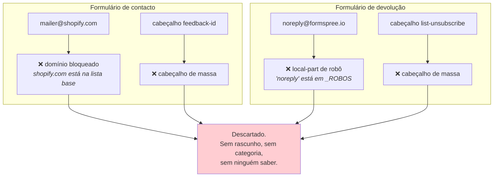
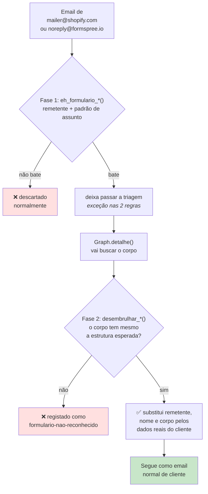

# Formulários do site

> **Pergunta que este documento responde:** como é que pedidos submetidos nos formulários do
> site chegam ao assistente, e porque é que quase os perdemos todos?

## O problema

A loja tem dois formulários no site. Nenhum envia email diretamente — ambos são **reencaminhados
por uma plataforma**, e chegam à caixa com a cara de uma notificação automática.

| Formulário | Reencaminhado por | Remetente aparente | Assunto |
|---|---|---|---|
| Contacto | Shopify | `mailer@shopify.com` | "Nova mensagem de cliente…" |
| Devolução | Formspree | `noreply@formspree.io` | "New submission on…" |

> [!WARNING] Ambos eram descartados em silêncio
> São **clientes reais disfarçados de ruído**. A triagem, a fazer bem o seu trabalho, apanhava
> os dois.

## Como cada um era apanhado



**Duas regras independentes** apanhavam cada formulário. Corrigir uma só não resolvia nada.

### O impacto real

| Formulário | Descoberto | Impacto |
|---|---|---|
| Contacto | 20/08/2026 | 3 casos reais num só dia, incluindo *"um cliente a queixar-se de já não ter tido resposta"* |
| Devolução | 22/08/2026 | **Todas** as submissões, **desde sempre** — sendo esse o passo padrão da própria base de conhecimento para iniciar uma devolução |

> [!IMPORTANT] O segundo bug é o mais instrutivo
> A base de conhecimento diz ao cliente para usar o formulário de devolução. O sistema
> descartava 100% dessas submissões. **A documentação e o comportamento contradiziam-se, e
> ninguém dava por isso** — porque um email descartado não deixa rasto nenhum.
>
> É exatamente o cenário que a métrica "clientes perdidos" do [[evaluation|banco de ensaio]]
> existe para apanhar.

## A correção — exceções em duas fases

O desenho é cuidadoso: a triagem **não** confia no que parece. Só deixa passar quem tem cara de
ser um formulário, e a confirmação a sério faz-se depois, com o corpo em mãos.



**Implemented** — a razão está no código (`desembrulhar_formulario_contacto`):

> Aqui confirma-se a sério, com o corpo em mãos, e devolve-se False se o formato não bater
> certo. Nunca se finge que se percebeu algo que pode não ser isto: passar um
> "mailer@shopify.com" sem corrigir seria pior do que tê-lo bloqueado.

### As exceções, em concreto

| Regra | Exceção | Onde |
|---|---|---|
| Local-part de robô (`noreply`) | Salta se `eh_formulario_devolucao()` | `triar()` |
| Domínio bloqueado (`shopify.com`) | Salta se `eh_formulario_contacto()` | `triar()` |
| Cabeçalho `feedback-id` | Salta se veio do formulário de contacto | `triar_cabecalhos()` |
| Cabeçalho `list-unsubscribe` | Salta se veio do formulário de devolução | `triar_cabecalhos()` |

> [!NOTE] As outras marcas de bulk mail continuam a aplicar-se
> Só estas duas são conhecidas por dar falso positivo. Um formulário que traga `Precedence: bulk`
> continua a ser descartado.

### Uma subtileza de argumentos

`triar_cabecalhos()` recebe dois *flags* do chamador:

```python
def triar_cabecalhos(msg, veio_do_formulario_contacto=False,
                      veio_do_formulario_devolucao=False) -> str | None:
```

**Implemented** — a razão está na docstring: os *flags* têm de ser calculados **antes** de
`desembrulhar_*()` substituir `msg["de"]` pelo email real do cliente. A essa altura, `msg` já não
tem `mailer@shopify.com` para se poder detetar ali dentro.

> [!TIP] A lógica das duas fases está numa função só
> `desembrulhar_formularios()` (`assistente.py`) calcula os dois flags, tenta os dois
> desembrulhares e devolve `(contacto, devolucao, motivo)`. `processar()` e as três ferramentas
> offline (`medir_deriva.py`, `reprocessar.py`, `eval.py`) chamam a mesma função, em vez de cada
> uma repetir a sequência — até 27/08/2026 as três repetiam-na mal, sem os flags, e descartavam
> submissões que a produção processa bem. Ver Finding L-2 em [[technical-debt|Dívida técnica]].

## O que cada formulário traz

### Contacto (Shopify)

Extração por regex: `E-mail:`, `Name:`, `Corpo:` (até `Website:` ou fim).

O `replyTo` do Shopify já aponta para o email real do cliente, *"por isso um rascunho normal
chega à pessoa certa"*.

### Devolução (Formspree)

O corpo chega como uma lista plana de `campo\nvalor`, separados por linha em branco. É
reestruturado num texto corrido **na ordem que interessa ao modelo**, não na ordem em que o
Formspree o reencaminha:

```
Número do pedido: #22301
Telefone: 925001122
Produto: Smartwatch Z81
Motivo principal: defeito
Onde ocorreu o problema: produto
Descrição: O relógio não liga de todo, tentei carregar 24 horas e nada.
Detalhe: Comprado há 5 dias, nunca funcionou bem.
```

Validação: o campo `email` tem de passar um regex de email válido, e tem de haver pelo menos uma
linha de conteúdo. Caso contrário, `False` → descartado com motivo explícito.

> [!TIP] As fotos vêm como anexos normais
> Os campos `foto_N` do formulário são só o **nome do ficheiro**, sem uso. As imagens em si
> chegam como anexos do email e são apanhadas pelo fluxo normal de
> [[ai-architecture|processamento de imagens]].

## Proteção contra regressão

Ambos os casos têm testes unitários (`FormularioContactoShopify`,
`FormularioDevolucaoFormspree`) **e** um caso no banco de ensaio:

| Caso | Testa |
|---|---|
| `formulario-devolucao-formspree-nao-e-descartado` | Que a submissão chega ao modelo e é respondida sem pedir dados que já vieram |

> [!TIP] A lição transferível
> Quando uma plataforma reencaminha correio de clientes, **assume que traz marcas de bulk mail**.
> Vale a pena verificar explicitamente qualquer canal de entrada que passe por um
> intermediário — o descarte é silencioso por natureza.

## Related

- [[decision-making|Tomada de decisão]] — as regras de triagem que estas exceções atravessam
- [[email|Email]] — como o detalhe é obtido na fase 2
- [[evaluation|Banco de ensaio]] — o caso que protege contra a regressão
- [[knowledge-base|Base de conhecimento]] — que manda o cliente usar o formulário de devolução
