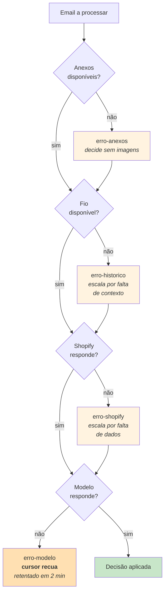
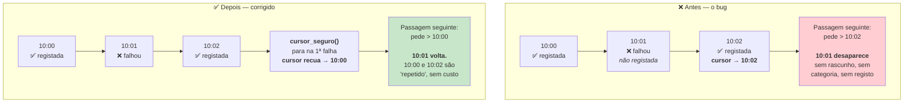

# Tratamento de erros

> **Pergunta que este documento responde:** o que acontece quando cada componente falha, e o que
> garante que nenhum email de cliente se perde?

## A filosofia: degradar por camadas, nunca perder um email

Cada integração opcional tem um `try/except` que a torna prescindível. O princípio repete-se nos
comentários do código: uma falha numa fonte de contexto **degrada** a decisão — o modelo escala
por falta de dados — mas **nunca a impede**.



## Tabela completa

| Falha | Comportamento | Consequência |
|---|---|---|
| Anexos indisponíveis | `log("erro-anexos")`, segue | Como se o email não tivesse anexos |
| Fio indisponível | `log("erro-historico")`, segue | Modelo escala por falta de contexto |
| Shopify indisponível | `log("erro-shopify")`, confiança `nenhuma` | Modelo escala por falta de dados |
| Data de entrega indisponível | `log("erro-data-entrega")`, omite a linha | Prompt já instrui a não adivinhar |
| Dossiê falha (2ª chamada) | `log("erro-dossie")`, mantém a classificação | Escala sem dossiê |
| Mensagem apagada a meio (404) | Salta só essa, regista o motivo | Passagem continua |
| **Modelo falha (1ª chamada)** | `log("erro-modelo")`, não regista, **cursor recua** | Retentado na passagem seguinte |
| Graph falha na listagem | `log("erro-graph")`, sai com código 1 | Passagem inteira falha; retentada em 2 min |
| Token Graph inválido | `sys.exit()` | Falha imediata e visível |

> [!NOTE] A degradação é sempre para o comportamento anterior à funcionalidade
> Quando a Shopify falha, o sistema comporta-se **como antes de a integração existir**: o modelo
> escala por falta de dados. Não há estado intermédio estranho.

## Os dois incidentes de produção

Ambos ocorreram a 26 de agosto de 2026, no primeiro dia.

### 16:49 — Mensagem apagada a meio da passagem

```
RuntimeError: Graph 404: {"error":{"code":"ErrorItemNotFound", …}}
→ tripat3s-assistente.service: Failed with result 'exit-code'
```

O lojista apaga ou move emails ao responder. Se isso acontecer entre a listagem e o pedido de
detalhe, o Graph devolve 404 — e a exceção **derrubava a passagem inteira**.

**Corrigido** no mesmo dia: apanha-se o 404 especificamente, regista-se
`mensagem-desapareceu-antes-do-detalhe`, e a passagem continua com as restantes mensagens.

```python
try:
    graph.detalhe(msg, cfg.max_body)
except RuntimeError as exc:
    if "Graph 404" not in str(exc):
        raise
    registar(con, msg, "saltar", "mensagem-desapareceu-antes-do-detalhe", "")
    return "saltado"
```

### 16:55 — Resposta do modelo truncada

```
erro-modelo | JSONDecodeError: Unterminated string starting at: line 1 column 205
→ passagem | vistos=1 dry_run=False falhado=1
```

Apanhado corretamente, sem *crash*. **Resolvido sozinho** na passagem seguinte, às 16:58 — o
mesmo email foi processado com sucesso.

> [!IMPORTANT] Este incidente revelou um bug maior
> Nessa passagem havia **apenas 1 mensagem**, por isso não houve perda. Com duas ou mais, o
> cursor teria avançado com a mensagem seguinte e a falhada teria desaparecido.
>
> Ver a secção seguinte.

## O cursor e a garantia de não perder emails

**Implemented** — `cursor_seguro()`, corrigido a 27/08/2026 (era o Finding C-1).

### O problema

`registar()` avança o cursor **mensagem a mensagem**. Se uma falhava a meio do lote e uma
posterior corria bem, o cursor ficava à frente da falhada — e a passagem seguinte, que só pede o
que veio **depois** do cursor, nunca mais a via.



### A correção

```python
def cursor_seguro(inicial: str, resultados: list[tuple[str, str]]) -> str:
    seguro = inicial
    for recebido, resultado in resultados:
        if resultado == "falhado":
            break
        if recebido > seguro:
            seguro = recebido
    return seguro
```

`main()` aplica-a no fim do lote e recua o cursor se este tiver passado à frente.

> [!TIP] Reprocessar não custa nada
> As mensagens que correram bem já estão em `processados`. `ja_processado()` apanha-as pelo
> Message-ID e devolve `"repetido"` **antes de qualquer chamada ao modelo**.

Cobertura: 7 testes dedicados (classe `CursorSeguro`), incluindo o caso exato do incidente.

## O padrão de retentativa: o timer

Não há lógica de *retry* dentro do processo. **A retentativa é o próprio agendamento.**

Se uma passagem falha, a seguinte corre 2 minutos depois e vê exatamente as mesmas mensagens —
porque o cursor não avançou e a deduplicação não marcou nada.

**Implemented** — o modelo `oneshot` reforça isto:

> Não há ciclo interno nem processo permanente: um arranque limpo de dois em dois minutos é mais
> robusto do que um processo que tem de sobreviver a semanas, e o estado vive no SQLite.

> [!WARNING] Consequência: uma falha permanente retenta para sempre
> Se um email causar sempre a mesma falha (por exemplo, um corpo que quebra sistematicamente o
> JSON), o cursor fica preso e cada passagem paga uma chamada ao modelo, de 2 em 2 minutos,
> indefinidamente.
>
> É o compromisso deliberado: **retentar para sempre (visível, custa dinheiro) é melhor do que
> perder um cliente em silêncio**. Um contador de tentativas exigiria uma coluna nova e não foi
> feito.

## O que não está coberto

| Cenário | Estado |
|---|---|
| Timeout de API | ✅ 60 s Anthropic · 30 s Graph · 15 s Shopify |
| JSON malformado | ✅ `JSONDecodeError` → `erro-modelo` |
| Passagens sobrepostas | ✅ `OnUnitActiveSec` conta do fim da anterior |
| Perda de email em falha do modelo | ✅ Corrigido 27/08/2026 |
| Rate limit (429) em Graph/Shopify | ✅ Corrigido 27/08/2026 |
| 5xx transitório em Graph/Shopify | ✅ Corrigido 27/08/2026 |
| Corrupção de SQLite | 🟡 Sem prevenção, mas recuperável — cópia diária via `manutencao.py` (M-4) |
| Alerta de falha repetida | ✅ `OnFailure=` + webhook opcional (M-6) |

> [!NOTE] `_com_retentativa()` — até 3 tentativas, só em GET
> O `anthropic` já fazia 2 retentativas por omissão. `Graph._pedir()` e `Shopify._procurar()`
> levantavam imediatamente em qualquer `status_code >= 400`, sem distinguir transitório de
> permanente. Corrigido a 27/08/2026 (Finding M-2): 429 e 5xx repetem com espera exponencial
> (respeitando `Retry-After` num 429); um 4xx permanente continua a sair já na primeira.
>
> `criar_rascunho()` (POST) e `marcar()` (PATCH) ficam de fora de propósito — repetir um 5xx
> nessas arriscaria duplicar um rascunho, que não é uma operação idempotente.

## Uma inconsistência residual conhecida

Se `graph.marcar()` levantar **depois** de `registar()` ter corrido, o email fica registado e com
rascunho criado, mas **sem a categoria aplicada**.

- **Não há perda** — a passagem seguinte trata-o como `"repetido"`
- **Mas** o email não aparece filtrado no Outlook, e o operador pode não o ver

Gravidade baixa; não corrigido. Documentado para não voltar a ser descoberto de raiz.

## Observar erros

```bash
journalctl -u tripat3s-assistente | grep -E "erro-|Failed|cursor-recuado"
```

| Evento | Significa |
|---|---|
| `erro-anexos` · `erro-historico` · `erro-shopify` · `erro-data-entrega` · `erro-dossie` | Falha isolada e absorvida |
| `erro-modelo` | A decisão falhou; será retentada |
| `erro-graph` | A passagem inteira falhou |
| `cursor-recuado` | Houve uma falha; o cursor recuou para não perder a mensagem |

## Related

- [[end-to-end-flow|Fluxo ponta a ponta]] — onde cada falha ocorre
- [[technical-debt|Dívida técnica]] — o que falta (retry, backup, alertas)
- [[deployment|Deployment]] — como observar em produção
- [[data-flow|Fluxo de dados]] — o cursor e a deduplicação
- [[qa|QA e testes]] — a cobertura destes caminhos
