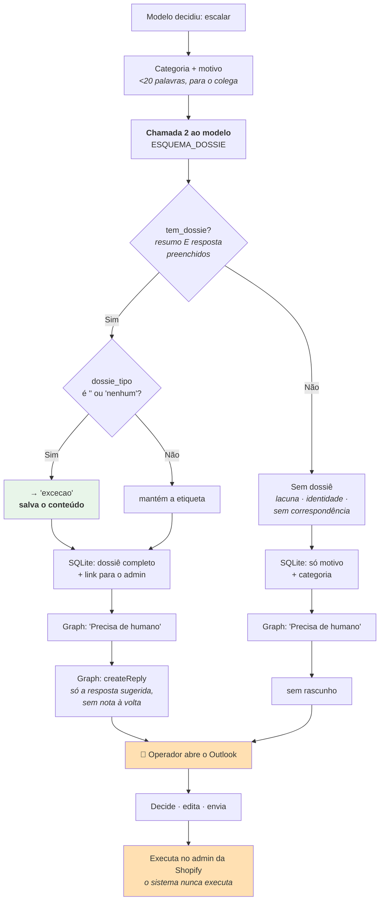
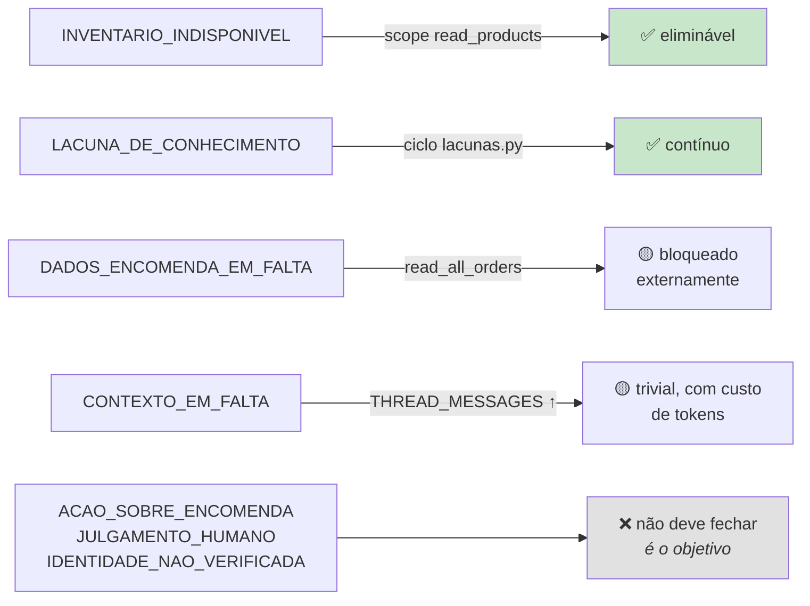

# Sistema de escalação

> **Pergunta que este documento responde:** como é que o sistema decide envolver uma pessoa, e o
> que entrega a essa pessoa quando o faz?

## O princípio

> [!IMPORTANT] Escalar não é despachar
> **Implemented** — `dossie.py`:
>
> *"Cada caso aqui traz o que foi confirmado, o que impede, a ação recomendada e a resposta ao
> cliente já redigida. O objetivo é quem decide perceber o caso em segundos, em vez de ir
> investigar."*

Uma escalação sem dossiê poupa zero trabalho. Uma escalação com dossiê poupa a maior parte.
**O indicador de saúde não é a taxa de escalação — é a fração de escalações que vêm preparadas.**

## A taxonomia — 9 categorias

**Implemented** — `CATEGORIAS`. A razão de serem identificadores fixos e não texto livre:

> Sem identificadores fixos, medir o efeito de uma alteração obriga a classificar texto livre com
> expressões regulares, que foi como se mediu até aqui e não é reproduzível.

A regra de escolha, no prompt: *"a causa principal, a que teria de mudar para este email deixar
de precisar de uma pessoa."*

| Categoria | Causa raiz | Como se fecharia | Evitável? |
|---|---|---|---|
| `DADOS_ENCOMENDA_EM_FALTA` | Deu um número, a consulta não encontrou | Janela >60 dias (`read_all_orders`) | 🟡 Parcialmente |
| `IDENTIDADE_NAO_VERIFICADA` | Existe encomenda, titularidade não provada | Nada — é a decisão correta | ❌ Não |
| `INVENTARIO_INDISPONIVEL` | Pergunta de stock | Scope `read_products` | ✅ **Sim** |
| `CONTEXTO_EM_FALTA` | Fio não veio ou insuficiente | Mais mensagens/chars | 🟡 Parcialmente |
| `LACUNA_DE_CONHECIMENTO` | A base não cobre | Escrever o facto | ✅ **Sim** |
| `ACAO_SOBRE_ENCOMENDA` | Cancelar, alterar, reembolsar, trocar | Nada — só há leitura, por desenho | ❌ Não |
| `JULGAMENTO_HUMANO` | Garantia, litígio, exceção, gesto comercial | Nada — é o objetivo | ❌ Não |
| `COMPROMISSO_ANTERIOR` | A loja prometeu, falta data ou estado | Integração com sistema de execução | 🟡 Teoricamente |
| `OUTRO` | Nenhuma das anteriores | Rever periodicamente | — |

> [!NOTE] Duas regras de prioridade, nascidas de ambiguidade real
> - `INVENTARIO_INDISPONIVEL` **tem prioridade** sobre `LACUNA_DE_CONHECIMENTO` — stock muda
>   todos os dias e escrevê-lo na base não é a correção possível.
> - `DADOS_ENCOMENDA_EM_FALTA` só se aplica quando o cliente **deu** um número. Sem número,
>   pedir o número é resposta normal, não escalação.

## O fluxo



## O dossiê — seis campos

| Campo | Conteúdo | Regra |
|---|---|---|
| `dossie_tipo` | cancelamento · reembolso · troca · garantia · alteração de morada · disputa · exceção | Só `"nenhum"` em 3 situações |
| `dossie_resumo` | A situação em 1-2 frases | Escrito para um colega |
| `dossie_validacao` | Uma verificação por linha, começada por "sim"/"não" | **Só factos que tem à frente** |
| `dossie_accao` | A ação recomendada, numa frase | Recomendação, nunca ordem |
| `dossie_risco` | baixo · medio · alto | medio = envolve dinheiro; alto = disputa formal |
| `dossie_resposta` | A resposta ao cliente já redigida | Fórmula obrigatória (ver abaixo) |

Exemplo de `dossie_validacao`, do próprio prompt:

```
sim, encomenda encontrada e identidade confirmada
sim, ainda não foi expedida
não, o pagamento já foi capturado
```

`dossie.py` renderiza-as com ✓ e ✗ — *"o símbolo é para se ver de relance qual é qual"*.

### A regra de linguagem mais afinada do sistema

> [!IMPORTANT] "Verificar **se conseguimos**", nunca "verificar e confirmamos"
> **Implemented** — no `PROMPT`:
>
> *"Uma ação ainda por decidir tem sempre incerteza sobre o resultado, não só sobre o momento — a
> fórmula é sempre 'vamos verificar internamente **se conseguimos** [a ação]', nunca 'vamos
> verificar e confirmamos [a ação]'. A segunda forma promete o resultado como certo, só falta a
> confirmação — é dizer a mais, mesmo que pareça óbvio que vai correr bem."*
>
> Corrigido a partir de um caso real de produção, 18 de agosto de 2026.

### As três situações sem dossiê

1. **`LACUNA_DE_CONHECIMENTO`** — não há nada a preparar; preparar seria inventar.
2. **`IDENTIDADE_NAO_VERIFICADA`** sem pedido concreto a sugerir — não há dados utilizáveis em
   segurança.
3. **`DADOS_ENCOMENDA_EM_FALTA`** sem qualquer correspondência — não há nada concreto para
   validar.

> [!WARNING] Fora destas três, `"nenhum"` é sempre um erro
> O prompt é explícito, porque em produção o modelo devolvia `"nenhum"` com demasiada facilidade:
>
> *"Dois pedidos parecidos (por exemplo, dois clientes a pedir o cancelamento de uma unidade a
> mais) têm de receber o mesmo tratamento — um dossiê preparado, nunca um 'nenhum' à sorte só
> porque um parecia mais simples de escrever do que o outro."*
>
> Nem "envolve dinheiro", nem "é uma unidade dentro de uma encomenda maior", nem "há incerteza
> genuína" são motivo para `"nenhum"` — é precisamente para essa incerteza que serve a fórmula
> "verificar se conseguimos".

## Validação por conteúdo, não por etiqueta

```python
tem_dossie = (
    cfg.pre_dossies
    and decisao["acao"] == "escalar"
    and bool(decisao["dossie_resumo"].strip())
    and bool(decisao["dossie_resposta"].strip())
)
dossie_tipo_final = decisao["dossie_tipo"]
if tem_dossie and dossie_tipo_final in ("", "nenhum"):
    dossie_tipo_final = "excecao"
```

> [!TIP] Porque é que o código não exige a etiqueta
> Visto em produção (18/08/2026): o modelo às vezes escreve um dossiê completo e uma resposta
> sugerida já pronta, mas **erra ou hesita só na etiqueta** e devolve `"nenhum"`. Sem esta
> tolerância, esse trabalho todo era deitado fora por causa de um campo.
>
> *"O conteúdo é que decide se há dossiê; a etiqueta é só arrumação."*

## O que o operador recebe

No Outlook, um rascunho com **apenas a resposta sugerida** — sem resumo, sem validação, sem link.

> [!NOTE] A nota interna foi removida a pedido do cliente
> *"O rascunho é só o email, sem nota nenhuma à volta — o cliente pediu para tirar a nota
> interna, quer só o texto que mandaria."*

A análise completa fica no registo, acessível por `dossie.py`:

```bash
python dossie.py --lista              # uma linha por caso
python dossie.py --caso 42            # só este
python dossie.py --tipo cancelamento
python dossie.py --risco alto
```

E termina sempre com o lembrete:

```
A ação é sempre executada por uma pessoa, no admin da Shopify.
Esta aplicação não tem permissão de escrita e não a vai ter.
```

## Registo de compromissos

Resolve um problema específico: o fio visível tem 8 mensagens, mas **um compromisso feito há três
semanas pode já não aparecer** — e um cliente que volta a perguntar não pode fazer a loja
"esquecer-se". Diagrama e modelo de dados completos em
[[data-flow|Fluxo de dados]] ("`compromissos` — estado, não histórico").

- Chave `(conversation_id, tipo)` — **estado atual, não histórico**
- Registado em **qualquer** ação: um rascunho que promete uma substituição é tanto um compromisso
  como um caso escalado
- Só os `pendente` são injetados no prompt
- `compromisso_data` só se houver data concreta dita no fio — *"nunca inventes nem estimes"*

Categoria dedicada: `COMPROMISSO_ANTERIOR`, para quando o cliente pergunta pelo estado de algo
que só uma pessoa sabe.

## Escalações evitáveis — a análise honesta

Produção, primeiro dia (23 emails — **amostra pequena, indicativa**):

| Ação | n | % |
|---|---|---|
| `escalar` | 19 | 83% |
| `rascunhar` | 3 | 13% |
| `saltar` | 1 | 4% |

Das 19 escalações, **18 traziam dossiê** (95%). As categorias dominantes foram
`ACAO_SOBRE_ENCOMENDA` e `COMPROMISSO_ANTERIOR` — ambas na coluna "Não evitável".

> [!NOTE] 83% é alto, mas a amostra não é representativa
> **Inference:** o primeiro dia coincidiu com um período de devoluções ativas. O banco de ensaio,
> construído para cobrir o espectro, tem 41% de casos a escalar.
>
> O indicador saudável não é a taxa em si, mas **escalações com dossiê / escalações totais** —
> em 95%. O valor estabilizado da taxa só se conhece no fim da semana de observação.

### O que fecharia escalações



## Related

- [[decision-making|Tomada de decisão]] — como se chega a "escalar"
- [[knowledge-base|Base de conhecimento]] — o ciclo que fecha `LACUNA_DE_CONHECIMENTO`
- [[identity-resolution|Resolução de identidade]] — a categoria que não deve fechar
- [[evaluation|Banco de ensaio]] — recall e precisão medem esta decisão
- [[operations|Ferramentas de operação]] — `dossie.py` e `lacunas.py`
- [[shopify|Shopify]] — os limites que causam algumas categorias
