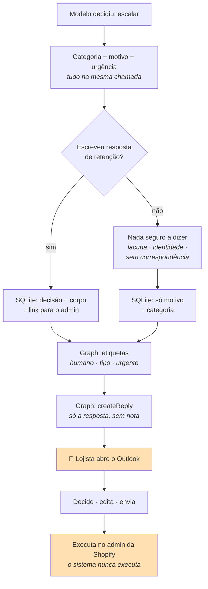
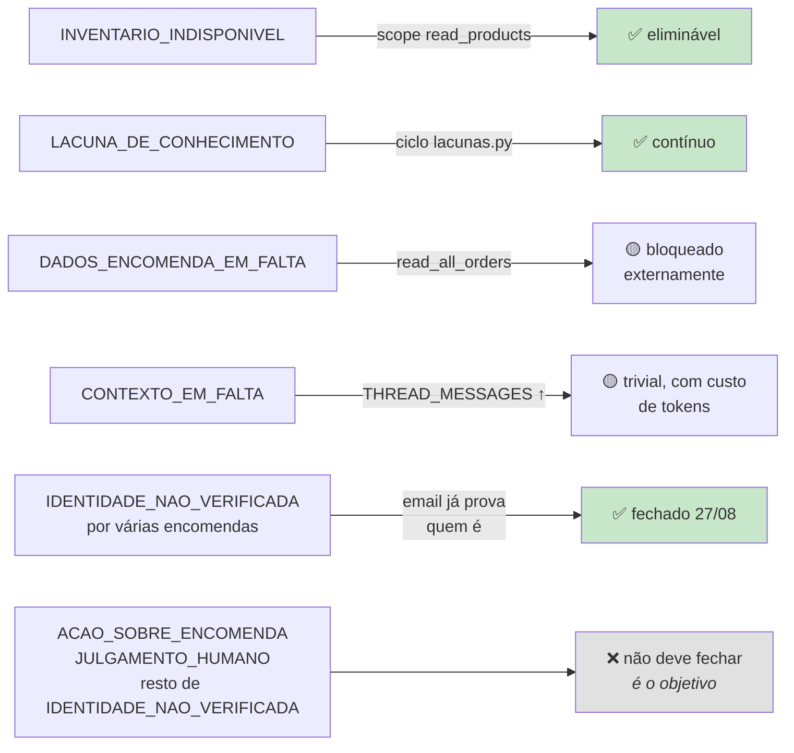

# Sistema de escalação

> **Pergunta que este documento responde:** como é que o sistema decide envolver uma pessoa, e o
> que entrega a essa pessoa quando o faz?

## O princípio

> [!IMPORTANT] Escalar não é despachar
> Um caso escalado chega ao lojista com a resposta ao cliente já redigida e com etiquetas que
> dizem o que há a fazer. O objetivo é ele perceber o caso em segundos, em vez de ir investigar.

Uma escalação sem texto preparado poupa zero trabalho. Uma escalação com a resposta escrita poupa
a maior parte. **O indicador de saúde não é a taxa de escalação — é a fração de escalações que
vêm preparadas**, medida a 01/09/2026 em 94%.

## A taxonomia — 9 categorias

**Implemented** — `CATEGORIAS`. A razão de serem identificadores fixos e não texto livre:

> Sem identificadores fixos, medir o efeito de uma alteração obriga a classificar texto livre com
> expressões regulares, que foi como se mediu até aqui e não é reproduzível.

A regra de escolha, no prompt: *"a causa principal, a que teria de mudar para este email deixar
de precisar de uma pessoa."*

| Categoria | Causa raiz | Como se fecharia | Evitável? |
|---|---|---|---|
| `DADOS_ENCOMENDA_EM_FALTA` | Deu um número, a consulta não encontrou | Janela >60 dias (`read_all_orders`) | 🟡 Parcialmente |
| `IDENTIDADE_NAO_VERIFICADA` | Existe encomenda, titularidade não provada | Nada — é a decisão correta | ❌ Não |
| ~~`IDENTIDADE_NAO_VERIFICADA` por várias encomendas do mesmo email~~ | O email já prova quem é, só a compra ficava por identificar | Corrigido 27/08/2026 — passa a `rascunhar`, pede para especificar | ✅ **Fechado** |
| `INVENTARIO_INDISPONIVEL` | Pergunta de stock | Scope `read_products` | ✅ **Sim** |
| `CONTEXTO_EM_FALTA` | Fio não veio ou insuficiente | Mais mensagens/chars | 🟡 Parcialmente |
| `LACUNA_DE_CONHECIMENTO` | A base não cobre | Escrever o facto | ✅ **Sim** |
| `ACAO_SOBRE_ENCOMENDA` | Cancelar, alterar, reembolsar, trocar | Nada — só há leitura, por desenho | ❌ Não |
| `JULGAMENTO_HUMANO` | Garantia, litígio, exceção, gesto comercial | Nada — é o objetivo | ❌ Não |
| `COMPROMISSO_ANTERIOR` | A loja prometeu, falta data ou estado | Integração com sistema de execução | 🟡 Teoricamente |
| `OUTRO` | Nenhuma das anteriores | Rever periodicamente | — |

> [!NOTE] Duas regras de prioridade, nascidas de ambiguidade real
> - `INVENTARIO_INDISPONIVEL` **tem prioridade** sobre `LACUNA_DE_CONHECIMENTO` — stock muda
>   todos os dias e escrevê-lo na base não é a correção possível.
> - `DADOS_ENCOMENDA_EM_FALTA` só se aplica quando o cliente **deu** um número. Sem número,
>   pedir o número é resposta normal, não escalação.

## O fluxo



## A resposta de retenção

Escalar não é ficar calado. Um pedido concreto sobre uma encomenda leva **sempre** pelo menos o
texto que o lojista pode enviar enquanto trata do caso — e isso sai na mesma chamada que decide.

**Medido a 01/09/2026: 94% dos casos escalados trazem a resposta já escrita.**

O que essa resposta pode dizer:

| Pode | Não pode |
|---|---|
| Confirmar que o pedido chegou e está a ser tratado | Uma data que ninguém confirmou |
| Fazer a pergunta que a base manda fazer nesta situação | Prometer que a ação vai acontecer |
| Citar prazos e políticas **já escritos** | Inventar valores, moradas ou contactos |

### A regra de linguagem mais afinada do sistema

Uma ação por decidir tem incerteza sobre o **resultado**, não só sobre o momento:

> *"Vamos verificar internamente **se conseguimos** cancelar."*
>
> nunca
>
> *"Vamos verificar e confirmamos o cancelamento."*

A segunda promete o resultado, e quem revê fica preso a ela. Nasceu de um caso real de 18/08/2026
em que uma resposta prometeu o que ainda não estava decidido.

### As três situações sem resposta

O corpo fica mesmo vazio — e não se cria rascunho — quando:

1. **Falta conhecimento** para dizer o que quer que seja
2. **A identidade não está confirmada** e não há um pedido de confirmação concreto a fazer
3. **A encomenda não tem correspondência** nenhuma

Nesses casos o email leva só as etiquetas. É a fronteira de segurança: escrever a alguém cuja
identidade não está provada é pior do que ficar calado.

> [!NOTE] Havia aqui um dossiê até 01/09/2026
> Os casos escalados faziam uma segunda chamada que preparava resumo, validações, ação recomendada
> e risco, além da resposta. Cinco desses campos nunca chegavam ao lojista — ficavam no registo
> local, e ele trabalha no Outlook. Quando confirmou que não precisava deles, a segunda chamada
> saiu e a resposta passou para o campo `corpo`.
>
> O que substituiu a função de triagem do dossiê foram as **etiquetas no Outlook**, que dizem o
> tipo de caso e se é urgente sem ser preciso abrir nada.

## O que o lojista recebe

Na lista de mensagens, **etiquetas** que dizem o que há a fazer sem abrir nada:

```
Re: Encomenda #22241    [Precisa de humano] [Ação na encomenda] [Urgente]
Re: Encomenda #22440    [Precisa de humano] [Já prometido]
Re: Devolução           [Precisa de humano] [Decisão]
```

E, ao abrir, um rascunho com **apenas a resposta ao cliente** — sem resumo, sem validação, sem
link.

> [!NOTE] A nota interna foi removida a pedido do lojista
> *"O rascunho é só o email, sem nota nenhuma à volta — o lojista pediu para tirar a nota interna,
> quer só o texto que mandaria."*
>
> Nota interna dentro do rascunho é nota interna que um dia sai para o cliente por engano.

A etiqueta de urgência só aparece quando esperar piora o caso: ameaça de queixa formal, invocação
de legislação, terceira insistência, ou valor elevado. **Nos dados históricos isso dava ~2 casos
por semana** — e é a raridade que lhe dá peso. O `metricas.py` reporta a taxa, para se poder
apertar o critério se ela subir.

## Registo de compromissos

Resolve um problema específico: o fio visível tem 8 mensagens, mas **um compromisso feito há três
semanas pode já não aparecer** — e um cliente que volta a perguntar não pode fazer a loja
"esquecer-se". Diagrama e modelo de dados completos em
[[data-flow|Fluxo de dados]] ("`compromissos` — estado, não histórico").

- Chave `(conversation_id, tipo)` — **estado atual, não histórico**
- Registado em **qualquer** ação: um rascunho que promete uma substituição é tanto um compromisso
  como um caso escalado
- Só os `pendente` são injetados no prompt
- `compromisso_data` só se houver data concreta dita no fio — *"nunca inventes nem estimes"*

Categoria dedicada: `COMPROMISSO_ANTERIOR`, para quando o cliente pergunta pelo estado de algo
que só uma pessoa sabe.

## Escalações evitáveis — a análise honesta

Produção, primeiro dia (23 emails — **amostra pequena, indicativa**):

| Ação | n | % |
|---|---|---|
| `escalar` | 19 | 83% |
| `rascunhar` | 3 | 13% |
| `saltar` | 1 | 4% |

Das 19 escalações, **18 traziam resposta preparada** (95%). As categorias dominantes foram
`ACAO_SOBRE_ENCOMENDA` e `COMPROMISSO_ANTERIOR` — ambas na coluna "Não evitável", e continuaram a
sê-lo: a 01/09, sobre 216 escalações, eram 38% e 28%.

> [!NOTE] 83% é alto, mas a amostra não é representativa
> **Inference:** o primeiro dia coincidiu com um período de devoluções ativas. O banco de ensaio,
> construído para cobrir o espectro, tem 41% de casos a escalar.
>
> O indicador saudável não é a taxa em si, mas **escalações com resposta preparada / escalações
> totais** — em 95% nesse dia, 94% uma semana depois sobre 216 casos. A taxa de escalação em si
> manteve-se entre 66% e 77%, e a análise caso a caso de 01/09 mostrou que ~74% são estruturais.

### O que fecharia escalações



## Related

- [[decision-making|Tomada de decisão]] — como se chega a "escalar"
- [[knowledge-base|Base de conhecimento]] — o ciclo que fecha `LACUNA_DE_CONHECIMENTO`
- [[identity-resolution|Resolução de identidade]] — a categoria que não deve fechar
- [[evaluation|Banco de ensaio]] — recall e precisão medem esta decisão
- [[operations|Ferramentas de operação]] — `lacunas.py` e `metricas.py`
- [[shopify|Shopify]] — os limites que causam algumas categorias
