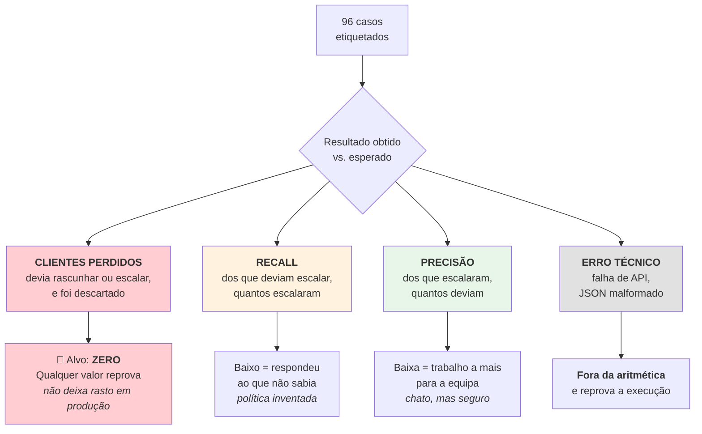

# Banco de ensaio

> **Pergunta que este documento responde:** como é que a qualidade das decisões do modelo é
> medida, e porque é que as métricas estão desenhadas assim?

`eval.py` corre a triagem e o modelo reais contra emails fixos com resultado esperado. **Não
toca na caixa de correio** — o Graph não entra — por isso é seguro correr contra uma
configuração de produção.

## As três métricas — e porque não valem o mesmo

Esta é a parte mais interessante do desenho.



| Métrica | Definição | Alvo |
|---|---|---|
| **Clientes perdidos** | Casos que deviam gerar rascunho ou escalação e foram descartados | **Zero.** Qualquer valor acima reprova a execução |
| **Recall de escalação** | Dos casos que deviam escalar, quantos escalaram | Alto |
| **Precisão de escalação** | Dos que escalaram, quantos deviam | Alto |

**Implemented** — `eval.py`, na docstring do módulo:

> **clientes perdidos** — casos que deviam gerar rascunho ou escalação e foram descartados. Em
> produção não deixam rasto que alguém veja. Alvo: zero.

### O tratamento de erros técnicos

> [!IMPORTANT] Uma falha técnica não é uma decisão
> **Implemented** — `eval.py`:
>
> *"Uma falha técnica não é uma decisão: fica marcada como ERRO, fora da aritmética, e reprova a
> execução. Sem isso, **uma chave expirada daria 'recall 100%'** — todos os casos por responder
> escalam, e escalar parece correto."*
>
> É um detalhe de rigor estatístico raro em suites de avaliação de LLMs. Sem ele, o modo de
> falha mais comum (credenciais) produziria a melhor pontuação possível.

## Asserções disponíveis

Um caso pode exigir muito mais do que a ação correta.

| Asserção | Testa |
|---|---|
| `expect` | A ação: `rascunhar`, `escalar`, `saltar` |
| `expect_categoria` | A categoria de escalação exata |
| `expect_sem_corpo` | Que **não** se escreva resposta (fronteira de segurança) |
| `expect_corpo` | Que um caso escalado traga a resposta de retenção escrita |
| `expect_parcial` | Que `por_responder` seja assinalado |
| `expect_sem_parcial` | Que **não** seja — o email foi respondido todo |
| `expect_compromisso` | O tipo de compromisso registado |
| `expect_sem_data_de_compromisso` | Que não invente uma data |
| `imagens` | Fixtures de imagem anexadas ao caso |

> [!TIP] As duas asserções do corpo são a mesma fronteira, vista dos dois lados
> `expect_corpo` diz que escalar não é ficar calado; `expect_sem_corpo` diz que há casos em que
> escrever seria pior do que ficar. Substituíram as três asserções do dossiê a 01/09/2026, quando
> o dossiê saiu — 9 casos migraram para a primeira, 2 para a segunda, e 16 desapareceram por
> serem asserções vazias em casos `rascunhar`, onde nunca houve dossiê.

## Casos portáteis

Os endereços aceitam `{mailbox}` e `{domain}`:

```json
"from": "joao@{domain}",
"to": ["{mailbox}"]
```

**Implemented** — sem isto, *"um caso que afirma 'o remetente é um colega' só valeria para a loja
contra a qual os casos foram escritos, e deixaria calado de testar seja o que for para qualquer
outra"*.

## Proveniência dos casos

Muitos vêm de produção real e **trazem-no escrito na nota**:

| Caso | Origem |
|---|---|
| `formulario-devolucao-formspree-nao-e-descartado` | Bug de 22/08 — todas as submissões descartadas desde sempre |
| `duas-encomendas-mencionadas-pergunta-qual` | Bug de 22/08 — `.search()` em vez de `.finditer()` |
| `devolucao-adiar-envio-verifica-prazo-14-dias` | Erro de cálculo de data, 21/08 — expectativa invertida a 01/09 |
| `cancelar-unidade-extra-antes-de-expedir-nunca-promete` | Regra de linguagem do cliente, 26/08 |
| `queixa-de-qualidade-pede-prova-antes-de-devolucao` | Caso real de produção, 17/08 |

> [!TIP] As notas documentam a evolução da regra, incluindo inversões
> Vários casos registam que a expectativa **mudou**:
>
> *"mudou de escalar para rascunhar em 17/08/2026. Antes escalava por a base não cobrir descontos
> por quantidade, e ausência de regra nunca é prova de que a resposta é não. A loja confirmou que
> não há desconto por quantidade (…), e passou a haver regra escrita para responder."*
>
> Isto torna o banco de ensaio um **registo histórico das políticas**, não só um teste.

E alguns casos documentam **deliberadamente não testar** algo:

> *"A categoria oscila entre ACAO_SOBRE_ENCOMENDA e JULGAMENTO_HUMANO (ambas defensáveis) e não
> vale a pena forçar uma sobre a outra (…). Testa-se só a ação, não a categoria."*

## Distribuição

| | n | % |
|---|---|---|
| `rascunhar` | 52 | 54% |
| `escalar` | 34 | 35% |
| `saltar` | 10 | 10% |
| **Total** | **96** | |

## Modos de execução

```bash
python eval.py --triagem                      # grátis, só regras determinísticas
python eval.py --casos eval/subset.json       # 23 casos delicados, ~0,30 €
python eval.py                                # os 96, ~1,30 €
python eval.py --caixa apoio@outraloja.pt     # sobrepõe MAILBOX
```

> [!NOTE] O eval não precisa das credenciais do Graph nem da Shopify
> **Implemented** — `main()` preenche-as com valores fictícios: *"nenhuma etapa do ensaio toca no
> Graph nem na Shopify, por isso exigir estas credenciais bloquearia uma execução que tem tudo o
> que precisa"*. Os dados da encomenda vêm do próprio JSON do caso.

## Resultados medidos

**26 de agosto de 2026**, subconjunto de 23 casos delicados:

| | Sonnet 5 | Haiku 4.5 |
|---|---|---|
| Casos corretos | 21/23 (91%) | 19/23 (83%) |
| **Clientes perdidos** | **0** | **0** |
| Recall de escalação | 91% | 91% |
| Precisão de escalação | 91% | **77%** |

> [!IMPORTANT] O que a estrutura assimétrica revelou
> Uma métrica agregada teria dito apenas "o Haiku é 8 pontos pior". A separação mostrou que
> **recall e clientes perdidos eram idênticos** — o Haiku não respondia ao que não sabia, nem
> perdia clientes. Toda a diferença estava na **precisão**: escalava casos que sabia resolver.
>
> Tradução para a decisão de negócio: o modelo mais barato não piora as respostas ao cliente,
> **piora a poupança de trabalho à equipa**. São coisas diferentes, com valores diferentes.

### As falhas por natureza

| Caso | Sonnet | Haiku | Natureza |
|---|---|---|---|
| Higiene: fones usados só têm troca | ❌ | ✅ | Regra de baixa saliência |
| **Pack: valor = total ÷ nº artigos** | ❌ | ❌ | **Aritmética — falha em ambos** |
| Bateria inchada: avisar antes de pedir prova | ✅ | ❌ | Ordem numa regra composta |
| Foto ilegível: pedir outra | ✅ | ❌ | Julgamento sobre prova |

O caso do pack é o Finding H-3: a regra existe e está escrita, mas ambos os modelos falham a
aplicá-la. Ver [[technical-debt|Dívida técnica]].

### 1 de setembro de 2026 — depois de remover o dossiê

O mesmo subconjunto, corrido para verificar que passar de duas chamadas para uma não degradava o
texto:

| | 26/08 | 01/09 |
|---|---|---|
| Casos corretos | 21/23 | **21/23** |
| **Clientes perdidos** | **0** | **0** |
| Recall de escalação | 91% | **91%** |
| Precisão de escalação | 91% | **91%** |

Números idênticos. Mas os agregados podem esconder trocas, por isso as duas falhas foram lidas
uma a uma:

- **O caso do pack** falhou outra vez — é o H-3, conhecido e documentado, e já falhava na linha
  de base.
- **O caso do prazo de devolução** falhou por a *expectativa* estar desatualizada, não o modelo:
  esperava `escalar`, mas a regra "Quando o prazo já passou" entrou em `devolucoes.md` a 28/08 e
  diz explicitamente que recusar com a alternativa de troca é *"a resposta normal, não uma
  escalação"*. A resposta gerada confirmava o prazo, recusava o reembolso e oferecia a troca como
  pergunta — exatamente o que a regra manda. O caso foi corrigido para `rascunhar`.

> [!TIP] Um agregado igual não prova ausência de regressão
> As duas falhas podiam ter sido outras duas, com o mesmo total. Ler quais falharam foi o que
> permitiu concluir que a mudança não degradou nada — e apanhar, de caminho, um caso de ensaio
> que estava a testar uma política revogada há quatro dias.

## Limitações do banco de ensaio

> [!NOTE] O eval não exercita `processar()` — mas `test_assistente.py` exerce, à parte
> `eval.py` chama `a.decidir()` **diretamente**, com `dados_encomenda` pré-cozinhado do JSON.
> Portanto **não testa aqui**: resolução de identidade integrada, agregação de múltiplas
> encomendas, gating do dossiê, rebaixamento de corpo vazio, criação de rascunho, aplicação de
> categorias — mede a qualidade do **julgamento do modelo**, não a correção da **orquestração**.
>
> Essa orquestração tem cobertura própria, sem gastar créditos: a classe `Processar` em
> `test_assistente.py` (Finding H-2, fechado 27/08/2026). Ver [[qa|QA e testes]].

Outras limitações:

- **Casos escritos por quem escreveu o sistema** — enviesamento inevitável para o que se sabia
  testar.
- **Sem casos adversariais sistemáticos** — há um de injeção de prompt, mas não uma bateria.
- **Variabilidade não medida** — os casos correm uma vez; não há execuções repetidas para separar
  falha genuína de variância. Existe uma nota de projeto a lembrar repetir 2-3 vezes antes de
  chamar instabilidade a uma falha.

## Related

- [[qa|QA e testes]] — as outras camadas de verificação
- [[decision-making|Tomada de decisão]] — o que está a ser avaliado
- [[escalation|Escalação]] — recall e precisão referem-se a esta decisão
- [[knowledge-base|Base de conhecimento]] — onde os factos novos ganham um caso
- [[technical-debt|Dívida técnica]] — Finding H-3, o caso do pack
