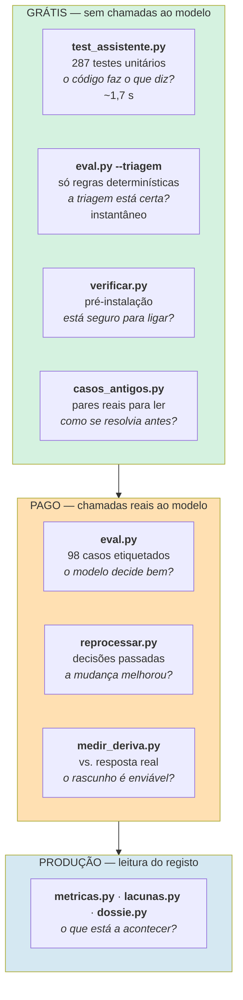
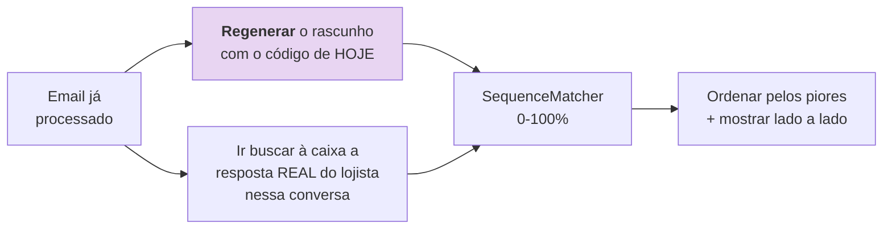
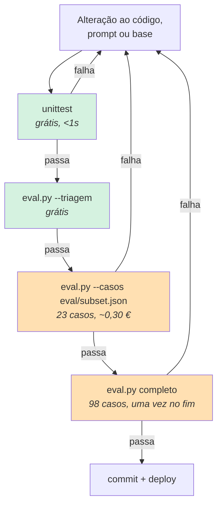

# QA e testes

> **Pergunta que este documento responde:** como é que se sabe que o sistema funciona, e o que é
> que a estratégia de testes não cobre?

## Quatro camadas independentes

Cada uma responde a uma pergunta diferente e tem um custo diferente.



## Camada 1 — Testes unitários

**Implemented** — 287 testes, `unittest` da biblioteca padrão, **zero dependências de teste**.

| Área | Classes | Cobre |
|---|---|---|
| Triagem | `Triagem`, `TriagemCabecalhos` | As 11 regras determinísticas |
| Formulários | `FormularioContactoShopify`, `FormularioDevolucaoFormspree`, `DesembrulharFormularios` | Desembrulhar e rejeitar |
| Texto | `Texto`, `HtmlDeSaida`, `LixoAposAssinatura` | HTML→texto, corte de citação, escape |
| Encomendas | `NumeroDeEncomenda`, `ResumoDeEncomenda` | Extração e formatação |
| Identidade | `ResolucaoDeIdentidade`, `EmailsIguais` | Os 4 níveis + opções seguras quando o email já bate, com `ShopifyFalsa` |
| Anexos | `AnexosDeImagem`, `DecidirComImagens` | Filtro e notas, com `ClienteFalso` |
| Persistência | `Registo`, `RegistoDeCompromissos`, `CursorSeguro` | Cursor, dedup, compromissos |
| Rede | `RetentativaHttp` | Backoff em GET, 429/5xx vs. erros permanentes |
| Segurança | `VerificarRestricaoDiaria` | Verificação diária da restrição do Exchange |
| Orquestração | `Processar` | A função inteira: triagem, identidade, dossiê, aplicação da decisão, robustez a falhas do Graph na aplicação |
| Fecho de ciclo | `FecharCiclo`, `CompararGravado` | Classificação apagado/pendente/enviado pelo `rascunho_id`; comparação do corpo gravado com a resposta real, sem regenerar |
| Custo | `CustoEstimado`, `RegistoDeCusto` | Multiplicadores de cache (leitura 0,1× / escrita 2×), e que o `usage` da API chega ao registo |
| Base de conhecimento | `AnalisarBase` | `verificar_kb.py` — montagem do pedido e leitura da resposta, com `ClienteFalso` |
| Anonimização | `Anonimizacao`, `EnderecoAnonimizado`, `Palpite` | `exportar.py` |

```bash
python -m unittest test_assistente -q
```

> [!TIP] A maior lacuna de cobertura fechou a 27/08/2026
> `processar()` tinha ~280 linhas, 10 pontos de retorno e zero testes — a concentração de risco
> do sistema. A classe `Processar` (28 testes) cobre agora os 10 pontos de retorno e os ramos que
> os alimentam: triagem antes e depois do detalhe, formulários, anexos e histórico (com falha
> absorvida), as quatro combinações de resolução de identidade, o gating do dossiê (incluindo o
> caso "sem tipo mas com conteúdo"), rascunho completo/parcial/vazio, e escalação com e sem
> dossiê. Finding H-2 em [[technical-debt|Dívida técnica]], fechado.

## Camada 2 — Banco de ensaio

98 casos etiquetados, com métricas assimétricas. Tem documento próprio:
[[evaluation|Banco de ensaio]].

## Camada 3 — Medição de deriva

**Implemented** — `medir_deriva.py`. Responde à pergunta que nenhuma outra camada responde:
**o rascunho é bom o suficiente para alguém o enviar?**



Regenerar em vez de usar o corpo gravado é deliberado:

> O registo local guarda o texto de quando o email foi processado, que pode ser de antes da
> última correção ao prompt ou à base. **Comparar código antigo contra a resposta real não diz
> nada sobre a qualidade do assistente agora.**

### A honestidade metodológica

O ficheiro documenta as suas próprias limitações — invulgar numa ferramenta de medição:

> [!NOTE] O número é uma bússola, não uma nota
> *"Um rascunho pode ter 40% de semelhança de caracteres e estar certo (o lojista escreveu por
> outras palavras a mesma coisa), ou ter 80% e estar errado (mudou só a parte que importava).
> **Ler é obrigatório**; o número só ajuda a decidir por onde começar."*

E uma armadilha antecipada: se um rascunho tiver sido criado manualmente para demonstração, seria
lido como "resposta real do lojista". O código deteta-o pelo prefixo de aviso e exclui-o.

> [!WARNING] A referência nunca foi medida
> O limiar *"acima de 60% editado, o rascunho é ruído"* aparece em `registar()` e no README como
> referência do projeto. Mas `medir_deriva.py` declara explicitamente que **nunca foi medido**.
>
> A ferramenta existe e funciona; a linha de base continua por estabelecer.
> Finding M-3 em [[technical-debt|Dívida técnica]].

## Camada 4 — Verificação pré-instalação

**Implemented** — `verificar.py`. Corre no dia da instalação, antes de ligar seja o que for.

| Verifica | Falha? |
|---|---|
| Configuração completa | Obrigatória |
| Base de conhecimento não vazia + tamanho vs. mínimo de cache | Aviso |
| Chave da Anthropic responde | Obrigatória |
| Autenticação Graph + leitura da caixa alvo | Obrigatória |
| **A aplicação NÃO consegue ler outra caixa** | **Obrigatória** |
| Autenticação Shopify + scope `read_orders` ativo | Obrigatória |

Sai com código 1 se alguma obrigatória falhar, *"para poder ser usado como porta de entrada num
script de instalação"*.

O teste de segurança é **ativo**, não declarativo. Ver [[email|Email]] e [[security|Segurança]].

## Camada auxiliar — Reprocessamento

**Implemented** — `reprocessar.py`. Responde a: *uma alteração ao prompt, à base ou uma
integração nova mudou alguma coisa nos casos reais que já passaram por aqui?*

Vai buscar o email original à caixa pelo `internetMessageId` e corre a passagem inteira outra
vez. **Nunca cria rascunhos nem marca categorias.**

```bash
python reprocessar.py --acao escalar -n 20 --detalhe
```

Mostra quantas decisões mudaram e, com `--detalhe`, o corpo dos rascunhos novos.

## Fluxo de trabalho recomendado



> [!TIP] Subconjunto primeiro, corrida completa uma vez
> Correr os 98 casos a cada iteração é desperdício. O `eval/subset.json` tem 23 casos
> escolhidos pelos mais delicados (devoluções, garantias, identidade) e dá o sinal em ~⅓ do
> custo.

## O que a estratégia não cobre

| Lacuna | Consequência |
|---|---|
| Sem testes de integração reais | Graph e Shopify só testados com duplos ou em produção |
| Sem teste de carga | Comportamento com >25 mensagens por passagem nunca exercitado |
| Deriva não medida continuamente | O sistema pode degradar sem sinal |
| Contradições na base não detetadas | Duas regras conflituantes passam |

Ver [[technical-debt|Dívida técnica]] e [[improvements|Melhorias]].

## Related

- [[evaluation|Banco de ensaio]] — a camada 2 em detalhe
- [[guardrails|Guardrails]] — o que os testes protegem
- [[operations|Ferramentas de operação]] — as ferramentas de produção
- [[technical-debt|Dívida técnica]] — as lacunas de cobertura
- [[deployment|Deployment]] — o gate de qualidade que corre antes de cada deploy
