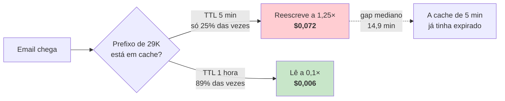

# Auditoria de custo da API

> **Pergunta que este documento responde:** onde é que o dinheiro da Anthropic está a ser
> gasto, e o que se pode cortar sem perder qualidade?

Auditoria de **30 de agosto de 2026**, sobre os 5 primeiros dias de produção (26-30/08).
Custo reportado pelo cliente antes da auditoria: **~4 €/dia**.

> [!IMPORTANT] O que este sistema **não** faz — e que a maioria das auditorias de custo procura
> Não usa Opus, não usa *effort* elevado, não tem *tool use*, não tem ciclo agêntico, e não tem
> retries em cascata. É **uma chamada por email** (duas quando escala), com `thinking` desativado
> e `max_tokens=2048`. Não há aqui nenhum modelo caro a ser usado por engano — a fatura vem
> quase toda de um sítio só, e é o prefixo.

## Onde estava o dinheiro

**Medido** — todas as chamadas do caminho de produção:

| Local | Função | Modelo | Chamadas/email | Contexto | Finalidade |
|---|---|---|---|---|---|
| `assistente.py` | `decidir()` → núcleo | `claude-sonnet-5` | **1, sempre** | prefixo ~29K + email | Decidir rascunhar/escalar/saltar |
| `assistente.py` | `decidir()` → dossiê | `claude-sonnet-5` | **1, só se escalar** | o mesmo + instrução | Preparar o caso para o humano |
| `verificar.py` | instalação | idem | manual | 1 token | Confirmar que a chave funciona |
| `verificar_kb.py` | manual | idem | manual | base inteira | Contradições na base |
| `eval.py`, `reprocessar.py`, `medir_deriva.py` | manual | idem | manual | por caso | Avaliação — fora do caminho de produção |

Nos 5 dias medidos: **171 emails chegaram ao modelo** (de 184 processados — 13 foram
descartados pela triagem, a custo zero) e geraram **303 chamadas**. As escalações são 77% dos
emails e, por fazerem 2 chamadas, representam **87% de todas as chamadas**.

## O achado principal: o TTL da cache estava errado para este padrão de tráfego

O prefixo de sistema (instruções + base de conhecimento, **~29 000 tokens**) é idêntico em todas
as chamadas e está marcado para cache. O que decide o custo é se cada chamada **lê** esse prefixo
(0,1× do preço de entrada) ou o **reescreve** (1,25× com o TTL de 5 minutos por omissão).

**Medido** sobre os *timestamps* reais de produção — a "TTL walk" sobre os 171 emails:

| | TTL 5 min (era) | TTL 1 hora (é) |
|---|---:|---:|
| Chamadas que apanham cache quente | 42 (**25%**) | 151 (**89%**) |
| Chamadas que reescrevem as 29K tokens | 129 | **20** |
| Preço da escrita | 1,25× | 2× |

O intervalo **mediano** entre emails é de **14,9 minutos**, e 109 dos 170 intervalos caem entre
5 e 60 minutos — exatamente a janela onde o TTL de 1 hora compensa. A escrita passa a custar o
dobro, mas acontece **6× menos vezes**.



> [!TIP] Porque é que isto é um *free win* e não um compromisso
> Não muda o modelo, o prompt, o contexto, nem a decisão. É **um parâmetro** — o mesmo pedido,
> com a cache a durar mais tempo. Não há nada de qualidade a trocar.

### O efeito estimado

**Estimativa**, não fatura — a ~50 emails/dia a chegarem ao modelo, com a distribuição medida
(77% escalar / 21% rascunhar):

| | Antes (5 min) | Depois (1 h) |
|---|---:|---:|
| Escritas de cache | ~37/dia | **~6/dia** |
| Custo de entrada | ~$3,15/dia | **~$1,26/dia** |
| Custo de saída | ~$0,38/dia | ~$0,38/dia |
| **Total** | **~$3,5/dia** | **~$1,6/dia** |

Redução esperada: **~54%**. Os valores de saída não mudam — só a entrada é que era o problema.

> [!WARNING] Isto é uma estimativa até haver dados reais
> Os números de entrada vêm da simulação de TTL sobre *timestamps* reais e do tamanho do prefixo
> medido com `count_tokens`; os de saída, do comprimento real dos textos gravados. **A
> confirmação verdadeira vem do registo de tokens** (abaixo), que passou a existir no mesmo
> commit — a primeira semana com ele dirá o número real.

## Observabilidade de custo

Antes desta auditoria, o sistema **não registava tokens nenhuns** — a única fonte era a fatura
mensal da Anthropic, agregada e sem forma de a atribuir a um email. Sem isso não há como provar
que uma alteração fez o que se esperava.

`decidir()` passou a devolver o `usage` que a API reporta, e `registar()` grava-o:

| Coluna | O que é |
|---|---|
| `modelo` | Qual modelo respondeu (para o custo não ser calculado com o preço errado) |
| `tokens_entrada` | Entrada não cacheada, ao preço cheio |
| `tokens_cache_escrita` | Prefixo reescrito, a 2× |
| `tokens_cache_leitura` | Prefixo lido, a 0,1× |
| `tokens_saida` | O que o modelo gerou |
| `chamadas_modelo` | 1 ou 2 (2 = escalou e preparou dossiê) |
| `custo_estimado` | A conta, em dólares |

`metricas.py` mostra o custo por email, a taxa de acerto da cache, e **o custo por resultado
útil** — por rascunho e por escalação, que é a pergunta de negócio, não "quantos tokens".

> [!NOTE] `custo_estimado` não é faturação
> Usa a tabela de preços em `PRECOS` (`assistente.py`). Se os preços mudarem, o valor absoluto
> fica desatualizado em silêncio — as comparações relativas (antes vs. depois) continuam
> válidas. Ver [[operations|Ferramentas de operação]].

## Levers considerados e rejeitados

Honestidade sobre o que **não** vale a pena — para não voltar a ser investigado do zero:

| Lever | Porque não |
|---|---|
| **Cachear também a mensagem do utilizador** | O `pedido` é único por email: cacheá-lo era escrever a 2× algo que só se lê uma vez (na 2ª chamada) e nunca mais. Uma sobretaxa pura para os 21% que não escalam. O guia da Anthropic assinala isto explicitamente como anti-padrão |
| **Trocar para Haiku 4.5** | Já medido a 26/08: mesmo *recall*, mesmos clientes perdidos, mas **precisão de escalação de 77% contra 91%**. Escalaria mais casos que sabia resolver — troca custo por trabalho manual do lojista. Ver [[evaluation\|Banco de ensaio]] |
| **Baixar o `effort`** | Não se aplica: `thinking` já está desativado, que é o mais barato nesse eixo |
| **Batch API (-50%)** | O produto é o rascunho já estar lá quando o lojista abre o Outlook. O *batch* tem até 24 h de latência — mataria o produto para poupar metade de uma fatura pequena |
| **Encolher a base de conhecimento** | Com o TTL corrigido, o prefixo é lido a 0,1× em 89% das chamadas — o seu custo marginal colapsou. Cortá-la agora poupava pouco e arriscava a qualidade que é o valor do sistema |
| **Combinar as 2 chamadas numa** | Já foi tentado e reverteu-se, e **voltou a ser medido a 31/08/2026** com números exatos — ver "Segunda auditoria" abaixo. Não é viável: 17 propriedades levam 68 s, acima do `timeout=60.0` do cliente. Ver decisão D4 em [[technical-decisions\|Decisões técnicas]] |
| **Retries e loops** | Auditado no journal: **3 falhas em 5 dias**, todas auto-resolvidas na passagem seguinte. Não há fuga aqui |

## Segunda auditoria — 31 de agosto de 2026

Feita sobre 69 emails reais que chegaram ao modelo num dia, já com o TTL corrigido e as colunas
de custo a registar. A decomposição contradiz a intuição de que o problema é o volume de
contexto:

| Componente | Custo | % |
|---|---|---|
| **Cache escrita** | $1,649 | **51,8%** |
| Cache leitura | $0,680 | 21,4% |
| Saída | $0,528 | 16,6% |
| Entrada nova | $0,325 | 10,2% |

Os 89% de acerto são reais, mas **os 11% de falhas custam 2,4× mais do que todos os acertos
somados**: 14 escritas custam $1,65, 117 leituras custam $0,68.

### Há duas entradas de cache, não uma

Reconstruindo as 8 falhas de cache do dia evento a evento, a aritmética fecha exatamente:

```
núcleo = 31 330 tokens   (rascunhar = só a 1ª chamada)
dossiê = 31 166 tokens   (62 496 − 31 330, nas escalações com cache fria)
delta  =    164 tokens
```

O mesmo delta de 164 aparece outra vez, de forma independente, num par de emails 9 minutos
apartados (31 809 vs. 31 645). **O esquema entra no prefixo em cache**, por isso o núcleo e o
dossiê mantêm entradas separadas e um arranque a frio escreve o prompt duas vezes.

> [!WARNING] Uni-los para poupar essa escrita não é possível — está medido
> Uma chamada real por configuração, 31/08/2026:
>
> | Esquema | Propriedades | Tempo | Resultado |
> |---|---|---|---|
> | Núcleo (atual) | 11 | **5,34 s** | OK |
> | União núcleo+dossiê | 17 | **67,89 s** | OK, mas acima do `timeout=60.0` |
> | União + 2 (controlo) | 19 | 184,03 s | **400 "Schema is too complex"** |
>
> As 17 propriedades estourariam o timeout em **todas** as chamadas — falha total, não
> intermitente. E o custo não é linear (11→5 s, 17→68 s), por isso aparar um campo ou dois
> também não salva. **As duas entradas de cache são o preço de manter cada chamada nos ~5 s**,
> e o desenho de duas chamadas é load-bearing, não uma verruga.
>
> O ensaio custou ~$0,008 e evitou um deploy que teria parado o atendimento.

### O que sobra: as escritas por deploy

Das 8 falhas de cache do dia, **4 foram expirações legítimas de TTL** (intervalos de 162, 62 e
215 minutos, de madrugada) e **3 foram causadas por deploys** — cada deploy muda o prompt e
invalida as duas entradas.

| | Escrita | Custo |
|---|---|---|
| Expiração de TTL (inevitável) | 218 818 tokens | $0,875 |
| **Deploys (evitável)** | **193 526 tokens** | **$0,774** |

Num dia de 6 deploys como este, **um quarto da fatura foi o custo de publicar alterações à base
de conhecimento em horário de tráfego**. O TTL de 1 h continua adequado: o desperdício não está
na sua duração, está em reaquecer a cache várias vezes por dia sem necessidade.

> [!NOTE] $3,18 não é a linha de base
> Este foi um dia atípico, com 6 deploys. Sem eles a fatura teria sido ~$2,41. Para uma linha de
> base real falta um dia sem deploys.

## O lever que sobra, e não é técnico

**77% dos emails escalam.** Como cada escalação faz 2 chamadas e gera ~3× mais tokens de saída
que um rascunho, é a taxa de escalação — não o preço por token — que domina o que resta da
fatura depois do TTL.

Baixá-la não é uma otimização de custo: é o trabalho normal de fechar lacunas na base de
conhecimento ([[knowledge-base|Base de conhecimento]]) e de destravar as categorias externas
([[escalation|Escalação]]). Poupa dinheiro **e** trabalho humano ao mesmo tempo — mas
mede-se em semanas, não num commit.

## Related

- [[ai-architecture|Arquitetura de IA]] — o mecanismo das chamadas e do cache
- [[operations|Ferramentas de operação]] — `metricas.py` e o relatório de custo
- [[evaluation|Banco de ensaio]] — a medição Sonnet vs. Haiku que fecha esse lever
- [[scalability|Escalabilidade]] — o custo por escala, e porque o regime de cache o domina
- [[technical-decisions|Decisões técnicas]] — D4, porque são duas chamadas e não uma
