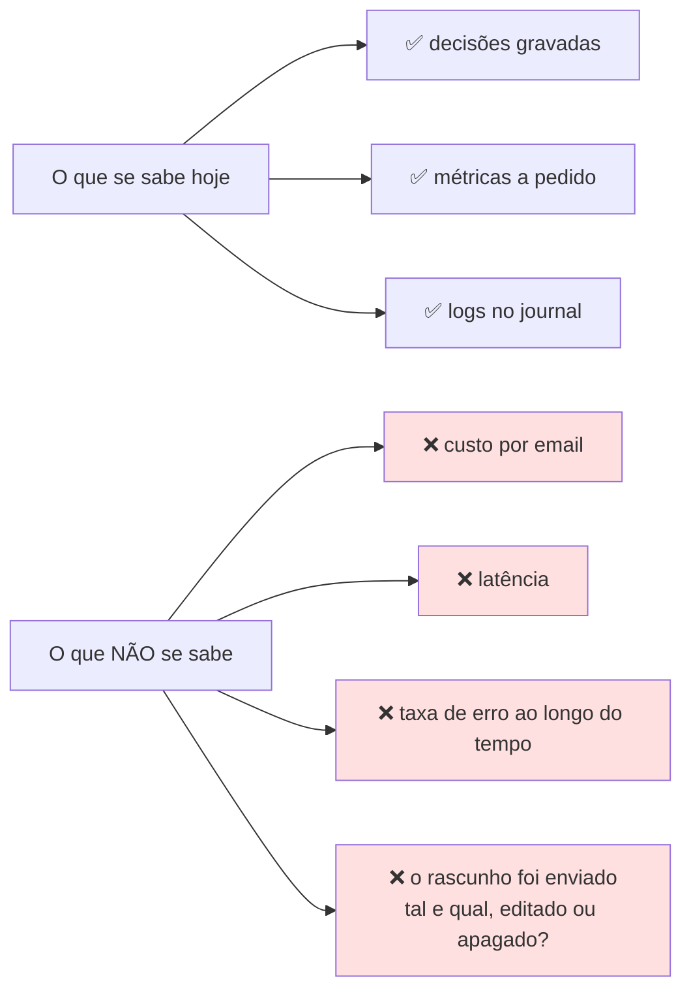

# Limitações

> **Pergunta que este documento responde:** o que é que este sistema não consegue fazer hoje, e
> porquê?

Distinguem-se três tipos, com implicações diferentes:

| Tipo | Significa |
|---|---|
| 🔒 **Por desenho** | Não é uma falha. É o que torna o sistema seguro |
| 🌐 **Externa** | Bloqueada por terceiros; não depende de nós |
| 🔧 **Corrigível** | Falta trabalho — ver [[improvements\|Melhorias]] |

---

## 🔒 Por desenho

> [!IMPORTANT] Estas três não são funcionalidades em falta
> São as propriedades que tornam todo o resto tolerável. Removê-las mudaria a natureza do
> sistema.

| Limitação | Consequência | Porquê |
|---|---|---|
| **Não envia email** | Tudo passa por revisão humana | Sem `Mail.Send`. O dano máximo de qualquer falha é texto que se apaga |
| **Não escreve na Shopify** | Cancelamentos e reembolsos escalam sempre | `read_orders` apenas. Quem executa é uma pessoa, no admin |
| **Não aprende sozinho** | Melhora só quando alguém edita `knowledge/` | *"O mecanismo de melhoria tem de ser legível por um humano"* |

---

## 🌐 Externas

### Shopify: janela de 60 dias

`read_orders` só dá acesso aos últimos 60 dias de encomendas.

**Impacto medido** (14/08/2026, sobre emails já processados): das 10 encomendas mencionadas por
clientes, **9 estavam dentro da janela** (idade mediana 3 dias, máxima 28) e 1 ficou de fora.
Os fios duram em mediana 2 dias; só 5% passam dos 30.

> **O limite morde em cerca de 1 em 10 casos — não é o travão principal.**

Desbloquear exige `read_all_orders`, um scope protegido. Já foi tentado: declará-lo no TOML
**não chega** — tem de ser pedido e aprovado no Dev Dashboard. Ver [[shopify|Shopify]].

### Shopify: sem acesso a produtos

Sem `read_products`, qualquer pergunta sobre stock ou reposição escala em
`INVENTARIO_INDISPONIVEL`.

> [!TIP] É a limitação externa mais facilmente removível
> O padrão de integração já existe; falta pedir o scope. Ver [[improvements|Melhorias]] (P2-4).

### Microsoft Graph

| Limitação | Consequência |
|---|---|
| `$orderby` + filtro por `conversationId` é recusado | Ordenação do fio feita em Python |
| `bodyPreview` vem truncado | O fio tem detalhe limitado por construção |

---

## 🧠 Do modelo

Todas verificadas na medição de 26/08/2026.

| Limitação | Evidência | Estado |
|---|---|---|
| **Aritmética não fiável** | Errou o prazo de devolução **com a data de entrega à mão** (21/08) | Contornado — cálculo movido para Python |
| **Regras compostas falham** | Pack (90 € ÷ 3 = 30 €) falha em **ambos** os modelos | ❌ Não resolvido — Finding H-3 |
| **Baixa saliência em documentos grandes** | Higiene de fones falhou com Sonnet | ❌ Não resolvido |
| **Sem raciocínio explícito** | `thinking` desativado | Ver [[improvements\|Melhorias]] |
| **Cauda longa persistente** | 91% no banco de ensaio | Os 9% são casos-limite genuínos |

> [!NOTE] Os dois tipos de falha não valem o mesmo
> Escalar o que sabia resolver custa **trabalho manual**. Responder ao que não sabia custa uma
> **política inventada**. Nenhum dos modelos testados cometeu o segundo tipo nos casos avaliados.

---

## 📚 Da base de conhecimento

| Limitação | Risco |
|---|---|
| Cresce sem limite estrutural (`devolucoes.md` já com 20 KB) | Regras específicas competem por atenção com regras gerais |
| **Sem verificação de contradições** | Duas secções podem contradizer-se sem que nada o detete |
| Sem versionamento semântico | Uma regra alterada não invalida automaticamente os casos de eval que dependiam da anterior |
| Um facto sem caso de teste não tem proteção | Regressões silenciosas seis meses depois |

Ver [[knowledge-base|Base de conhecimento]].

---

## 🔧 Técnicas e corrigíveis

| Limitação | Impacto | Esforço |
|---|---|---|
| Uma caixa e uma loja por instalação | Sem multi-tenancy | Alto — ver [[scalability\|Escalabilidade]] |
| ~~SQLite local, sem backup~~ | ✅ Resolvido 27/08 — `manutencao.py` | — |
| ~~Sem política de retenção~~ | ✅ Resolvido 27/08 — purga aos 90 dias | — |
| Processamento sequencial | 25 emails × ~10 s ≈ 4 min por lote | Médio |
| `LOTE = 25` fixo, não configurável | Uma rajada >25 divide-se por passagens | Trivial |
| **Sem retentativa em Graph/Shopify** | Um 429/5xx transitório degrada a decisão | Baixo |
| **Sem CI/CD** | Nada impede deploy com testes a falhar | Baixo |
| **Sem alertas** | Uma falha só se vê no `journalctl` | Baixo |
| `processar()` sem testes | 10 caminhos sem rede de segurança | Médio |

---

## 👁️ De observabilidade

> [!WARNING] A lacuna mais importante: o fecho de ciclo
> O sistema regista o que **decidiu**, mas não sabe o que **aconteceu depois**. `medir_deriva.py`
> pode responder a isso, mas corre a pedido e a referência (60% editado = ruído) **nunca foi
> medida**.
>
> É o risco de "deriva silenciosa" identificado no próprio README, ainda por instrumentar.

---

## O que isto significa na prática

Para uma loja com o perfil da tripat3s, hoje:

| | |
|---|---|
| ✅ **Funciona bem** | Perguntas cobertas pela base, estado de encomendas recentes, provas de defeito por foto, casos escalados com dossiê preparado |
| 🟡 **Funciona com atrito** | Encomendas >60 dias, perguntas de stock, regras compostas (pack, higiene) |
| ❌ **Não funciona** | Qualquer coisa que exija escrita, aprendizagem automática, ou conhecimento fora da base |

## Related

- [[capabilities|Capacidades]] — o lado positivo do mesmo inventário
- [[technical-debt|Dívida técnica]] — as limitações corrigíveis, com findings e prioridade
- [[improvements|Melhorias]] — o que fazer a cada uma
- [[scalability|Escalabilidade]] — os limites de escala
- [[shopify|Shopify]] — as limitações externas em detalhe
