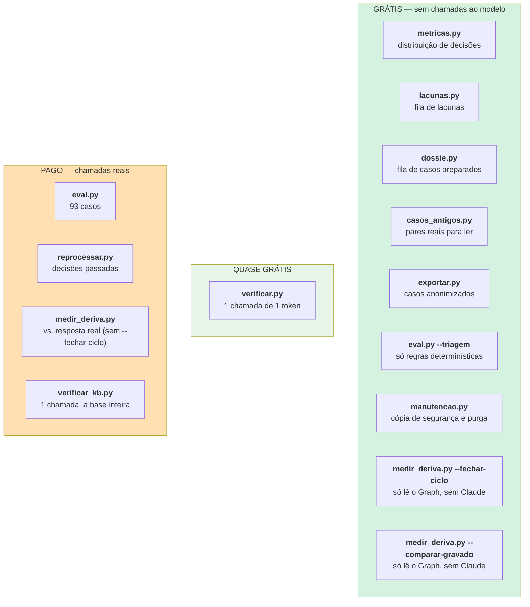

# Ferramentas de operação

> **Pergunta que este documento responde:** que ferramentas existem para operar e diagnosticar o
> sistema, e quais custam dinheiro?

Doze satélites que importam `assistente.py`. Nove só leem; `manutencao.py` (backup e purga), o
modo `medir_deriva.py --fechar-ciclo` (grava o resultado da verificação) e o `aquecer.py`
(marca quando aqueceu) escrevem no registo local — nenhum escreve na caixa nem em qualquer
serviço externo. Nenhum corre no caminho de produção; `manutencao.py` corre via cron e o
`aquecer.py` via temporizador próprio.

## Mapa por custo



> [!IMPORTANT] Antes de correr qualquer ferramenta da coluna paga
> As chamadas saem da conta da Anthropic do cliente. `eval.py` completo custa ~1,20 €;
> `medir_deriva.py` e `reprocessar.py` dependem do `-n`.

---

## Diagnóstico de produção

### `metricas.py` — o que está a acontecer

```bash
python metricas.py              # últimos 30 dias
python metricas.py --dias 7
python metricas.py --tudo
```

Distribuição de ações, categorias dos escalados, risco dos dossiês preparados, e — desde
30/08/2026 — o **custo real**: por email, por rascunho, por escalação, e a taxa de acerto da
cache. Barras em texto.

> [!TIP] O custo por resultado é a pergunta de negócio
> Não "quantos tokens", mas quanto custa cada rascunho e cada escalação — é isso que se compara
> com o tempo de trabalho que poupa. Ver [[cost-optimization|Auditoria de custo]].

> [!NOTE] Não faz chamadas nem toca na caixa
> *"Lê só o que já está gravado em processados. Os números não mudam se este script correr dez
> vezes seguidas."*

Responde à pergunta que motivou a arquitetura: **a percentagem de escalação está a descer, e em
que categorias ainda há trabalho?**

### `dossie.py` — a fila de casos preparados

```bash
python dossie.py --lista              # uma linha por caso
python dossie.py --caso 42
python dossie.py --tipo cancelamento
python dossie.py --risco alto
```

Mostra resumo, validações marcadas ✓/✗, ação recomendada, link para o admin e a resposta
sugerida.

> [!TIP] Não é o canal principal
> A resposta sugerida **já vai sozinha para o rascunho no Outlook**. Esta ferramenta mostra a
> análise toda, para consulta e depuração — o lojista não precisa de a correr.

### `lacunas.py` — o que falta saber

```bash
python lacunas.py                 # lacunas por fechar, mais frequentes primeiro
python lacunas.py --categorias    # peso de cada causa de escalação
python lacunas.py --tudo          # inclui as já cobertas
```

Agrupa temas escritos de formas diferentes (normalização com remoção de *stopwords*) e marca
como `coberta?` as que já parecem estar na base.

> [!IMPORTANT] O modelo produz a pergunta, nunca a resposta
> *"Nunca transformar a resposta do modelo em facto: o modelo escalou precisamente por não saber.
> O que ele produz aqui é a pergunta, não a resposta."*
>
> Ver [[knowledge-base|Base de conhecimento]].

### `aquecer.py` — mantém a cache do prompt quente

```bash
python aquecer.py             # aquece só se houver 40 min de silêncio
python aquecer.py --simular   # diz o que faria, sem chamar a API
python aquecer.py --forcar    # aquece sempre (para verificar)
```

Corre sozinho via `tripat3s-assistente-aquecer.timer`, de 20 em 20 minutos. Custa **$0,0135**
quando aquece e **nada** quando a cache já está quente — que é o caso na maior parte das
passagens diurnas.

É a única ferramenta que gasta créditos **sem que ninguém a mande correr**. Gasta-os para poupar
mais: escrever a cache custa 18× o que custa lê-la. Ver [[cost-optimization|Auditoria de custo]].

### `manutencao.py` — cópia de segurança e purga

```bash
python manutencao.py --simular    # diz o que faria, sem escrever
python manutencao.py              # as duas coisas; é o que o cron corre
python manutencao.py --backup     # só a cópia
python manutencao.py --purgar --dias 30
```

Trata de duas responsabilidades distintas do `assistente.db`:

| | O que faz | Porquê |
|---|---|---|
| **Cópia de segurança** | API de backup do SQLite, rotação das últimas 14, em `backups/` | Perder a base não é perder histórico — é perder **o cursor**. Uma reinstalação sem cursor começa em "agora" e salta em silêncio o que chegou entretanto |
| **Purga** | Esvazia o texto livre com mais de 90 dias: assunto, corpo, dossiês, `por_responder` | É correspondência de clientes. Sem janela declarada, acumula-se para sempre — problema de RGPD, não de disco |

> [!NOTE] Usa a API de backup, não um `cp`
> Um `cp` pode apanhar a base a meio de uma escrita. O timer corre de dois em dois minutos e
> ninguém quer coordenar cron com timer.

> [!IMPORTANT] A purga não apaga linhas nenhumas
> A chave `message_id` é o que impede o assistente de responder duas vezes ao mesmo email.
> Apagar a linha devolveria a mensagem ao estado de "nunca vista" — e, se alguém repuser um
> cursor antigo a partir de uma cópia, o assistente voltaria a rascunhar emails já respondidos.
>
> Fica a classificação (`acao`, `categoria`, `motivo`, `em`) e as lacunas, que é o que o
> `metricas.py` e o `lacunas.py` leem.

No servidor, uma linha no crontab do utilizador `assistente`:

```cron
30 4 * * * cd /opt/assistente && .venv/bin/python manutencao.py >> logs/manutencao.log 2>&1
```

---

## Verificação e qualidade

### `verificar.py` — antes de ligar

```bash
python verificar.py
python verificar.py --outra-caixa geral@empresa.pt   # ← o passo crítico
```

Seis verificações; sai com código 1 se alguma obrigatória falhar. Ver [[security|Segurança]].

### `eval.py` — o banco de ensaio

Documento próprio: [[evaluation|Banco de ensaio]].

### `reprocessar.py` — a mudança melhorou?

```bash
python reprocessar.py --acao escalar -n 20 --detalhe
```

Vai buscar o email original pelo `internetMessageId` e corre a passagem inteira com o código de
hoje. **Nunca cria rascunhos nem marca categorias.**

Marca cada linha com `MUDOU` ou `=`, e indicadores de que contexto esteve disponível
(`fio`, `nº`, `shopify`).

### `medir_deriva.py` — o rascunho é enviável?

```bash
python medir_deriva.py -n 15
python medir_deriva.py --incluir-escalados
python medir_deriva.py --pasta deleteditems -n 30
python medir_deriva.py --fechar-ciclo          # ver abaixo -- grátis, sem Claude
python medir_deriva.py --comparar-gravado      # ver abaixo -- grátis, sem Claude
```

Regenera o rascunho com o código de hoje e compara com o que o lojista realmente enviou.
Ver [[qa|QA e testes]].

> [!NOTE] Duas fontes de casos
> Por omissão, o registo local (só o que o assistente já viu). Com `--pasta`, qualquer pasta do
> Graph — *"um universo muito maior de conversas reais, incluindo as que nunca chegaram a passar
> pelo assistente"*. A segunda gasta créditos por caso.

### `medir_deriva.py --comparar-gravado` — o que a IA escreveu, de facto, foi editado?

```bash
python medir_deriva.py --comparar-gravado
python medir_deriva.py --comparar-gravado -n 20
```

**Implemented** a 28/08/2026. Diferente do resto do ficheiro: usa o texto **tal como foi gravado
na altura** (`processados.corpo`), nunca o regenera com o código de hoje. Responde a uma pergunta
diferente da do resto do ficheiro — não "o código de hoje resolve isto bem?", mas "o que foi
escrito na altura foi editado, e quanto?". Não chama o Claude, só o Graph.

> [!NOTE] Porque é que isto é um modo à parte
> O resto de `medir_deriva.py` regenera de propósito (ver a nota no topo do ficheiro): comparar
> código antigo contra a resposta real não diz nada sobre a qualidade do assistente agora. Mas
> às vezes a pergunta que interessa é literalmente "o que o lojista mudou neste rascunho
> concreto" — para isso, regenerar seria mentir sobre o que aconteceu de facto.

### `medir_deriva.py --fechar-ciclo` — o que aconteceu ao rascunho, de verdade

```bash
python medir_deriva.py --fechar-ciclo
python medir_deriva.py --fechar-ciclo -n 30
```

**Implemented** a 27/08/2026. Diferente do resto do ficheiro: não chama o Claude, não procura
heuristicamente "a próxima resposta na conversa" — pergunta ao Graph pelo **próprio id** do
rascunho criado (gravado em `rascunho_id` desde esta data) e classifica em `apagado`, `pendente`,
`enviado-tal-e-qual` ou `enviado-editado`, comparando o corpo enviado com o corpo gravado. Grava
o resultado; `metricas.py` lê-o sem repetir as chamadas.

> [!NOTE] Só cobre rascunhos criados depois de 27/08/2026
> Registos anteriores não têm `rascunho_id` — ficam de fora deste modo, sem alternativa possível
> (o id não foi gravado na altura). Ver [[data-flow|Fluxo de dados]].

Correr periodicamente (ex.: junto com a revisão semanal) para a taxa de aceitação em
`metricas.py` deixar de estar vazia. É a peça que faltava para medir a referência de deriva do
Finding M-3.

### `verificar_kb.py` — contradições na base de conhecimento

```bash
python verificar_kb.py
```

**Implemented** a 27/08/2026. Uma chamada só ao Claude, offline: lê a base inteira e pede uma
lista estruturada de contradições (regras que respondem de forma diferente à mesma pergunta,
prioridades ambíguas entre secções). Corre-se à mão depois de editar `knowledge/*.md`, antes do
commit — não é deteção contínua, não corre em produção.

> [!IMPORTANT] Gasta uma chamada -- confirmar o custo antes de correr
> Ao contrário dos outros scripts "grátis" desta lista, isto fala com a API da Anthropic. O
> resultado é uma sugestão para leitura humana, nunca uma correção automática: só confirmar com o
> lojista deve levar a editar `knowledge/*.md`.

---

## Recolha de dados

### `exportar.py` — casos anonimizados

```bash
python exportar.py --quantos 100
python exportar.py --desde 2026-07-01
```

**Só lê.** Faz duas coisas: grava emails pseudonimizados em `eval/real-AAAA-MM.json` (fora do
git), e conta a distribuição real dos tipos de email.

A contagem responde à pergunta que decide se o projeto vale a pena:

```
ESTADO DE ENCOMENDAS: 12/40 = 30% dos emails que chegam ao modelo
✓ Abaixo de 30%: o assistente responde à maioria.
```

Com limiares e recomendações explícitas (>60% = rever o âmbito; 30-60% = discutir integração com
o sistema de encomendas).

> [!WARNING] O ficheiro produzido é correspondência de clientes
> *"Mesmo anonimizada, aquela é correspondência de clientes e não vai para repositório nenhum."*
> Está no `.gitignore` como `eval/real-*.json`. Ver [[security|Segurança]].

### `casos_antigos.py` — como se resolvia antes

```bash
python casos_antigos.py -n 40
python casos_antigos.py --contem reclamação
python casos_antigos.py --pasta inbox
```

Pares pergunta-resposta de conversas antigas, para **leitura humana**. Zero créditos.

Duas subtilezas de implementação, ambas com razão documentada:

> [!NOTE] Procura a resposta na caixa inteira, não só na pasta de origem
> *"A pergunta pode ter sido apagada e a resposta continuar nos Itens Enviados (…). Confirmado
> nesta sessão que das conversas com mensagem de cliente, **menos de metade tinham a resposta na
> mesma pasta**."*

> [!NOTE] Um par por conversa, ancorado na primeira mensagem do cliente
> *"Numa conversa longa o cliente escreve várias vezes; sem agrupar por conversa, cada mensagem
> dele virava um 'par' a apontar quase sempre para a mesma resposta."*

E o aviso de âmbito: *"Um 'apagado' não é sinónimo de 'bom exemplo': a maioria vai ser ruído, e
cabe a quem lê decidir o que vale a pena."* — **não** para gerar dados de treino
automaticamente.

---

## Fluxos de trabalho comuns

### Depois de uma alteração ao prompt ou à base

```bash
python -m unittest test_assistente -q          # grátis
python eval.py --triagem                       # grátis
python eval.py --casos eval/subset.json        # ~0,30 €
# só no fim, uma vez:
python eval.py                                 # ~1,20 €
```

### Revisão semanal de produção

```bash
python metricas.py --dias 7        # a distribuição mudou?
python lacunas.py                  # o que fechar a seguir?
python dossie.py --lista           # que casos estão à espera?
```

### Manutenção (automática, via cron)

```bash
python manutencao.py --simular     # confirmar o que o cron vai fazer
ls -la backups/                    # as cópias estão a ser feitas?
```

### Investigar uma resposta má

```bash
python dossie.py --caso <n>                    # ver a análise completa
python reprocessar.py --acao escalar -n 5 --detalhe   # o código de hoje resolve?
```

## Related

- [[qa|QA e testes]] — a estratégia que estas ferramentas servem
- [[evaluation|Banco de ensaio]] — `eval.py` em detalhe
- [[knowledge-base|Base de conhecimento]] — o ciclo que `lacunas.py` alimenta
- [[escalation|Escalação]] — o que `dossie.py` mostra
- [[deployment|Deployment]] — observação em produção
