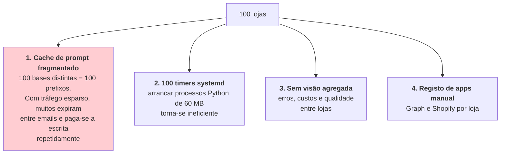
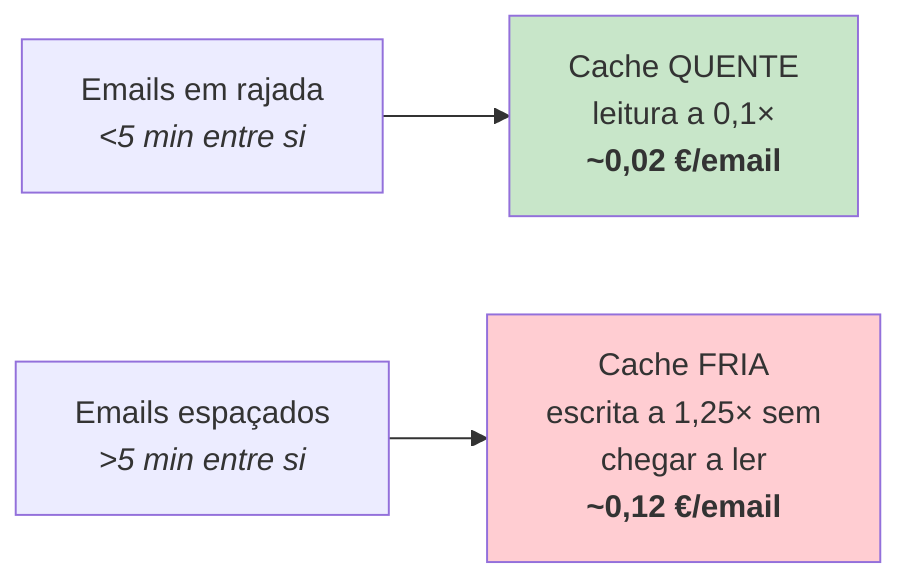

# Escalabilidade

> **Pergunta que este documento responde:** até onde é que esta arquitetura chega, e o que
> quebra primeiro?

> [!IMPORTANT] Distinção entre atual e futuro
> Esta página descreve o **estado atual** (`Implemented`) e onde ele deixa de servir. As
> arquiteturas alternativas são `Proposed` e vivem em
> [[future-architecture|Arquitetura futura]] — **nada disso está construído**.

## Estado atual — 1 loja

**Implemented.** Instalação única: uma caixa, uma loja Shopify, uma base de conhecimento, um
ficheiro SQLite, um timer.

| Recurso | Valor |
|---|---|
| Lote por passagem | 25 mensagens (`LOTE`, fixo) |
| Processamento | Sequencial |
| Tempo por email | ~10 s (1 chamada) a ~20 s (2 chamadas) |
| Memória de pico | ~61 MB |
| CPU por passagem | ~1,5 s |
| Prompt cacheado | 28 929 tokens |

**Inference:** o teto de uma instalação está bem acima do volume atual. 25 emails × 20 s ≈ 8
minutos, o que ultrapassaria o intervalo de 2 min — mas `OnUnitActiveSec` impede sobreposição, e
os restantes ficam para a passagem seguinte. Para uma loja com dezenas de emails por dia, folga
confortável.

## 10 lojas — viável com mudanças de configuração

**Inference.** Nada na arquitetura impede isto; as variáveis certas já existem.

| Componente | Mudança necessária | Esforço |
|---|---|---|
| Base de conhecimento | Já suportado — `KNOWLEDGE_DIR` é configurável, e o `.gitignore` já prevê `clients/` | Nenhum |
| SQLite | Um ficheiro por loja — `DB_FILE` é configurável | Nenhum |
| Configuração | Um `.env` por loja | Baixo |
| systemd | Um par serviço/timer por loja, ou um template `@.service` | Baixo |
| Graph | Uma app por inquilino, ou uma app multi-inquilino com consentimento | Médio |
| Custo de inferência | Linear; cada loja tem o seu próprio cache | — |

> [!TIP] O isolamento a esta escala é *físico*
> Instalações separadas não se podem contaminar. É uma propriedade de segurança valiosa que se
> perde ao passar para multi-tenancy lógica.

## 100 lojas — exige rearquitetura

**Inference.** Quatro pontos de rutura, por ordem de gravidade:

> [!WARNING] O ponto 1 é o maior custo oculto
> O cache de prompt é o que torna a arquitetura barata a 1 loja. A 100 lojas com tráfego esparso,
> **o regime inverte-se**: paga-se a escrita do prefixo (1,25×) repetidamente sem chegar a ler o
> desconto (0,1×).
>
> Este efeito já é visível a 1 loja — ver a secção de custos abaixo.

### O que teria de mudar

| Aspeto | 1 loja | 100 lojas |
|---|---|---|
| Base de dados | SQLite | Postgres com *row-level security* |
| Agendamento | systemd timer | Scheduler central + fila |
| Processo | `oneshot` | Pool de workers permanentes |
| Segredos | `.env` | Cofre (Vault / Secrets Manager) |
| Observabilidade | `journalctl` | Métricas agregadas + alertas |
| **Isolamento de dados** | **Físico** (um ficheiro) | **Lógico** (RLS) ← risco novo |

> [!IMPORTANT] O risco novo mais importante
> Hoje, o isolamento entre clientes é **físico**. Num sistema multi-inquilino torna-se **lógico**,
> e a [[identity-resolution|resolução de identidade]] passaria a ter de validar não só *"esta
> encomenda é desta pessoa?"* mas também *"esta encomenda é desta loja?"*.
>
> É uma superfície de bug nova, no ponto mais sensível do sistema.

## 1000+ lojas — produto diferente

**Inference.** Não é uma evolução desta arquitetura. Exigiria:

- Onboarding *self-service*
- Editor de base de conhecimento para não-técnicos
- Faturação por utilização
- SLA e painel de operação
- Reformulação do modelo de conhecimento — de ficheiros Markdown para conteúdo estruturado
  versionado

## Custos por escala

**Estimativas**, não faturas. A amplitude vem do regime de cache.

| Escala | Servidor | Inferência (30 emails/dia/loja) | Total/mês |
|---|---|---|---|
| 1 loja | ~4 € | ~10-40 € | ~15-45 € |
| 10 lojas | ~10 € | ~100-400 € | ~110-410 € |
| 100 lojas | ~150 € | ~1000-4000 € | ~1200-4200 € |

### O regime de cache domina o custo

> [!NOTE] Medido e corrigido a 30/08/2026
> Esta secção foi escrita antes de haver dados reais. Já os há: o intervalo mediano entre emails
> é de ~15 minutos, e passar o TTL da cache de 5 minutos para 1 hora levou a taxa de acerto de
> **25% para 89%**. O regime de cache fria descrito abaixo era real — e deixou de dominar.
> Ver [[cost-optimization|Auditoria de custo]].

> [!WARNING] Numa loja pequena, o regime de cache fria domina
> Com emails espaçados — o normal numa PME — o Sonnet paga quase sempre a sobretaxa de escrever
> o cache sem nunca chegar a ler o desconto. Nesse regime é **~19× mais caro** que o Haiku, não
> os ~3× do preço de tabela.
>
> O Haiku sofre a mesma penalização, mas sobre uma base 3× mais barata e mais pequena, pelo que o
> impacto é quase invisível para ele.

Valores por confirmar com a fatura real da semana de observação.

## Limites de outros recursos

| Recurso | Limite | Quando morde |
|---|---|---|
| Janela de contexto | 1M tokens; usa-se ~30K | Base de conhecimento >100K tokens |
| Mínimo de cache | 1024 (Sonnet) / 4096 (Haiku) | Já ultrapassado — não é limite |
| `LOTE = 25` | Fixo, não configurável | Rajadas >25 dividem-se por passagens |
| Rate limits da Shopify | Não tratados | Sem *backoff* — Finding M-2 |
| Rate limits do Graph | Não tratados | Idem |
| SQLite concorrente | Um escritor | Só um processo por base — não é problema hoje |

## Onde a arquitetura escala bem

Sendo justo com o desenho:

| Propriedade | Porque escala |
|---|---|
| `oneshot` sem estado | Adicionar instâncias é trivial; não há sessões a coordenar |
| Estado em SQLite | Sem servidor de base de dados a gerir a 1-10 lojas |
| Configuração por ambiente | `KNOWLEDGE_DIR`, `DB_FILE`, `MAILBOX` já parametrizados |
| Degradação por camadas | Uma API lenta não bloqueia; degrada |
| Cache de prompt | Absorve o custo da base inteira **enquanto o tráfego for contínuo** |

## Related

- [[future-architecture|Arquitetura futura]] — o que construir, marcado `Proposed`
- [[technical-decisions|Decisões técnicas]] — as escolhas que criam estes limites
- [[limitations|Limitações]] — os limites atuais
- [[knowledge-base|Base de conhecimento]] — o que já suporta multi-loja
- [[identity-resolution|Resolução de identidade]] — o risco novo em multi-tenancy
