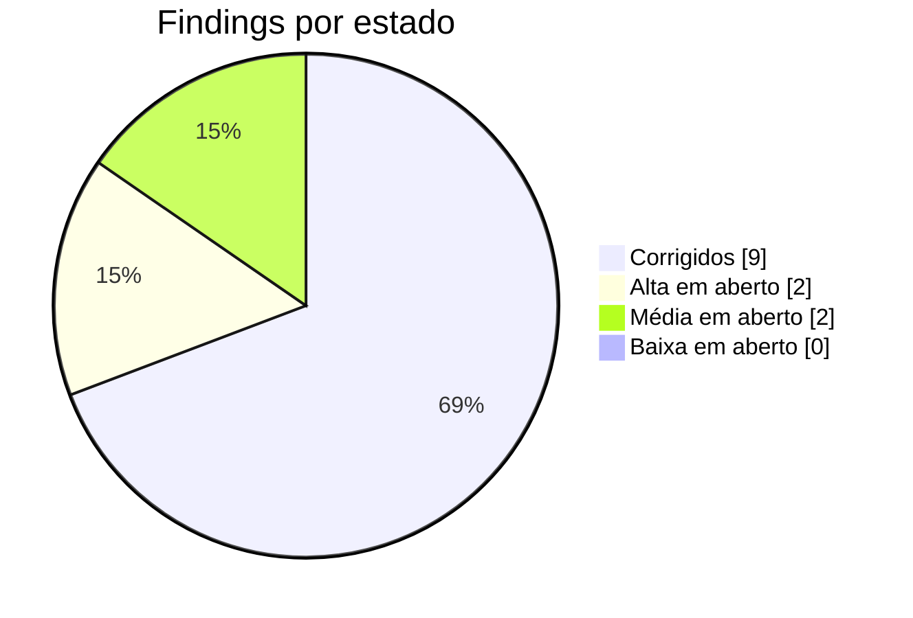
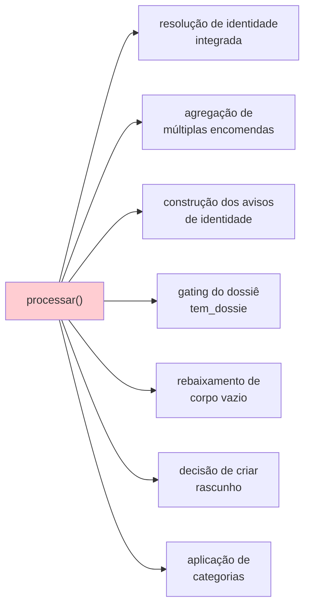

# Dívida técnica e findings

> **Pergunta que este documento responde:** o que está mal, quanto custa, e por onde começar?

Resultado da auditoria técnica de **27 de agosto de 2026**, feita por leitura integral do código
no commit `bc5408b`. Cada finding traz evidência verificável.

## Estado atual

| ID | Gravidade | Título | Esforço | Estado |
|---|---|---|---|---|
| C-1 | 🔴 Crítica | Perda de email quando o modelo falha a meio de lote | Trivial | ✅ **Corrigido 27/08** |
| ~~H-1~~ | ✅ **Corrigido** | Premissa de custo/cache desatualizada em 3 locais | Trivial | Feito 27/08 |
| H-2 | 🟠 Alta | `processar()` sem cobertura de testes | Média | ⬜ Aberto |
| H-3 | 🟠 Alta | Regra do pack falha em ambos os modelos | Baixa | ⬜ Aberto |
| ~~M-1~~ | ✅ **Corrigido** | README contradiz a integração Shopify | Trivial | Feito 27/08 |
| ~~M-2~~ | ✅ **Corrigido** | Sem retentativa em Graph/Shopify | Baixa | Feito 27/08 |
| M-3 | 🟡 Média | Referência de deriva nunca medida | Baixa | ⬜ Aberto |
| ~~M-4~~ | ✅ **Corrigido** | Sem retenção nem backup | Baixa | Feito 27/08 |
| ~~M-5~~ | ✅ **Corrigido** | Deploy sem verificação automática | Baixa | Feito 27/08 |
| M-6 | 🟡 Média | Sem alertas de falha | Baixa | ⬜ Aberto |
| ~~L-1~~ | ✅ **Corrigido** | Estimativa de tokens imprecisa | Trivial | Feito 27/08 |
| ~~L-2~~ | ✅ **Corrigido** | Ferramentas offline sem exceções de formulário | Trivial | Feito 27/08 |
| ~~L-3~~ | ✅ **Corrigido** | `Persistent=true` inócuo | Trivial | Feito 27/08 |

> [!TIP] Nove fechados, quatro em aberto
> A dívida deste projeto é rasa. Dos que faltam, só o H-2 (testes de `processar()`) exige
> trabalho a sério; o resto (H-3, M-3, M-6) é mais pequeno.

---

## ✅ C-1 — Perda de email quando o modelo falha a meio de lote

**Gravidade:** Crítica · **Estado:** Corrigido a 27/08/2026

**O problema:** `registar()` avançava o cursor mensagem a mensagem. Se a chamada ao modelo
falhasse numa mensagem e uma posterior corresse bem, o cursor ficava à frente da falhada — e a
passagem seguinte, que só pede o que veio depois do cursor, **nunca mais a via**.

**Cenário:** três emails (10:00, 10:01, 10:02). O de 10:01 falha → não registado. O de 10:02
corre bem → cursor avança para 10:02. O de 10:01 desaparece: sem rascunho, sem categoria, sem
registo.

> [!IMPORTANT] Não era hipotético
> A falha do modelo ocorreu em produção a 26/08/2026 às 16:55 (`JSONDecodeError`). Nessa
> passagem `vistos=1`, pelo que não houve perda — **com dois ou mais emails no lote, teria
> havido**.
>
> Violava o requisito de primeira ordem do sistema: "clientes perdidos: zero".

**A correção:** `cursor_seguro()` para na primeira falha; `main()` recua o cursor no fim do lote.
Verificado contra uma base SQLite real (o bug reproduz-se sem a correção e desaparece com ela).
7 testes novos.

Ver [[error-handling|Tratamento de erros]].

---

## ✅ H-1 — Premissa de custo/cache desatualizada

**Onde:** `README.md`, `.env.example`, e um comentário em `assistente.py`.

Os três afirmam que a base de conhecimento é *menor* que os 4096 tokens mínimos do Haiku 4.5 e
que por isso *"nunca chegaria a ser cacheada"*.

**Medição real** (`count_tokens`, gratuito, 26/08/2026):

| Modelo | Tokens do prefixo | Mínimo | Cacheia? |
|---|---|---|---|
| `claude-sonnet-5` | 28 929 | 1 024 | ✅ |
| `claude-haiku-4-5` | **22 092** | 4 096 | ✅ **5,4× acima** |

Era verdade quando foi escrito; deixou de ser quando `devolucoes.md` cresceu para 20 KB.

**Impacto:** a decisão "manter Sonnet porque o Haiku não cacheia" assentava numa premissa falsa.
A comparação correta é: Haiku custa ~3× menos e perde 14 pontos de **precisão** de escalação
(91% → 77%), sem perder clientes. É uma escolha real de negócio, que estava a ser tomada com
informação errada.

**Estado: ✅ CORRIGIDO a 27/08/2026.** Os três locais passaram a dizer que a base cacheia em
ambos os modelos, com os números medidos, e que a diferença real é de qualidade de escalação. O
`README.md` ganhou também a distinção entre cache quente (~0,02 €/email) e cache fria
(~0,12 €/email), que é o que domina o custo numa loja de pouco volume.

---

## 🟠 H-2 — `processar()` sem cobertura de testes

**Evidência:** `processar()` tem ~280 linhas e 10 pontos de retorno. `test_assistente.py` importa
30 símbolos de `assistente` — **`processar` e `main` não estão entre eles**.

`eval.py` também não a exercita: chama `a.decidir()` diretamente com `dados_encomenda`
pré-cozinhado do JSON.

**Lógica não testada:**

**Correção:** testes com duplos para `Graph`, `Shopify` e cliente Anthropic. **Os padrões já
existem** no ficheiro de testes (`ShopifyFalsa`, `ClienteFalso`) — falta aplicá-los à função que
mais precisa.

Ver [[qa|QA e testes]].

---

## 🟠 H-3 — Regra do pack falha em ambos os modelos

**Evidência:** o caso `reembolso-artigo-de-pack-divide-igualmente` testa uma regra escrita e
confirmada pelo lojista: o valor de um artigo dentro de um pack é o total dividido pelo número de
artigos (90 € ÷ 3 = 30 €). A regra está em `devolucoes.md`.

Na medição de 26/08/2026, **ambos os modelos falharam**: Sonnet escalou em vez de responder;
Haiku idem. **Não é diferença entre modelos — é a regra a não ser aplicada.**

**Impacto:** um cliente que pergunte o valor de reembolso de um artigo de pack recebe uma
escalação em vez de resposta, apesar de a loja ter regra escrita. Trabalho manual evitável, de
forma recorrente.

**Correção — Inference:** a causa provável é aritmética sem espaço de raciocínio, o mesmo padrão
que motivou mover o cálculo do prazo de devolução para Python. A solução consistente com a
arquitetura seria **fornecer o valor por artigo já calculado** nos dados da encomenda, em vez de
pedir ao modelo que divida.

Ver [[decision-making|Tomada de decisão]] — é exatamente o padrão "mover para fora do modelo".

---

## ✅ M-1 — README contradiz a integração Shopify

**Evidência:** `README.md`, secção "Âmbito — o que este assistente não faz":

> **Não sabe o estado das encomendas.** Sem ligação ao sistema de encomendas, "onde está a minha
> encomenda?" cai sempre em `escalar`.

Contradiz diretamente a integração implementada, a resolução de identidade, o resumo de
encomenda, a instrução dedicada no prompt, e casos de eval que provam o contrário.

**Impacto:** quem avalie o projeto pelo README **subestima significativamente** as suas
capacidades.

**Estado: ✅ CORRIGIDO a 27/08/2026.** A secção "Âmbito" passou a descrever as limitações
reais: janela de 60 dias (com o impacto medido — 1 em 10 casos), ausência de `read_products`, e
só-leitura. De caminho, corrigiu-se também a contagem de testes, que dizia 102.

---

## ✅ M-2 — Sem retentativa em Graph e Shopify

**Evidência:** `Graph._pedir()` e `Shopify._procurar()` levantavam imediatamente em qualquer
`status_code >= 400`. Sem *backoff*, sem distinguir 429/5xx (transitórios) de 4xx (permanentes).

**Estado: ✅ CORRIGIDO a 27/08/2026** com `_com_retentativa()` — até 3 tentativas com espera
exponencial (1s, 2s), respeitando `Retry-After` num 429. Um 4xx permanente continua a sair já na
primeira, sem disfarçar o erro real.

> [!NOTE] Só GET se repete
> `criar_rascunho()` (POST) e `marcar()` (PATCH) ficam de fora de propósito: um 5xx a meio de um
> `createReply` pode já ter sido aplicado do lado do Graph, e repeti-lo às cegas arriscaria
> duplicar um rascunho. Falha imediata é o comportamento mais seguro para operações não
> idempotentes.

4 testes novos, com `time.sleep` mockado — não acrescentam tempo real à suite.

---

## 🟡 M-3 — Referência de deriva nunca medida

**Evidência:** o limiar *"acima de 60% editado, o rascunho é ruído"* aparece em `registar()` e no
README como referência do projeto. Mas `medir_deriva.py` declara explicitamente:
*"Referência do projeto (…), **nunca antes medido**"*.

**Impacto:** o sistema tem uma ferramenta funcional para responder a "isto ainda serve?" e um
limiar de decisão, mas nunca correu a medição. O risco de deriva silenciosa permanece por
instrumentar.

**Correção:** correr `medir_deriva.py` no fim da semana de observação e estabelecer a linha de
base. Gasta créditos; usar `-n`.

---

## ✅ M-4 — Sem retenção nem backup

**Evidência:** `processados` guarda o corpo integral dos rascunhos e cresce indefinidamente. Não
há purga, não há backup.

**Impacto duplo:**

| Risco | Detalhe |
|---|---|
| **RGPD** | Correspondência de clientes retida indefinidamente, sem política declarada |
| **Operacional** | Perder o disco = perder o cursor. A reinstalação ou reprocessa tudo ou salta emails |

**Estado: ✅ CORRIGIDO a 27/08/2026** com o `manutencao.py`.

| | |
|---|---|
| **Cópia de segurança** | API de backup do SQLite (não um `cp` — a base pode estar a ser escrita), rotação das últimas 14, em `backups/` (no `.gitignore`) |
| **Purga** | Esvazia o texto livre com mais de 90 dias: assunto, corpo, dossiês, `por_responder` |
| **O que fica** | Classificação (`acao`, `categoria`, `motivo`, `em`) e lacunas — é o que o `metricas.py` e o `lacunas.py` leem |

> [!IMPORTANT] A purga não apaga linhas
> A chave `message_id` é o que impede o assistente de responder duas vezes ao mesmo email.
> Apagar a linha devolveria a mensagem ao estado de "nunca vista" — e, se alguém repuser um
> cursor antigo a partir de uma cópia, o assistente voltaria a rascunhar emails já respondidos.

Testado contra uma base real: linhas antigas com o texto anulado e a classificação intacta,
linha recente por tocar, 198 linhas preservadas, e a cópia com `integrity_check: ok` e o cursor
lá dentro.

---

## ✅ M-5 — Deploy sem verificação automática

**Evidência:** o deploy era `git archive HEAD | ssh … tar -x`. Nada corria os testes antes.

**Estado: ✅ CORRIGIDO a 27/08/2026** com `deploy/enviar.sh` — corre `unittest` e
`eval.py --triagem` (ambos grátis, <1s) e aborta sem tocar em SSH se algum falhar. Testado nos
dois sentidos: com um `PYTHON` falso a simular testes a falhar (aborta antes da rede) e com o
gate a passar (envia e confirma no servidor).

---

## 🟡 M-6 — Sem alertas de falha

**Evidência:** uma passagem que falhe repetidamente só se descobre por inspeção manual do
`journalctl`.

**Correção:** `OnFailure=` no systemd com um envio simples.

---

## ⚪ Findings de prioridade baixa

### ✅ L-1 — Estimativa de tokens imprecisa

`verificar.py` usava `len(base) // 4`. O rácio real é ~2,3 chars/token, pelo que a estimativa
**subestimava em ~40%**.

**Estado: ✅ CORRIGIDO a 27/08/2026.** Passou a usar `count_tokens` (gratuito), sobre o prompt
inteiro e não só a base — é o prompt que vai para cache. Se a chamada falhar, cai numa
estimativa marcada como tal.

### ✅ L-2 — Ferramentas offline sem exceções de formulário

`medir_deriva.py`, `reprocessar.py` e `eval.py` chamavam `triar_cabecalhos(msg)` sem os dois
argumentos de formulário (omissão `False`), e nunca desembrulhavam o corpo. Descartavam
submissões do formulário de devolução que a produção processa corretamente, e para as que
passassem, alimentavam o modelo com o dump em bruto do Formspree em vez do texto reformatado.

**Estado: ✅ CORRIGIDO a 27/08/2026.** Extraída `desembrulhar_formularios()` de dentro de
`processar()` — comportamento idêntico lá, agora partilhado pelas três ferramentas. O caso de
eval do Formspree ganhou o cabeçalho `list-unsubscribe` simulado, para testar mesmo a parte do
bug histórico que faltava (antes só testava a exceção do local-part "noreply"). Verificado sem
gastar créditos: o caso passa a chegar ao modelo com o email e nome reais do cliente já
extraídos. 5 testes novos.

### ✅ L-3 — `Persistent=true` inócuo

`deploy/tripat3s-assistente.timer` definia `Persistent=true`, que no systemd só se aplica a
temporizadores `OnCalendar`. Este usa `OnBootSec`/`OnUnitActiveSec`. A diretiva era inofensiva
mas **enganadora** — sugeria um comportamento de recuperação que não existe.

**Estado: ✅ CORRIGIDO a 27/08/2026.** Removida, com um comentário no lugar a explicar porque
não está lá e que é o `OnBootSec` que cobre o arranque após paragem.

---

## Dívida estrutural (não é finding)

| Item | Natureza | Custo hoje |
|---|---|---|
| Monólito de 2386 linhas | Decisão D2 | Baixo com um mantenedor; alto com equipa |
| Sem multi-tenancy | Decisão de âmbito | Zero hoje; bloqueante a partir de ~10 lojas |
| Base de conhecimento sem verificação de contradições | Lacuna de processo | Cresce com a base |
| Sem fecho de ciclo (rascunho enviado vs. editado) | Lacuna de observabilidade | Deriva não detetável |

Ver [[scalability|Escalabilidade]] e [[limitations|Limitações]].

## Riscos operacionais

| Risco | Probabilidade | Impacto | Mitigação atual |
|---|---|---|---|
| Política de acesso do Exchange removida | Baixa | **Crítico** | `verificar.py` (manual) |
| Deriva silenciosa da qualidade | Média | Médio | `medir_deriva.py` (manual, sem cadência) |
| **Dependência de um único mantenedor** | **Alta** | Médio | Comentários densos; esta KB |
| Alteração de política sem atualizar o eval | Média | Médio | Processo humano |
| RGPD sem acordo de subcontratação | — | **Crítico** | Identificado como pré-requisito |

## Related

- [[improvements|Melhorias]] — o que fazer, priorizado
- [[limitations|Limitações]] — o contexto de cada finding
- [[qa|QA e testes]] — as lacunas de cobertura
- [[error-handling|Tratamento de erros]] — o C-1 em detalhe
- [[security|Segurança]] — os riscos de RGPD e acesso
