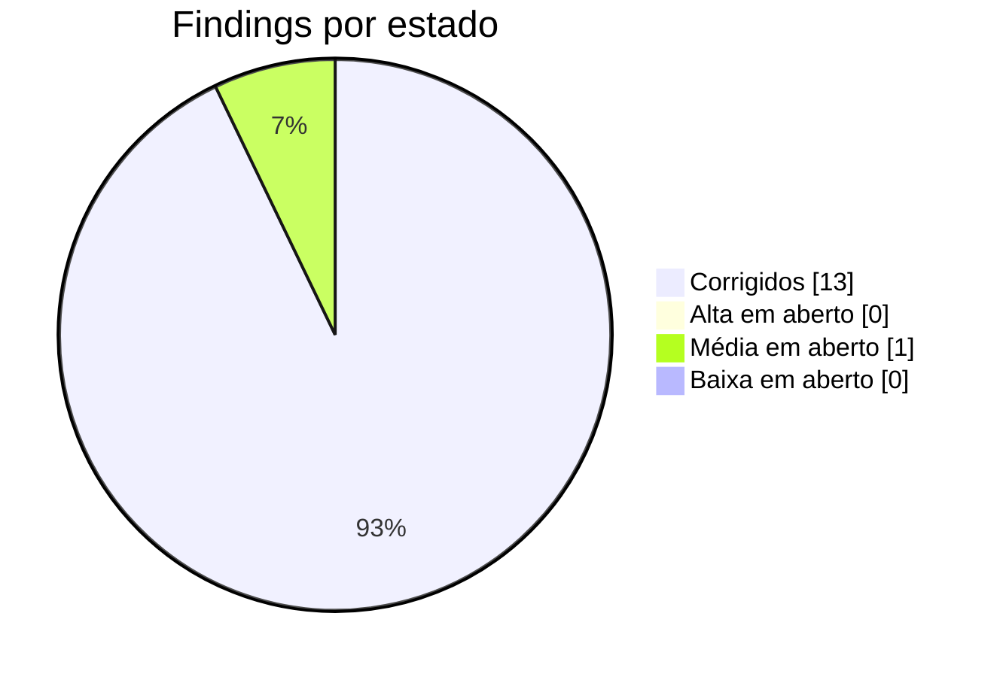
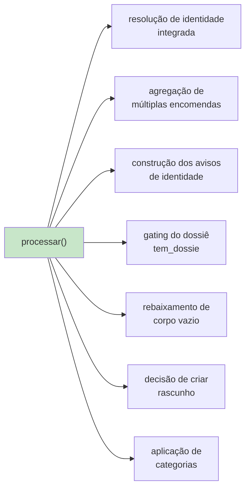

# Dívida técnica e findings

> **Pergunta que este documento responde:** o que está mal, quanto custa, e por onde começar?

Resultado da auditoria técnica de **27 de agosto de 2026**, feita por leitura integral do código
no commit `bc5408b`. Cada finding traz evidência verificável.

## Estado atual

| ID | Gravidade | Título | Esforço | Estado |
|---|---|---|---|---|
| C-1 | 🔴 Crítica | Perda de email quando o modelo falha a meio de lote | Trivial | ✅ **Corrigido 27/08** |
| ~~H-4~~ | ✅ **Corrigido** | Falha em `criar_rascunho()`/`marcar()` podia derrubar o lote inteiro | Baixa | Feito 27/08 |
| P0-2 | 🔴 Crítica | Restrição de acesso do Exchange nunca reverificada | Baixa | 🟡 **Construído 27/08, por ativar** |
| ~~H-1~~ | ✅ **Corrigido** | Premissa de custo/cache desatualizada em 3 locais | Trivial | Feito 27/08 |
| ~~H-2~~ | ✅ **Corrigido** | `processar()` sem cobertura de testes | Média | Feito 27/08 |
| ~~H-3~~ | ✅ **Corrigido** | Regra do pack — não havia bug, o teste é que estava errado | Trivial | Feito 27/08 |
| ~~M-1~~ | ✅ **Corrigido** | README contradiz a integração Shopify | Trivial | Feito 27/08 |
| ~~M-2~~ | ✅ **Corrigido** | Sem retentativa em Graph/Shopify | Baixa | Feito 27/08 |
| M-3 | 🟡 Média | Referência de deriva nunca medida | Baixa | ⬜ Aberto |
| ~~M-4~~ | ✅ **Corrigido** | Sem retenção nem backup | Baixa | Feito 27/08 |
| ~~M-5~~ | ✅ **Corrigido** | Deploy sem verificação automática | Baixa | Feito 27/08 |
| ~~M-6~~ | ✅ **Corrigido** | Sem alertas de falha | Baixa | Feito 27/08 |
| ~~L-1~~ | ✅ **Corrigido** | Estimativa de tokens imprecisa | Trivial | Feito 27/08 |
| ~~L-2~~ | ✅ **Corrigido** | Ferramentas offline sem exceções de formulário | Trivial | Feito 27/08 |
| ~~L-3~~ | ✅ **Corrigido** | `Persistent=true` inócuo | Trivial | Feito 27/08 |

> [!TIP] Treze fechados, um em aberto — mais o P0-2, pronto mas por ativar
> A dívida deste projeto é rasa. Do que falta, só o M-3 (linha de base da deriva) exige dados
> ainda por vir — e o `medir_deriva.py --fechar-ciclo` novo (27/08) é precisamente a peça que
> faltava para a medir. O P0-2 já está construído — falta só um endereço de outra caixa do
> inquilino no `.env` para ligar. H-4 (falha não apanhada em `criar_rascunho()`/`marcar()`) foi
> encontrado e fechado no mesmo dia, ao instrumentar o fecho de ciclo do draft.

---

## ✅ C-1 — Perda de email quando o modelo falha a meio de lote

**Gravidade:** Crítica · **Estado:** Corrigido a 27/08/2026

**O problema:** `registar()` avançava o cursor mensagem a mensagem. Se a chamada ao modelo
falhasse numa mensagem e uma posterior corresse bem, o cursor ficava à frente da falhada — e a
passagem seguinte, que só pede o que veio depois do cursor, **nunca mais a via**.

**Cenário:** três emails (10:00, 10:01, 10:02). O de 10:01 falha → não registado. O de 10:02
corre bem → cursor avança para 10:02. O de 10:01 desaparece: sem rascunho, sem categoria, sem
registo.

> [!IMPORTANT] Não era hipotético
> A falha do modelo ocorreu em produção a 26/08/2026 às 16:55 (`JSONDecodeError`). Nessa
> passagem `vistos=1`, pelo que não houve perda — **com dois ou mais emails no lote, teria
> havido**.
>
> Violava o requisito de primeira ordem do sistema: "clientes perdidos: zero".

**A correção:** `cursor_seguro()` para na primeira falha; `main()` recua o cursor no fim do lote.
Verificado contra uma base SQLite real (o bug reproduz-se sem a correção e desaparece com ela).
7 testes novos.

Ver [[error-handling|Tratamento de erros]].

---

## ✅ H-4 — Falha em `criar_rascunho()`/`marcar()` podia derrubar o lote inteiro

**Gravidade:** Alta · **Estado:** Corrigido a 27/08/2026

**O problema:** ao contrário de todas as outras chamadas ao Graph dentro de `processar()`
(anexos, histórico, Shopify — todas com `try/except` e um `log("erro-*")` de recuperação), as
duas chamadas que aplicam a decisão (`graph.criar_rascunho()` e `graph.marcar()`, nos ramos
`rascunhar` e `escalar`) não tinham nenhuma. Encontrado ao instrumentar o `rascunho_id` para o
Finding "fecho de ciclo do draft" — mexer nestas linhas obrigou a olhar para elas com atenção.

**Cenário:** um 5xx transitório no `createReply` (a mesma classe de falha que o M-2 já resolveu
para os GET, mas POST/PATCH ficam de propósito fora do `_com_retentativa()` — não são
idempotentes). Sem `try/except`, a exceção propagava por `processar()` e por `main()` sem ser
apanhada em lado nenhum, **derrubando a passagem inteira**: não só o email em causa, mas todos os
que viriam a seguir no mesmo lote ficavam por processar até à passagem seguinte.

> [!NOTE] Não havia perda de email, mas havia atraso desnecessário
> O `registar()` já corre antes (ramo `escalar`) ou logo a seguir (ramo `rascunhar`) da chamada
> que falha, por isso a mensagem causadora não desaparecia — mas todas as que vinham depois dela
> no lote ficavam à espera de mais um ciclo de 2 minutos sem necessidade nenhuma, e o sintoma no
> journal era um traceback não tratado, não um `erro-*` como as restantes falhas absorvidas.

**A correção:** as duas chamadas passam a ter `try/except`, com `log("erro-rascunho"/"erro-marcar")`
a seguir o mesmo padrão do resto da função. Sem rascunho criado, não se tenta `marcar()` a
categoria "IA-Rascunhado" (seria enganador). 6 testes novos, incluindo a reprodução exata do
crash sem a correção. Ver [[error-handling|Tratamento de erros]].

---

## ✅ H-1 — Premissa de custo/cache desatualizada

**Onde:** `README.md`, `.env.example`, e um comentário em `assistente.py`.

Os três afirmam que a base de conhecimento é *menor* que os 4096 tokens mínimos do Haiku 4.5 e
que por isso *"nunca chegaria a ser cacheada"*.

**Medição real** (`count_tokens`, gratuito, 26/08/2026):

| Modelo | Tokens do prefixo | Mínimo | Cacheia? |
|---|---|---|---|
| `claude-sonnet-5` | 28 929 | 1 024 | ✅ |
| `claude-haiku-4-5` | **22 092** | 4 096 | ✅ **5,4× acima** |

Era verdade quando foi escrito; deixou de ser quando `devolucoes.md` cresceu para 20 KB.

**Impacto:** a decisão "manter Sonnet porque o Haiku não cacheia" assentava numa premissa falsa.
A comparação correta é: Haiku custa ~3× menos e perde 14 pontos de **precisão** de escalação
(91% → 77%), sem perder clientes. É uma escolha real de negócio, que estava a ser tomada com
informação errada.

**Estado: ✅ CORRIGIDO a 27/08/2026.** Os três locais passaram a dizer que a base cacheia em
ambos os modelos, com os números medidos, e que a diferença real é de qualidade de escalação. O
`README.md` ganhou também a distinção entre cache quente (~0,02 €/email) e cache fria
(~0,12 €/email), que é o que domina o custo numa loja de pouco volume.

---

## 🟡 P0-2 — Restrição de acesso do Exchange nunca reverificada

**Gravidade:** Crítica · **Estado:** Construído a 27/08/2026, **por ativar**

**Evidência:** `verificar.py --outra-caixa` prova, no dia da instalação, que a aplicação não
consegue ler outra caixa do inquilino. Depois disso, nada repete o teste. Se o
`New-ApplicationAccessPolicy` do Exchange (que faz essa restrição, fora deste repositório) for
removido ou nunca reaplicado depois de uma migração, a aplicação passa a poder ler o correio de
toda a empresa — e nada no sistema o assinalaria.

**O que ficou construído:** `verificar_restricao_diaria()`, chamada no arranque de `main()`,
repete o mesmo teste **uma vez por dia** (marcado em `meta`, para não gastar uma chamada extra
ao Graph em cada passagem de 2 minutos):

| Resposta ao ler `OUTRA_CAIXA_VERIFICACAO` | Significado | Ação |
|---|---|---|
| `403` | A restrição continua a funcionar | Regista a data, silencioso |
| `404` | Inconclusivo — o endereço pode não existir | Regista a data com um aviso no log, não repete no mesmo dia |
| Outro erro (rede, token) | Não prova nada sobre a política | Tenta outra vez na passagem seguinte |
| **Sucesso (200)** | **A aplicação leu uma caixa que não é a sua** | `sys.exit()` com uma mensagem de alarme — dispara `OnFailure=` e o alerta do M-6 |

> [!IMPORTANT] Falta um endereço real, e isso não se inventa
> O teste precisa do endereço de **outra caixa real do mesmo inquilino** — não há um genérico
> que sirva para qualquer instalação. Fica em `OUTRA_CAIXA_VERIFICACAO` no `.env`, vazio por
> omissão: sem ele, `verificar_restricao_diaria()` devolve imediatamente sem fazer nada, e o
> comportamento é o mesmo de antes desta correção.
>
> **Para ativar:** preencher `OUTRA_CAIXA_VERIFICACAO` com um endereço real do inquilino da
> tripat3s no `.env` do servidor. É uma decisão do cliente, não uma correção de código.

6 testes novos (`GraphFalso`, classe `VerificarRestricaoDiaria`), cobrindo os quatro ramos da
tabela acima e a confirmação de que uma verificação já feita hoje não repete a chamada.

Ver [[security|Segurança]].

---

## ✅ H-2 — `processar()` sem cobertura de testes (fechado 27/08/2026)

**O problema:** `processar()` tem ~280 linhas e 10 pontos de retorno — a maior concentração de
risco do sistema — e não tinha um único teste. `test_assistente.py` importava 30 símbolos de
`assistente`; `processar` e `main` não estavam entre eles. `eval.py` também não a exercita:
chama `a.decidir()` diretamente com `dados_encomenda` pré-cozinhado do JSON, sem passar pelo
encaminhamento, pela resolução de identidade nem pela aplicação da decisão.

**Lógica que ficou sem cobertura até agora:**

**A correção:** 28 testes novos (`Processar`), cobrindo os 10 pontos de retorno e os ramos que os
alimentam — repetido, saltado por triagem/cabeçalhos/formulário-não-reconhecido, mensagem
apagada a meio (404 vs. outros erros), anexos e histórico (caminho feliz e falha absorvida),
compromissos, as quatro combinações de resolução de identidade (modo compatibilidade, por
níveis, confiança média sem revelar dados, vários candidatos), erro da Shopify absorvido, falha
do modelo devolvendo `"falhado"` sem gravar, `tem_dossie` incluindo o caso "sem tipo mas com
conteúdo → exceção", rascunho (completo, parcial, corpo vazio rebaixado a escalação) e escalação
(com e sem dossiê, `dry_run` nos dois casos).

Isto exigiu estender os três duplos já existentes (`GraphFalso`, `ShopifyFalsa`, `ClienteFalso`)
para cobrirem todos os métodos que `processar()` chama, não só os que os testes anteriores
usavam — `GraphFalso`, em particular, passou de um duplo com uma só chamada simulada para um com
seis, cada uma configurável para devolver um valor ou lançar uma exceção.

175 → 203 testes (`test_assistente -q`); `eval.py --triagem` continua em 8/8, sem regressão.

Ver [[qa|QA e testes]].

---

## ✅ H-3 — Regra do pack: não havia bug, o teste é que estava errado (fechado 27/08/2026)

**Evidência:** o caso `reembolso-artigo-de-pack-divide-igualmente` testa uma regra escrita e
confirmada pelo lojista: o valor de um artigo dentro de um pack é o total dividido pelo número de
artigos (90 € ÷ 3 = 30 €). A regra está em `devolucoes.md`, **com o exemplo numérico já
resolvido** ("pack de 3 artigos por 90€ → 30€ por artigo").

Na medição de 26/08/2026, **ambos os modelos falharam**: Sonnet escalou em vez de responder;
Haiku idem.

> [!WARNING] O diagnóstico original (H-3 tal como descrito no PDF de 27/08 de manhã) estava
> incompleto
> Tinha atribuído isto a "aritmética sem espaço de raciocínio", pelo mesmo padrão que resolveu o
> prazo de devolução — e propus mover o cálculo para código. **Reexaminado ao tentar
> implementar isso**, e não se sustenta:
>
> 1. **Os números não vêm de dados estruturados.** O prazo de devolução vem de campos reais da
>    Shopify (data de entrega, +14 dias). Aqui, "pack de 3 artigos" e "90€" só existem no texto
>    livre da conversa — a Shopify não tem conceito de "pack" nos dados que `resumir_encomenda()`
>    recebe. Pré-calcular exigiria interpretar linguagem natural em código, o que é frágil e
>    arrisca extrair o número errado de emails que não sejam sobre isto.
> 2. **Há uma tensão real entre duas regras do prompt.** A regra geral diz, com ênfase repetido:
>    *"Reembolso (…) escala sempre, mesmo em forma de pergunta (…) não escreves no 'corpo' de um
>    rascunho."* A secção do pack diz para responder com o valor calculado **diretamente** — que
>    é precisamente um valor de reembolso num rascunho. O caso de eval espera `"rascunhar"`; a
>    regra geral, lida à letra, pediria `"escalar"`. **É defensável que o modelo esteja a seguir
>    a regra mais forte e mais repetida do prompt, não a falhar contas.**

**Resolução, perguntado diretamente ao lojista:** *"Depois de calculares os 30€, o assistente
pode escrever logo ao cliente 'o valor desse artigo é 30€' e enviar isso automaticamente, ou
isso tem de ficar à espera que alguém da equipa veja e aprove antes de sair, como acontece com os
outros reembolsos?"* Resposta: **fica em rascunho, para o lojista analisar o email** — ou seja,
escala como qualquer outro reembolso.

> [!IMPORTANT] Não havia bug nenhum no código
> **Sonnet 5 e Haiku 4.5 já escalavam este caso** nas duas corridas de eval de 26/08/2026 — a
> tabela de resultados desse dia mostrava isto como "FALHA" só porque o campo `expect` do caso
> dizia `"rascunhar"`. A própria secção do pack em `devolucoes.md` já dizia *"segue a regra
> normal de Reembolso"*; só tinha sido lida (por mim, ao escrever o caso a 21/08) como aplicando-se
> só ao processo (crédito primeiro, etc.), não ao valor em si.
>
> **A correção foi ao teste, não ao código nem à base de conhecimento:** `expect` mudou de
> `"rascunhar"` para `"escalar"`, com `expect_dossie_com_conteudo: true`. 175 testes continuam a
> passar; a triagem determinística confirma zero clientes perdidos.

Ver [[decision-making|Tomada de decisão]] para o padrão que continua válido para decisões
verdadeiramente aritméticas (como o prazo de devolução), e [[evaluation|Banco de ensaio]] para
o resto dos casos que dependem de verificação manual do texto, não de asserção automática.

---

## ✅ M-1 — README contradiz a integração Shopify

**Evidência:** `README.md`, secção "Âmbito — o que este assistente não faz":

> **Não sabe o estado das encomendas.** Sem ligação ao sistema de encomendas, "onde está a minha
> encomenda?" cai sempre em `escalar`.

Contradiz diretamente a integração implementada, a resolução de identidade, o resumo de
encomenda, a instrução dedicada no prompt, e casos de eval que provam o contrário.

**Impacto:** quem avalie o projeto pelo README **subestima significativamente** as suas
capacidades.

**Estado: ✅ CORRIGIDO a 27/08/2026.** A secção "Âmbito" passou a descrever as limitações
reais: janela de 60 dias (com o impacto medido — 1 em 10 casos), ausência de `read_products`, e
só-leitura. De caminho, corrigiu-se também a contagem de testes, que dizia 102.

---

## ✅ M-2 — Sem retentativa em Graph e Shopify

**Evidência:** `Graph._pedir()` e `Shopify._procurar()` levantavam imediatamente em qualquer
`status_code >= 400`. Sem *backoff*, sem distinguir 429/5xx (transitórios) de 4xx (permanentes).

**Estado: ✅ CORRIGIDO a 27/08/2026** com `_com_retentativa()` — até 3 tentativas com espera
exponencial (1s, 2s), respeitando `Retry-After` num 429. Um 4xx permanente continua a sair já na
primeira, sem disfarçar o erro real.

> [!NOTE] Só GET se repete
> `criar_rascunho()` (POST) e `marcar()` (PATCH) ficam de fora de propósito: um 5xx a meio de um
> `createReply` pode já ter sido aplicado do lado do Graph, e repeti-lo às cegas arriscaria
> duplicar um rascunho. Falha imediata é o comportamento mais seguro para operações não
> idempotentes.

4 testes novos, com `time.sleep` mockado — não acrescentam tempo real à suite.

---

## 🟡 M-3 — Referência de deriva nunca medida

**Evidência:** o limiar *"acima de 60% editado, o rascunho é ruído"* aparece em `registar()` e no
README como referência do projeto. Mas `medir_deriva.py` declara explicitamente:
*"Referência do projeto (…), **nunca antes medido**"*.

**Impacto:** o sistema tem uma ferramenta funcional para responder a "isto ainda serve?" e um
limiar de decisão, mas nunca correu a medição. O risco de deriva silenciosa permanece por
instrumentar.

**Correção:** correr `medir_deriva.py` no fim da semana de observação e estabelecer a linha de
base. Gasta créditos; usar `-n`.

---

## ✅ M-4 — Sem retenção nem backup

**Evidência:** `processados` guarda o corpo integral dos rascunhos e cresce indefinidamente. Não
há purga, não há backup.

**Impacto duplo:**

| Risco | Detalhe |
|---|---|
| **RGPD** | Correspondência de clientes retida indefinidamente, sem política declarada |
| **Operacional** | Perder o disco = perder o cursor. A reinstalação ou reprocessa tudo ou salta emails |

**Estado: ✅ CORRIGIDO a 27/08/2026** com o `manutencao.py`.

| | |
|---|---|
| **Cópia de segurança** | API de backup do SQLite (não um `cp` — a base pode estar a ser escrita), rotação das últimas 14, em `backups/` (no `.gitignore`) |
| **Purga** | Esvazia o texto livre com mais de 90 dias: assunto, corpo, dossiês, `por_responder` |
| **O que fica** | Classificação (`acao`, `categoria`, `motivo`, `em`) e lacunas — é o que o `metricas.py` e o `lacunas.py` leem |

> [!IMPORTANT] A purga não apaga linhas
> A chave `message_id` é o que impede o assistente de responder duas vezes ao mesmo email.
> Apagar a linha devolveria a mensagem ao estado de "nunca vista" — e, se alguém repuser um
> cursor antigo a partir de uma cópia, o assistente voltaria a rascunhar emails já respondidos.

Testado contra uma base real: linhas antigas com o texto anulado e a classificação intacta,
linha recente por tocar, 198 linhas preservadas, e a cópia com `integrity_check: ok` e o cursor
lá dentro.

---

## ✅ M-5 — Deploy sem verificação automática

**Evidência:** o deploy era `git archive HEAD | ssh … tar -x`. Nada corria os testes antes.

**Estado: ✅ CORRIGIDO a 27/08/2026** com `deploy/enviar.sh` — corre `unittest` e
`eval.py --triagem` (ambos grátis, <1s) e aborta sem tocar em SSH se algum falhar. Testado nos
dois sentidos: com um `PYTHON` falso a simular testes a falhar (aborta antes da rede) e com o
gate a passar (envia e confirma no servidor).

---

## ✅ M-6 — Sem alertas de falha

**Evidência:** uma passagem que falhe repetidamente só se descobria por inspeção manual do
`journalctl`.

**Estado: ✅ CORRIGIDO a 27/08/2026.** `tripat3s-assistente.service` ganhou
`OnFailure=tripat3s-assistente-alerta.service`, uma unit dedicada que corre `deploy/alertar.py`:
escreve sempre para o journal (as últimas linhas do serviço principal, para dar contexto) e, se
`ALERTA_WEBHOOK_URL` estiver definido no `.env`, envia também um POST de texto simples para fora
da máquina — serve um tópico grátis do ntfy.sh ou qualquer endpoint equivalente.

O canal (que webhook usar) não vinha decidido, por isso `ALERTA_WEBHOOK_URL` fica vazio por
omissão: sem ele, o comportamento é o mesmo de sempre, só mais visível no journal.

> [!NOTE] Achado durante a instalação: faltava uma permissão
> O utilizador `assistente` não conseguia ler o próprio journal — `journalctl` sem estar no
> grupo `systemd-journal` devolve "insufficient permissions" mesmo para os logs da própria
> unidade. Corrigido com `usermod -aG systemd-journal assistente` no servidor (só leitura,
> reversível). Sem isto, o alerta corria mas chegava sempre vazio de contexto.

Testado nos três casos: sem webhook (silencioso, só journal), webhook a funcionar (confirmado
que o corpo chega tal e qual ao outro lado), e webhook inacessível (falha a enviar mas não
derruba o próprio alerta). Confirmado também via `systemctl show ... -p OnFailure` que a
ligação entre as duas units está feita, e a unit de alerta corre com sucesso quando invocada.

---

## ⚪ Findings de prioridade baixa

### ✅ L-1 — Estimativa de tokens imprecisa

`verificar.py` usava `len(base) // 4`. O rácio real é ~2,3 chars/token, pelo que a estimativa
**subestimava em ~40%**.

**Estado: ✅ CORRIGIDO a 27/08/2026.** Passou a usar `count_tokens` (gratuito), sobre o prompt
inteiro e não só a base — é o prompt que vai para cache. Se a chamada falhar, cai numa
estimativa marcada como tal.

### ✅ L-2 — Ferramentas offline sem exceções de formulário

`medir_deriva.py`, `reprocessar.py` e `eval.py` chamavam `triar_cabecalhos(msg)` sem os dois
argumentos de formulário (omissão `False`), e nunca desembrulhavam o corpo. Descartavam
submissões do formulário de devolução que a produção processa corretamente, e para as que
passassem, alimentavam o modelo com o dump em bruto do Formspree em vez do texto reformatado.

**Estado: ✅ CORRIGIDO a 27/08/2026.** Extraída `desembrulhar_formularios()` de dentro de
`processar()` — comportamento idêntico lá, agora partilhado pelas três ferramentas. O caso de
eval do Formspree ganhou o cabeçalho `list-unsubscribe` simulado, para testar mesmo a parte do
bug histórico que faltava (antes só testava a exceção do local-part "noreply"). Verificado sem
gastar créditos: o caso passa a chegar ao modelo com o email e nome reais do cliente já
extraídos. 5 testes novos.

### ✅ L-3 — `Persistent=true` inócuo

`deploy/tripat3s-assistente.timer` definia `Persistent=true`, que no systemd só se aplica a
temporizadores `OnCalendar`. Este usa `OnBootSec`/`OnUnitActiveSec`. A diretiva era inofensiva
mas **enganadora** — sugeria um comportamento de recuperação que não existe.

**Estado: ✅ CORRIGIDO a 27/08/2026.** Removida, com um comentário no lugar a explicar porque
não está lá e que é o `OnBootSec` que cobre o arranque após paragem.

---

## Dívida estrutural (não é finding)

| Item | Natureza | Custo hoje |
|---|---|---|
| Monólito de 2673 linhas | Decisão D2 | Baixo com um mantenedor; alto com equipa |
| Sem multi-tenancy | Decisão de âmbito | Zero hoje; bloqueante a partir de ~10 lojas |
| Base de conhecimento sem verificação de contradições | Lacuna de processo | Cresce com a base |
| Sem fecho de ciclo (rascunho enviado vs. editado) | Lacuna de observabilidade | Deriva não detetável |

Ver [[scalability|Escalabilidade]] e [[limitations|Limitações]].

## Riscos operacionais

| Risco | Probabilidade | Impacto | Mitigação atual |
|---|---|---|---|
| Política de acesso do Exchange removida | Baixa | **Crítico** | `verificar.py` (manual) |
| Deriva silenciosa da qualidade | Média | Médio | `medir_deriva.py` (manual, sem cadência) |
| **Dependência de um único mantenedor** | **Alta** | Médio | Comentários densos; esta KB |
| Alteração de política sem atualizar o eval | Média | Médio | Processo humano |
| RGPD sem acordo de subcontratação | — | **Crítico** | Identificado como pré-requisito |

## Related

- [[improvements|Melhorias]] — o que fazer, priorizado
- [[limitations|Limitações]] — o contexto de cada finding
- [[qa|QA e testes]] — as lacunas de cobertura
- [[error-handling|Tratamento de erros]] — o C-1 em detalhe
- [[security|Segurança]] — os riscos de RGPD e acesso
