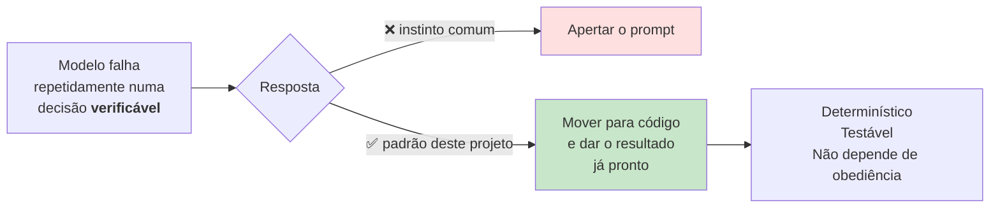

# Decisões técnicas

> **Pergunta que este documento responde:** que escolhas de engenharia foram feitas, porquê, e o
> que se perdeu com cada uma?

Cada decisão traz: o que foi escolhido, o motivo (marcado **Implemented** quando está escrito no
código, **Inference** quando é dedução), o benefício, o *trade-off*, e as alternativas
rejeitadas.

---

## D1 — Passagem única, sem processo permanente

**Escolha:** `Type=oneshot` disparado por um timer de 2 minutos. Nada corre entre passagens.

**Motivo** — **Implemented**, `assistente.py`:
> Não há ciclo interno nem processo permanente: um arranque limpo de dois em dois minutos é mais
> robusto do que um processo que tem de sobreviver a semanas, e o estado vive no SQLite.

| | |
|---|---|
| **Benefício** | Sem fugas de memória, sem reconexões, sem estado corrompido em RAM. Um *crash* custa 2 minutos. Reiniciar é a operação normal, não a recuperação |
| **Trade-off** | Latência mínima de 2 min; sem processamento imediato |
| **Alternativas** | *Webhooks* do Graph (endpoint público + renovação de subscrições); processo permanente com *polling* (o modo de falha que isto evita) |

> [!TIP] O efeito colateral mais valioso
> A retentativa **não precisa de código**. Se uma passagem falha, a seguinte vê exatamente as
> mesmas mensagens. Ver [[error-handling|Tratamento de erros]].

---

## D2 — Monólito de 2386 linhas

**Escolha:** todo o caminho de produção num ficheiro; as 10 ferramentas importam-no.

**Motivo** — **Inference**: manutenção por uma pessoa, navegabilidade num ficheiro.

| | |
|---|---|
| **Benefício** | Importação trivial pelos satélites; sem grafo de dependências interno; leitura linear do caminho completo |
| **Trade-off** | Ficheiro grande; `processar()` com 10 pontos de retorno é difícil de testar em isolamento — e, de facto, **não é testado** |
| **Alternativas** | Pacote com módulos por domínio |

> [!NOTE] Quando é que isto deixaria de servir
> **Inference:** a partir do momento em que houvesse mais do que um cliente ou mais do que um
> mantenedor. Hoje, o custo (Finding H-2) é a falta de testes, não a estrutura em si.

---

## D3 — Base de conhecimento inteira no prompt, sem RAG

**Escolha:** os 7 ficheiros vão em todas as chamadas, dentro do bloco cacheado.

**Motivo** — **Inference**: eliminar a classe de falhas de *retrieval*; o cache torna-a barata.

| | |
|---|---|
| **Benefício** | O modelo vê **sempre** todas as políticas. Sem risco de o chunk certo não ser recuperado — a causa mais comum de alucinação em apoio ao cliente. Regras que se cruzam (prazo × tipo de produto × motivo) são vistas em conjunto |
| **Trade-off** | Teto de escala; custo linear no tamanho da base |
| **Alternativas** | RAG com embeddings (adiciona um modo de falha silencioso); *retrieval* por palavras-chave (frágil em português com sinónimos) |

Para 29K tokens numa janela de 1M, a escolha é clara. Deixa de o ser em
[[scalability|escala]]. Ver [[knowledge-base|Base de conhecimento]].

---

## D4 — Duas chamadas ao modelo, não uma

**Escolha:** `ESQUEMA_NUCLEO` sempre; `ESQUEMA_DOSSIE` só quando escala.

**Motivo** — **Implemented**, e é empírico, não estético:
> Um único esquema com todos os campos chegou a 19 propriedades e a API passou a responder
> "Grammar compilation timed out" de forma consistente — descoberto a meio de uma corrida do
> eval.py que ficava presa sem erro nenhum, minutos a fio. Um esquema sem esses campos resolve em
> 1-2 segundos.

| | |
|---|---|
| **Benefício** | O esquema pequeno resolve em 1-2 s; só os escalados pagam a segunda chamada, que reutiliza o cache |
| **Trade-off** | Latência dupla nos escalados; a 2ª chamada pode falhar isoladamente (tratado) |
| **Alternativas** | Um esquema (não funciona); três chamadas (latência sem ganho) |

---

## D5 — Identidade decidida em código, não pelo modelo

**Escolha:** `resolver_encomenda()` classifica em 4 níveis; o modelo recebe só o resultado.

**Motivo** — **Implemented**:
> "Adivinhar" uma encomenda é o erro mais caro possível deste sistema, porque expõe dados de um
> cliente a outro.

| | |
|---|---|
| **Benefício** | Determinístico, testável (classe de teste dedicada), auditável. **Não depende de o modelo obedecer** |
| **Trade-off** | Mais código; regras de identidade rígidas — um cliente legítimo pode ficar em `media` |
| **Alternativas** | Confiar no prompt — rejeitado, e corretamente |

> [!IMPORTANT] Esta é a decisão que mais separa o sistema de uma chamada a um LLM
> Ver [[decision-making|Tomada de decisão]] e [[identity-resolution|Resolução de identidade]].

---

## D6 — Enums fora do esquema, validados em Python

**Escolha:** só `acao` tem `enum`. Os outros campos são `string` livre, validados depois.

**Motivo** — **Implemented**: contribuíam para o esquema pesado que causava o *timeout* (D4).

| | |
|---|---|
| **Benefício** | Esquema leve; validação com **valor de segurança** em vez de erro (`categoria` inválida → `"OUTRO"`) |
| **Trade-off** | O modelo pode devolver valores fora da lista — mitigado por `_validar()` |
| **Alternativas** | Manter enums (causa o timeout); validar só na leitura (métricas corrompidas em silêncio) |

---

## D7 — Dossiê validado por conteúdo, não por etiqueta

**Escolha:** `tem_dossie` exige `dossie_resumo` **e** `dossie_resposta` preenchidos; ignora
`dossie_tipo`.

**Motivo** — **Implemented**:
> Visto em produção (18/08/2026) que o modelo às vezes escreve um dossiê completo e uma resposta
> sugerida já pronta, mas erra ou hesita só na etiqueta de "dossie_tipo" e devolve "nenhum" — sem
> isto, esse trabalho todo era deitado fora por causa de um campo.

| | |
|---|---|
| **Benefício** | O trabalho útil não se perde por um erro de arrumação |
| **Trade-off** | `dossie_tipo` deixa de ser fiável para análise — mitigado atribuindo `"excecao"` |
| **Alternativas** | Exigir a etiqueta (perde dossiês bons); ignorar o conteúdo (fila inflacionada) |

---

## D8 — Registo indexado pelo `internetMessageId`

**Escolha:** a chave primária de `processados` é o Message-ID, não o `id` do Graph.

**Motivo** — **Implemented**: o `id` do Graph *"tem âmbito de pasta e é reatribuído quando alguém
arruma o email"*.

| | |
|---|---|
| **Benefício** | O registo sobrevive a reorganizações da caixa |
| **Trade-off** | Nenhum relevante |
| **Alternativas** | `id` do Graph — deixaria silenciosamente de fazer correspondência |

> [!NOTE] Este projeto tem um utilizador que arruma a caixa ao responder
> É um facto conhecido do cliente, e explica também porque é que outras ferramentas procuram sem
> âmbito de pasta.

---

## D9 — Sem filtro de "não lidas"

**Escolha:** processar todos os emails novos, lidos ou não.

**Motivo** — **Implemented**:
> Numa caixa que está a ser trabalhada, o operador abre o email minutos depois de chegar, e um
> filtro de não lidas faria desaparecer precisamente os emails em que alguém está a trabalhar
> agora.

| | |
|---|---|
| **Benefício** | O produto — o rascunho já estar lá quando ele abre o Outlook — funciona |
| **Trade-off** | Depende inteiramente do SQLite para não repetir |
| **Alternativas** | Filtrar por não lidas (quebra o produto) |

---

## D10 — Texto simples do modelo, HTML construído em código

**Escolha:** o modelo devolve texto; `para_html()` escapa e envolve em `
`.

**Motivo** — **Implemented**:
> Escapar texto é uma linha, enquanto sanitizar HTML de terceiros são cinquenta e nunca fica
> fechado.

| | |
|---|---|
| **Benefício** | Superfície de XSS fechada por construção |
| **Trade-off** | Sem formatação rica — irrelevante para respostas de 2-4 frases |
| **Alternativas** | Pedir HTML ao modelo e sanitizar (mais código, mais risco) |

---

## D11 — Sem CI/CD

**Escolha:** *deploy* manual por `git archive | ssh`.

**Motivo** — **Inference**: projeto de um mantenedor, testes locais rápidos.

| | |
|---|---|
| **Benefício** | Zero infraestrutura a manter |
| **Trade-off** | **Nada impede um deploy com testes a falhar.** As verificações relevantes são grátis e demoram <1 s |
| **Alternativas** | GitHub Actions; ou apenas um script de deploy que corra os testes |

> [!WARNING] É o *trade-off* com pior relação custo/benefício da lista
> Finding M-5. A correção é um script de 5 linhas. Ver [[improvements|Melhorias]].

---

## D12 — Interruptores de funcionalidade em vez de ramos

**Escolha:** 5 `ENABLE_*` mais `DRY_RUN`, cada um com o comportamento de desligado documentado.

**Motivo** — **Implemented**, nos comentários de `carregar_config()`: cada um descreve o que
acontece ao desligar (ex.: *"Desligar dá o comportamento anterior, que só encontrava a encomenda
com número mais email exato"*).

| | |
|---|---|
| **Benefício** | Uma funcionalidade que corra mal desliga-se **em produção, sem deploy** |
| **Trade-off** | Caminhos de código que raramente correm podem apodrecer sem ninguém dar por isso |
| **Alternativas** | Reverter por git (mais lento, exige deploy) |

---

## Padrão transversal: mover decisões para fora do modelo

Três decisões **saíram** do modelo depois de ele falhar nelas. Não é uma decisão isolada — é um
método.

| Decisão | Evidência da falha | Movida para |
|---|---|---|
| Data-limite de devolução | 21/08/2026 — errou com a data à mão | `resumir_encomenda()` |
| Validade do dossiê | 18/08/2026 — dossiês bons com etiqueta errada | `tem_dossie` |
| Titularidade da encomenda | Preventivo — o erro mais caro possível | `pode_revelar` |

> [!TIP] O próximo candidato
> O cálculo do valor de um artigo dentro de um pack (total ÷ nº artigos) falha em **ambos** os
> modelos testados. É aritmética, é verificável, e devia sair do modelo pelo mesmo padrão.
> Finding H-3 em [[technical-debt|Dívida técnica]].

## Related

- [[system-architecture|Arquitetura do sistema]] — onde estas decisões se materializam
- [[decision-making|Tomada de decisão]] — o padrão transversal em detalhe
- [[limitations|Limitações]] — o que os *trade-offs* custam hoje
- [[technical-debt|Dívida técnica]] — as decisões que envelheceram mal
- [[scalability|Escalabilidade]] — quais destas quebram em escala
