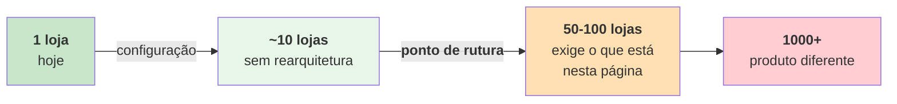
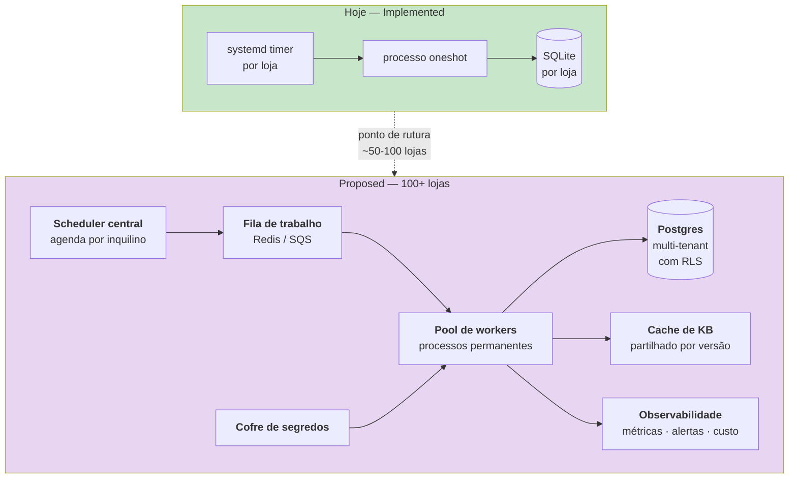

# Arquitetura futura

> **Pergunta que este documento responde:** se este sistema tivesse de servir muitas lojas, o que
> teria de mudar — e quando é que essa mudança se justifica?

> [!IMPORTANT] Nada nesta página está construído
> Tudo aqui é `Proposed` e **Inference**. A arquitetura atual está em
> [[system-architecture|Arquitetura do sistema]]; os seus limites em
> [[scalability|Escalabilidade]].
>
> Não confundir esta página com o sistema que existe.

## Quando é que esta página se torna relevante

> [!WARNING] Não construir isto antes de ser preciso
> A arquitetura atual é adequada e barata para o volume real. Adotar filas, workers e Postgres
> para uma loja seria trocar simplicidade por complexidade sem ganho — exatamente o oposto do
> critério que guiou as [[technical-decisions|decisões]] existentes.

## O que quebra primeiro

Por ordem de gravidade, a partir de ~50-100 lojas:

| # | Ponto de rutura | Porquê |
|---|---|---|
| 1 | **Cache de prompt fragmentado** | 100 bases distintas = 100 prefixos. Com tráfego esparso, muitos expiram entre emails e paga-se a escrita repetidamente |
| 2 | **N timers systemd** | Arrancar N processos Python de 60 MB de 2 em 2 minutos torna-se ineficiente |
| 3 | **Sem visão agregada** | Erros, custos e qualidade por loja, sem forma de os ver em conjunto |
| 4 | **Registo de apps manual** | Uma app Graph e uma app Shopify por loja é trabalho manual significativo |

## Arquitetura proposta

**Proposed** — para ~100 lojas.

### Mudanças por componente

| Aspeto | Hoje (Implemented) | Proposto |
|---|---|---|
| Base de dados | SQLite, um ficheiro por loja | Postgres com *row-level security* |
| Agendamento | systemd timer por loja | Scheduler central + fila |
| Processo | `oneshot`, arranca e sai | Pool de workers permanentes |
| Segredos | `.env` com `chmod 600` | Cofre (Vault / Secrets Manager) |
| Observabilidade | `journalctl` + ferramentas a pedido | Métricas agregadas + alertas |
| **Isolamento de dados** | **Físico** — um ficheiro por loja | **Lógico** — RLS |

## O risco que esta mudança cria

> [!IMPORTANT] O isolamento passa de físico a lógico
> Hoje, duas lojas não se podem contaminar: são ficheiros diferentes, processos diferentes,
> instalações diferentes. É uma propriedade de segurança **gratuita**.
>
> Num sistema multi-inquilino, essa garantia passa a depender de código. A
> [[identity-resolution|resolução de identidade]] — já o ponto mais sensível do sistema —
> passaria a ter de validar **duas** coisas:
>
> 1. *"Esta encomenda é desta pessoa?"* ← já valida
> 2. *"Esta encomenda é desta loja?"* ← **novo**
>
> É uma superfície de bug nova, no sítio onde um bug é mais caro.

**Inference:** mitigação — a `Correspondencia` passaria a transportar o identificador do
inquilino, e `pode_revelar` a verificá-lo. O padrão de teste já existe (`ShopifyFalsa`), mas os
casos teriam de cobrir contaminação entre inquilinos explicitamente.

## O que se mantém

Nem tudo mudaria. Estas propriedades escalam bem:

| Propriedade | Porque sobrevive |
|---|---|
| Fronteira código/modelo | Independente da escala; é uma decisão de desenho |
| Triagem determinística | Continua grátis e continua a filtrar |
| Taxonomia de escalação | Ganha valor com escala — permite comparar lojas |
| Degradação por camadas | Continua a aplicar-se |
| Banco de ensaio com métricas assimétricas | Ganha valor — permite regressão por loja |
| Base de conhecimento em Markdown | Até ~100 lojas; depois exige conteúdo estruturado |

## 1000+ lojas — produto diferente

**Proposed.** Não é uma evolução desta arquitetura; é outro produto. Exigiria:

- **Onboarding self-service** — hoje a instalação é manual e exige um engenheiro
- **Editor de base de conhecimento** para não-técnicos — hoje é Markdown + `git commit`
- **Faturação por utilização** — hoje o cliente paga a sua própria conta Anthropic
- **SLA e painel de operação**
- **Modelo de conhecimento estruturado e versionado** — Markdown deixa de escalar quando há
  milhares de bases a manter e a validar

## Evoluções que não dependem de escala

**Proposed** — fazem sentido a 1 loja, e estão em [[improvements|Melhorias]]:

| Evolução | Prioridade |
|---|---|
| Fecho de ciclo com o resultado real do rascunho | P3-1 |
| Editor de base de conhecimento | P3-2 |
| Raciocínio seletivo por categoria | P3-3 |
| Painel de operação | P3-4 |

> [!TIP] A ordem certa
> Fechar o ciclo de observabilidade (P3-1) **antes** de escalar. Sem saber se os rascunhos são
> enviados ou reescritos, escalar para 100 lojas é multiplicar por 100 um sistema cuja qualidade
> real não está medida.

## Related

- [[scalability|Escalabilidade]] — os limites atuais e onde quebram
- [[system-architecture|Arquitetura do sistema]] — o que existe hoje
- [[improvements|Melhorias]] — o que fazer antes de pensar nisto
- [[identity-resolution|Resolução de identidade]] — o risco novo em multi-tenancy
- [[technical-decisions|Decisões técnicas]] — o critério que desaconselha construir isto cedo
