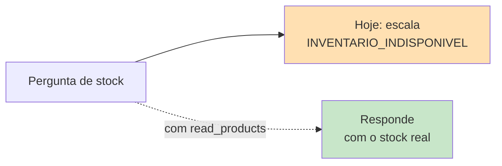
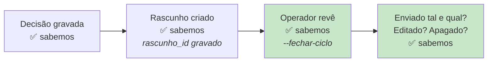
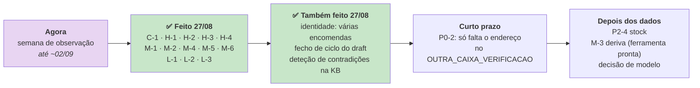

# Melhorias recomendadas

> **Pergunta que este documento responde:** o que fazer a seguir, por que ordem, e quanto custa
> cada coisa?

> [!IMPORTANT] Tudo nesta página é `Proposed`
> Nada aqui está construído. Para o que **está** implementado, ver [[capabilities|Capacidades]].

Priorizado por rácio impacto/esforço, com base no que o código revela.

---

## P0 — Crítico

### ✅ P0-1 · Perda de email em falha do modelo

**Feito a 27/08/2026.** `cursor_seguro()` + 7 testes. Era o Finding C-1.
Ver [[technical-debt|Dívida técnica]].

### ✅ P0-3 · Identidade — várias encomendas do mesmo email deixa de escalar sempre

**Feito a 27/08/2026.** Encontrado ao investigar porque é que o sistema escala cedo demais:
quando o email de quem escreveu já bate com mais do que uma encomenda (um cliente recorrente sem
o número à mão, o cenário mais comum de todos os "vários candidatos"), o sistema tratava isto
como se fosse o mesmo nível de risco de "email não bate com nada" — silêncio total, categoria
`IDENTIDADE_NAO_VERIFICADA`, escala sempre. Mas a titularidade **já está provada** (é o mesmo
nível de confiança que revela tudo quando há só uma correspondência); só falta saber qual das
compras. `Correspondencia.opcoes` passa a levar o número e a data de cada uma (não são segredo)
para o modelo responder diretamente a pedir para especificar, sem escalar. 4 testes novos a nível
de `resolver_encomenda()`, 2 a nível de `processar()`, e um caso novo no
[[evaluation|banco de ensaio]] (ainda por confirmar contra o modelo real — ver
[[identity-resolution|Resolução de identidade]]).

### 🟡 P0-2 · Verificação periódica da política de acesso do Exchange — construído, por ativar

**Construído a 27/08/2026.** `verificar_restricao_diaria()` repete, uma vez por dia, o mesmo
teste que `verificar.py --outra-caixa` faz na instalação — e para a passagem com um alarme
(`sys.exit`, que dispara o alerta do M-6) se conseguir ler outra caixa.

**Falta uma decisão do cliente, não código:** o teste precisa de `OUTRA_CAIXA_VERIFICACAO` no
`.env` — um endereço real de outra caixa do inquilino da tripat3s. Sem isso, fica desligado como
estava. Ver Finding P0-2 em [[technical-debt|Dívida técnica]] e [[security|Segurança]].

---

## P1 — Alto impacto

### ✅ P1-1 · Testes unitários para `processar()`

**Feito a 27/08/2026.** 28 testes novos, os três duplos (`GraphFalso`, `ShopifyFalsa`,
`ClienteFalso`) estendidos para cobrir todos os métodos que `processar()` chama. Finding H-2.

### ✅ P1-2 · Retentativa com *backoff* em Graph e Shopify

**Feito a 27/08/2026.** `_com_retentativa()`, só em GET, até 3 tentativas com espera
exponencial. Finding M-2.

### ✅ P1-3 · Corrigir a documentação de custo e cache

**Feito a 27/08/2026.** Os três locais corrigidos, com os números medidos e a distinção entre
cache quente e fria. Finding H-1.

### ✅ P1-4 · Regra do pack — fechado, não havia bug

**Resolvido a 27/08/2026.** Perguntado ao lojista se o assistente pode enviar o valor calculado
sozinho: respondeu que fica em rascunho, para ele analisar o email. Ou seja, escala como
qualquer outro reembolso — que é exatamente o que Sonnet 5 e Haiku 4.5 já faziam nas duas
corridas de eval de 26/08. A correção foi ao `expect` do caso de teste, não ao código nem à base
de conhecimento. Ver Finding H-3 em [[technical-debt|Dívida técnica]].

### ✅ P1-5 · Alerta em falha de passagem

**Feito a 27/08/2026.** `OnFailure=` + `tripat3s-assistente-alerta.service` + `deploy/alertar.py`.
Canal externo opcional via `ALERTA_WEBHOOK_URL` — vazio até ser configurado. Finding M-6.

---

## P2 — Evolução

| # | Melhoria | Problema | Complexidade |
|---|---|---|---|
| ~~P2-1~~ | ✅ **CI mínimo** — feito 27/08, `deploy/enviar.sh` | | |
| ~~P2-2~~ | ✅ **Backup do SQLite** — feito 27/08, `manutencao.py` | | |
| ~~P2-3~~ | ✅ **Reconciliar o README** — feito 27/08 | | |
| P2-4 | **Fechar `INVENTARIO_INDISPONIVEL`** | Scope `read_products` + consulta de stock | Média |
| ~~P2-5~~ | ✅ **Política de retenção** — feito 27/08, purga aos 90 dias | | |
| ~~P2-6~~ | ✅ **Deteção de contradições na base** — construído 27/08, `verificar_kb.py` | | |
| P2-7 | **Medir a linha de base da deriva** | Ferramenta pronta (`--fechar-ciclo`); falta correr um período e agregar | Baixa |

### Sobre P2-4 — a categoria mais facilmente eliminável

O padrão de integração já existe (autenticação, cliente HTTP, tradução de estados). Falta pedir
o scope e escrever a consulta.

### Sobre P2-6 — deteção de contradições (fechado 27/08/2026)

**Implemented.** `verificar_kb.py` — uma chamada só ao Claude, offline, que lê os 7 documentos e
devolve uma lista estruturada de contradições (`ESQUEMA_CONTRADICOES`), para correr à mão depois
de editar `knowledge/*.md`, antes do commit. Não entra no caminho de produção nem custa por
email — custa uma chamada isolada, cada vez que se corre.

A parte sem rede (montar o pedido, interpretar a resposta) tem 3 testes com `ClienteFalso`. A
qualidade real da deteção — se o Claude encontra mesmo boas contradições nesta base — só se
confirma com uma chamada real, ainda não corrida.

---

## P3 — Visão

| # | Melhoria | Nota |
|---|---|---|
| ~~P3-1~~ | ✅ **Fecho de ciclo com o resultado real** — feito 27/08, `medir_deriva.py --fechar-ciclo` | |
| P3-2 | **Editor de base de conhecimento** | Hoje exige editar Markdown e fazer commit |
| P3-3 | **Raciocínio seletivo por categoria** | `thinking` adaptativo só em devoluções/garantia |
| P3-4 | **Painel de operação** | Custo, latência e qualidade ao longo do tempo |
| P3-5 | **Multi-tenancy** | Ver [[future-architecture\|Arquitetura futura]] |

### Sobre P3-1 — a lacuna de observabilidade mais importante (fechada 27/08/2026)

O sistema registava o que **decidiu**, mas não sabia o que **acontecia depois**.

**Implemented.** `rascunho_id` (o id do Graph devolvido por `criar_rascunho()`) passa a ficar
gravado por email; `medir_deriva.py --fechar-ciclo` pergunta ao Graph pelo próprio id (não pela
conversa) se foi enviado, editado ou apagado, e grava o resultado. `metricas.py` já mostra a taxa
de aceitação assim que houver dados.

**O que ainda falta não é técnico, é tempo:** a ferramenta só cobre rascunhos criados a partir de
27/08/2026 (é quando o id passou a ser gravado), e a cadência é manual (correr
`--fechar-ciclo` periodicamente) — automatizar via cron é trivial, mas só vale a pena depois de
haver rascunhos suficientes para medir. Ver [[data-flow|Fluxo de dados]] e
[[operations|Ferramentas de operação]].

### Sobre P3-3 — raciocínio seletivo

`thinking` está desativado. As falhas observadas concentram-se em **regras compostas** (pack,
higiene × tipo de produto).

**Inference:** ativar raciocínio adaptativo **apenas** quando a categoria é de devolução/garantia
poderia fechar parte dos 9% restantes a custo controlado. Mensurável com o
[[evaluation|banco de ensaio]] existente antes de decidir.

---

## O que não fazer

> [!IMPORTANT] Três coisas que parecem melhorias e não são
> Removê-las mudaria a natureza do sistema.

| Não fazer | Porquê |
|---|---|
| **Permitir envio automático** | É a propriedade que torna todo o resto seguro. Sem ela, uma alucinação chega ao cliente |
| **Permitir escrita na Shopify** | Idem. `dossie.py` afirma-o explicitamente: *"não tem permissão de escrita e não a vai ter"* |
| **Aprendizagem automática a partir das respostas** | O ciclo humano é intencional: *"o mecanismo de melhoria tem de ser legível por um humano"* |

---

## Sequência sugerida

> [!TIP] Treze correções e três melhorias de fundo fechadas a 27/08/2026
> C-1, H-1, H-2, H-3, H-4, M-1, M-2, M-4, M-5, M-6, L-1, L-2 e L-3 fecharam riscos reais: perda
> silenciosa de email, decisão de custo com informação errada, a maior concentração de risco do
> sistema sem um único teste, um crash de lote inteiro por uma exceção não apanhada, retenção
> indefinida de correspondência, ferramentas offline inconsistentes com a produção, deploy sem
> gate de qualidade, e falhas silenciosas sem alerta nenhum.
>
> H-3 fechou por confirmação direta do lojista (não havia bug — o teste é que tinha o `expect`
> errado).
>
> No mesmo dia, três melhorias de maior alcance, a partir de uma revisão orientada a reduzir
> escalação e fechar o ciclo de melhoria contínua: a identidade deixa de escalar sempre quando o
> email já prova quem é (P0-3), o resultado real de cada draft passa a poder ser verificado pelo
> próprio id (`--fechar-ciclo`, P3-1), e há uma ferramenta para detetar contradições na base
> (P2-6).
>
> O que resta: **P0-2** (verificação periódica do Exchange, esforço baixo — falta só um endereço
> no `.env`) e **M-3** (linha de base da deriva) — a ferramenta já existe, falta correr um
> período e agregar. Ver [[technical-debt|Dívida técnica]] para o detalhe de cada um.

## Related

- [[technical-debt|Dívida técnica]] — os findings que estas melhorias resolvem
- [[limitations|Limitações]] — o que cada melhoria removeria
- [[future-architecture|Arquitetura futura]] — o que fica para lá do P3
- [[escalation|Escalação]] — as categorias que P2-4 fecharia
- [[qa|QA e testes]] — o contexto de P1-1
