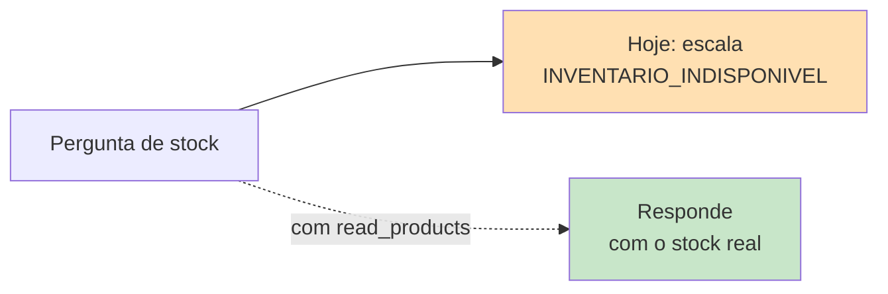
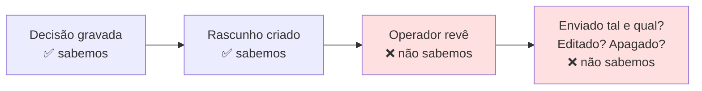
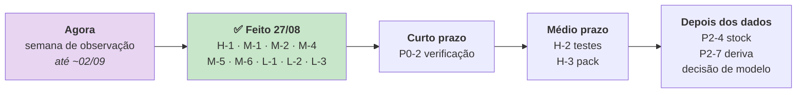

# Melhorias recomendadas

> **Pergunta que este documento responde:** o que fazer a seguir, por que ordem, e quanto custa
> cada coisa?

> [!IMPORTANT] Tudo nesta página é `Proposed`
> Nada aqui está construído. Para o que **está** implementado, ver [[capabilities|Capacidades]].

Priorizado por rácio impacto/esforço, com base no que o código revela.

---

## P0 — Crítico

### ✅ P0-1 · Perda de email em falha do modelo

**Feito a 27/08/2026.** `cursor_seguro()` + 7 testes. Era o Finding C-1.
Ver [[technical-debt|Dívida técnica]].

### P0-2 · Verificação periódica da política de acesso do Exchange

| | |
|---|---|
| **Problema** | `verificar.py --outra-caixa` prova a restrição, mas só corre quando alguém se lembra. Se a política for removida, a aplicação passa a poder ler **todas** as caixas do inquilino e nada o assinala |
| **Solução** | Incluir a verificação na passagem, uma vez por dia, com falha ruidosa |
| **Impacto** | **Crítico** — é a única defesa contra acesso indevido ao correio da empresa |
| **Complexidade** | Baixa — a lógica já existe em `verificar.py` |

Ver [[security|Segurança]].

---

## P1 — Alto impacto

### P1-1 · Testes unitários para `processar()`

| | |
|---|---|
| **Problema** | 10 pontos de retorno, zero cobertura. É a concentração de risco do sistema |
| **Solução** | Duplos para `Graph`, `Shopify` e cliente Anthropic. **Os padrões já existem** (`ShopifyFalsa`, `ClienteFalso`) |
| **Impacto** | Alto |
| **Complexidade** | Média — trabalho de horas, não de dias |

Finding H-2.

### ✅ P1-2 · Retentativa com *backoff* em Graph e Shopify

**Feito a 27/08/2026.** `_com_retentativa()`, só em GET, até 3 tentativas com espera
exponencial. Finding M-2.

### ✅ P1-3 · Corrigir a documentação de custo e cache

**Feito a 27/08/2026.** Os três locais corrigidos, com os números medidos e a distinção entre
cache quente e fria. Finding H-1.

### P1-4 · Resolver o cálculo do pack em código

| | |
|---|---|
| **Problema** | A regra "valor = total ÷ nº artigos" está escrita mas falha em **ambos** os modelos |
| **Solução** | Fornecer o valor por artigo já calculado nos dados da encomenda, em vez de pedir ao modelo que divida |
| **Impacto** | Médio — trabalho manual recorrente e evitável |
| **Complexidade** | Baixa |

Finding H-3. É o mesmo padrão que resolveu o prazo de devolução — ver
[[technical-decisions|Decisões técnicas]].

### ✅ P1-5 · Alerta em falha de passagem

**Feito a 27/08/2026.** `OnFailure=` + `tripat3s-assistente-alerta.service` + `deploy/alertar.py`.
Canal externo opcional via `ALERTA_WEBHOOK_URL` — vazio até ser configurado. Finding M-6.

---

## P2 — Evolução

| # | Melhoria | Problema | Complexidade |
|---|---|---|---|
| ~~P2-1~~ | ✅ **CI mínimo** — feito 27/08, `deploy/enviar.sh` | | |
| ~~P2-2~~ | ✅ **Backup do SQLite** — feito 27/08, `manutencao.py` | | |
| ~~P2-3~~ | ✅ **Reconciliar o README** — feito 27/08 | | |
| P2-4 | **Fechar `INVENTARIO_INDISPONIVEL`** | Scope `read_products` + consulta de stock | Média |
| ~~P2-5~~ | ✅ **Política de retenção** — feito 27/08, purga aos 90 dias | | |
| P2-6 | **Deteção de contradições na base** | Nada verifica se duas secções se contradizem | Média |
| P2-7 | **Medir a linha de base da deriva** | A referência dos 60% nunca foi medida | Baixa |

### Sobre P2-4 — a categoria mais facilmente eliminável

O padrão de integração já existe (autenticação, cliente HTTP, tradução de estados). Falta pedir
o scope e escrever a consulta.

### Sobre P2-6 — deteção de contradições

**Inference:** uma verificação por LLM, **offline**, que leia os 7 documentos e assinale regras
conflituantes, correndo apenas quando `knowledge/` muda. Não entra no caminho de produção nem
custa por email.

---

## P3 — Visão

| # | Melhoria | Nota |
|---|---|---|
| P3-1 | **Fecho de ciclo com o resultado real** | Saber se o rascunho foi enviado tal e qual, editado ou apagado |
| P3-2 | **Editor de base de conhecimento** | Hoje exige editar Markdown e fazer commit |
| P3-3 | **Raciocínio seletivo por categoria** | `thinking` adaptativo só em devoluções/garantia |
| P3-4 | **Painel de operação** | Custo, latência e qualidade ao longo do tempo |
| P3-5 | **Multi-tenancy** | Ver [[future-architecture\|Arquitetura futura]] |

### Sobre P3-1 — a lacuna de observabilidade mais importante

O sistema regista o que **decidiu**, mas não sabe o que **aconteceu depois**.

**Inference:** detetável comparando o rascunho gravado com a mensagem efetivamente enviada na
conversa — **a lógica já existe em `medir_deriva.py`**, falta a cadência automática.

Transformaria a medição de deriva de ferramenta manual em métrica contínua, e fecharia o risco
de "deriva silenciosa" identificado no próprio README.

### Sobre P3-3 — raciocínio seletivo

`thinking` está desativado. As falhas observadas concentram-se em **regras compostas** (pack,
higiene × tipo de produto).

**Inference:** ativar raciocínio adaptativo **apenas** quando a categoria é de devolução/garantia
poderia fechar parte dos 9% restantes a custo controlado. Mensurável com o
[[evaluation|banco de ensaio]] existente antes de decidir.

---

## O que não fazer

> [!IMPORTANT] Três coisas que parecem melhorias e não são
> Removê-las mudaria a natureza do sistema.

| Não fazer | Porquê |
|---|---|
| **Permitir envio automático** | É a propriedade que torna todo o resto seguro. Sem ela, uma alucinação chega ao cliente |
| **Permitir escrita na Shopify** | Idem. `dossie.py` afirma-o explicitamente: *"não tem permissão de escrita e não a vai ter"* |
| **Aprendizagem automática a partir das respostas** | O ciclo humano é intencional: *"o mecanismo de melhoria tem de ser legível por um humano"* |

---

## Sequência sugerida

> [!TIP] Dez correções fechadas a 27/08/2026
> H-1, M-1, M-2, M-4, M-5, M-6, L-1, L-2, L-3 e o crítico C-1. Fecharam riscos reais: decisão de
> custo com informação errada, perda de estado, retenção indefinida de correspondência,
> ferramentas offline inconsistentes com a produção, deploy sem gate de qualidade, e falhas
> silenciosas sem alerta nenhum.
>
> O que resta: **P0-2** (verificação periódica do Exchange, esforço baixo), **H-3** (pack, baixo)
> e **H-2** (testes de `processar()`, o único que dá trabalho a sério). **M-3** (linha de base
> da deriva) depende dos dados da semana de observação, ainda em curso.

## Related

- [[technical-debt|Dívida técnica]] — os findings que estas melhorias resolvem
- [[limitations|Limitações]] — o que cada melhoria removeria
- [[future-architecture|Arquitetura futura]] — o que fica para lá do P3
- [[escalation|Escalação]] — as categorias que P2-4 fecharia
- [[qa|QA e testes]] — o contexto de P1-1
