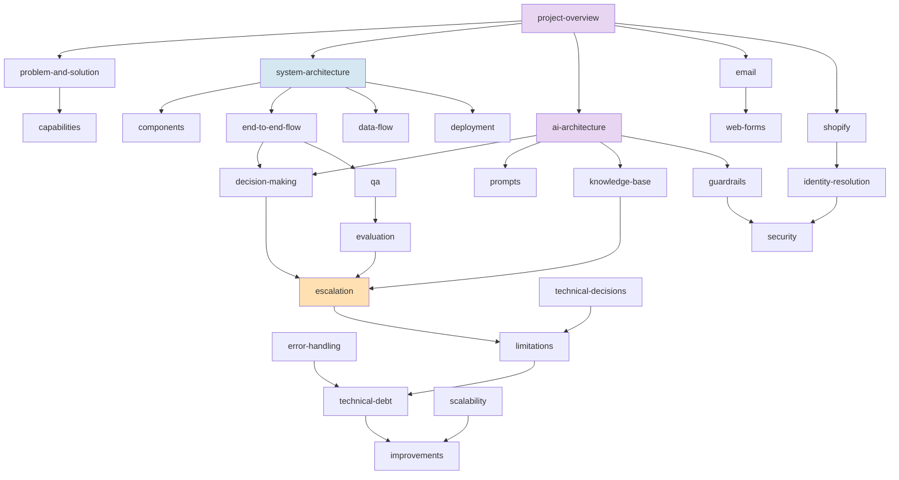

# Assistente de Apoio ao Cliente

Base de conhecimento técnica do sistema que lê a caixa de apoio da **tripat3s**, decide o que
fazer com cada email de cliente, escreve rascunhos de resposta e prepara os casos que precisam
de uma pessoa.

**Nunca envia nada.** A aplicação não tem permissão técnica para enviar email — todo o texto que
produz passa obrigatoriamente por revisão humana.

> [!INFO] Estado
> Em produção desde **26 de agosto de 2026**, numa caixa real, com `DRY_RUN=false`.
> Modelo: `claude-sonnet-5`. Passagem a cada 2 minutos via systemd timer.

---

## Por onde começar

Três percursos, consoante o que precisas de perceber.

| Se és… | Lê por esta ordem |
|---|---|
| **Novo no projeto** | [[project-overview\|Visão geral]] → [[problem-and-solution\|Problema e solução]] → [[end-to-end-flow\|Fluxo de um email]] |
| **Engenheiro a integrar-te** | [[system-architecture\|Arquitetura]] → [[components\|Componentes]] → [[data-flow\|Fluxo de dados]] → [[technical-decisions\|Decisões técnicas]] |
| **A avaliar o sistema** | [[capabilities\|Capacidades]] → [[limitations\|Limitações]] → [[technical-debt\|Dívida técnica]] → [[scalability\|Escalabilidade]] |

---

## Navegação

### 01 — Visão geral
- [[project-overview|Visão geral do projeto]] — o que é, em que estado está, com que stack
- [[problem-and-solution|Problema e solução]] — que problema resolve e porque foi desenhado assim
- [[capabilities|Capacidades]] — inventário do que faz e do que não faz

### 02 — Arquitetura
- [[system-architecture|Arquitetura do sistema]] — visão de conjunto, camadas, comunicação
- [[components|Componentes]] — inventário de cada peça e a sua responsabilidade
- [[end-to-end-flow|Fluxo ponta a ponta]] — a viagem de um email, passo a passo
- [[data-flow|Fluxo de dados]] — que dados existem, como se transformam, onde ficam
- [[deployment|Deployment e operação]] — como corre, onde corre, como se atualiza

### 03 — Inteligência artificial
- [[ai-architecture|Arquitetura de IA]] — modelo, chamadas, contexto, cache
- [[decision-making|Tomada de decisão]] — quem decide o quê: código vs. modelo
- [[prompts|Prompts]] — o que o prompt de sistema instrui e porquê
- [[knowledge-base|Base de conhecimento]] — a fonte de verdade e o ciclo de melhoria
- [[guardrails|Guardrails]] — as 22 defesas contra respostas erradas

### 04 — Integrações
- [[email|Email — Microsoft Graph]] — leitura da caixa, rascunhos, restrição de acesso
- [[shopify|Shopify]] — que dados se obtêm e quais são os limites
- [[identity-resolution|Resolução de identidade]] — como se prova que a encomenda é daquela pessoa
- [[web-forms|Formulários do site]] — contacto e devolução, e os bugs que causaram

### 05 — Fiabilidade
- [[qa|QA e testes]] — estratégia de verificação em quatro camadas
- [[evaluation|Banco de ensaio]] — os 93 casos e as métricas assimétricas
- [[escalation|Sistema de escalação]] — quando e como envolve uma pessoa
- [[error-handling|Tratamento de erros]] — degradação por camadas
- [[security|Segurança]] — permissões, segredos, injeção de prompt, dados pessoais

### 06 — Engenharia
- [[technical-decisions|Decisões técnicas]] — o que foi escolhido, porquê, e o que se perdeu
- [[operations|Ferramentas de operação]] — os 12 satélites de diagnóstico e manutenção
- [[limitations|Limitações]] — o que o sistema não consegue fazer hoje
- [[technical-debt|Dívida técnica e findings]] — o que está mal e quanto custa
- [[cost-optimization|Auditoria de custo]] — onde vai o dinheiro da API, e o que já foi cortado
- [[scalability|Escalabilidade]] — de 1 loja a 1000

### 07 — Roadmap
- [[improvements|Melhorias recomendadas]] — priorizadas P0 a P3
- [[future-architecture|Arquitetura futura]] — o que teria de mudar, e quando

---

## O grafo

As ligações entre documentos formam esta rede. No Obsidian, abre a vista de grafo para navegar.

---

## Convenções desta documentação

Cada afirmação sobre o comportamento do sistema traz uma destas marcas:

| Marca | Significado |
|---|---|
| **Implemented** | Verificado no código, com referência `ficheiro:linha` |
| **Inference** | Dedução sobre a intenção do desenho; o código não o afirma |
| **Proposed** | Ideia futura; **não** está construído |

> [!IMPORTANT] Arquitetura atual ≠ arquitetura futura
> Nada marcado como `Proposed` existe hoje. [[future-architecture|Arquitetura futura]] e
> [[improvements|Melhorias]] descrevem trabalho por fazer, não o sistema em produção.

Referências ao código apontam para o commit auditado. Os números de linha derivam
depressa — o nome da função é a âncora fiável.

---

## Relação com o PDF

Existem duas versões desta documentação, com objetivos diferentes:

| | `entregas/documentacao-tecnica.pdf` | `docs/` (esta KB) |
|---|---|---|
| **Objetivo** | Apresentação / documento executivo | Documentação técnica viva |
| **Formato** | 56 páginas, linear, para imprimir ou enviar | Rede de documentos curtos e navegáveis |
| **Audiência** | CTO, cliente, avaliação externa | Quem trabalha no código |
| **Atualização** | Regerado quando há mudanças materiais | Evolui com o código |

Ambos descrevem o mesmo sistema. Em caso de divergência, **o código manda**, e esta KB é
atualizada primeiro.

---

## Related

- [[project-overview|Visão geral do projeto]]
- [[system-architecture|Arquitetura do sistema]]
- [[ai-architecture|Arquitetura de IA]]
- [[technical-debt|Dívida técnica e findings]]
