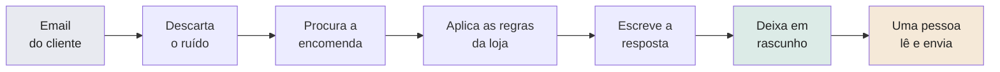
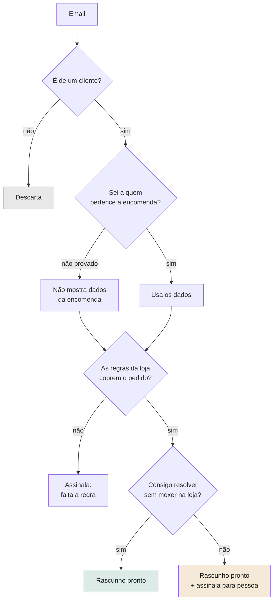

# Automação de Atendimento — Visão Geral

> Tratar automaticamente os emails previsíveis, preparar a resposta para todos os outros, e
> assinalar os casos que precisam mesmo de uma pessoa — sem nunca enviar nada sozinha.

> [!INFO] Os números deste documento
> Medidos em produção entre **26 de agosto e 1 de setembro de 2026** — sete dias, 308 emails.
> Onde não há medição, está escrito que não há.

---

## 1. O que a automação faz

De dois em dois minutos, olha para a caixa de apoio e trata cada email novo:

**Nunca envia.** O último passo é sempre uma pessoa.

---

## 2. O que consegue fazer

| Capacidade            | O que faz                                                                                     |
| --------------------- | --------------------------------------------------------------------------------------------- |
| **Triagem**           | Descarta newsletters, notificações e ruído antes de tudo o resto                              |
| **Identificação**     | Procura a encomenda pelo número ou pelo email de quem escreve                                 |
| **Consulta de dados** | Estado do pagamento, se foi expedida, código de rastreio, data de entrega, prazo de devolução |
| **Regras da loja**    | Aplica as políticas escritas — devoluções, garantias, prazos, trocas                          |
| **Escrita**           | Redige a resposta no tom da loja, em português                                                |
| **Rascunhos**         | Deixa o texto pronto no Outlook, na conversa certa                                            |
| **Sinalização**       | Marca os casos que precisam de decisão humana, com o motivo                                   |
| **Fotografias**       | Lê imagens que o cliente anexa e usa-as na análise                                            |

---

## 3. Onde é mais forte

Nos emails **repetitivos e com resposta definida**:

- "Onde está a minha encomenda?" — quando há dados na loja online
- "Como faço uma devolução?" — os passos, a morada, os prazos
- "O produto veio com defeito" — pedir as fotografias e o vídeo certos
- Pedidos de troca por defeito confirmado
- Perguntas sobre prazos, portes e condições
- Formulários do site, que chegam disfarçados de notificação automática

> [!TIP] O ganho maior está no que nunca chega a ver
> Dos 308 emails, **29 foram descartados sozinhos** — ruído que não precisou de atenção nenhuma.

---

## 4. Onde há escalamento

Escalar não é *"a automação não soube responder"*. Na maior parte dos casos ela **escreveu na
mesma a resposta** — o que assinala é que alguém tem de fazer algo que ela não pode fazer.

### A · Coisas que ela está proibida de fazer

A automação **não tem permissão** para alterar encomendas na loja online. Não é uma falha: é a
decisão que a torna segura.

Por isso escala sempre que o pedido é: cancelar, mudar a cor, corrigir a morada, processar um
reembolso, executar uma troca.

**É a maior fatia, de longe.**

### B · Informação que só existe na cabeça da equipa

O cliente pergunta *"o meu reembolso já saiu?"* ou *"a minha devolução já chegou aí?"*.

A automação vê a encomenda original na loja online, mas **não vê** o que aconteceu depois — se o
reembolso foi processado à mão, se o artigo devolvido chegou, se a análise já foi feita.

### C · Casos que exigem julgamento

Garantias em discussão, disputas, ameaças de queixa, exceções à política, gestos comerciais.
São decisões do negócio, não de um sistema.

### D · Falta de contexto ou de dados

- A encomenda tem mais de 60 dias e já não é visível *(limitação da loja online)*
- O email de quem escreve não bate certo com o da encomenda
- A pergunta é curta de mais para se perceber a que se refere
- Perguntas de stock — a automação **não consegue ver** o inventário

---

## 5. Porque escalar é, muitas vezes, a decisão certa

> [!IMPORTANT] O objetivo não é responder a 100%
> É responder automaticamente ao que pode ser respondido **com segurança**, e assinalar o resto.

Uma resposta errada não é neutra. Custa mais do que não responder:

| Se a automação inventasse | O que acontecia |
|---|---|
| Uma data de reembolso | Cliente volta zangado quando o prazo falha |
| Uma política que não existe | A loja fica presa a uma promessa que não quer cumprir |
| Um estado de encomenda | Perde-se a confiança, e o caso volta pior |

**Um caso escalado custa alguns minutos. Uma promessa errada custa um cliente.**

---

## 6. Como decide

> [!NOTE] O ramo da identidade é o mais importante
> Quando não está provado que a encomenda é de quem escreve, **os dados nunca chegam a ser
> usados**. É o que impede mostrar a encomenda de uma pessoa a outra.

---

## 7. O que a equipa ganha

Em sete dias, dos **308 emails** que entraram:

| | n | |
|---|---|---|
| Descartados sozinhos, nunca vistos | **29** | 9% |
| **Chegam com a resposta já escrita** | **267** | **87%** |
| Assinalados como precisando de uma pessoa | 216 | 70% |
| — destes, quantos trazem já a resposta escrita | **204** | **94%** |
| Enviados sem revisão humana | **0** | — |

> [!IMPORTANT] O número que importa
> **94% dos casos assinalados já trazem a resposta redigida.** Ser assinalado não significa
> começar do zero — significa ler, decidir, e agir na loja online.

Além do volume:

- **Consistência** — a mesma pergunta recebe a mesma resposta, seja qual for o dia
- **As regras num sítio só** — as políticas estão escritas e aplicadas de forma uniforme
- **Menos pesquisa** — o estado da encomenda e o prazo de devolução vêm já no contexto
- **Triagem automática** — o ruído desaparece antes de chegar à equipa

---

## 8. Porque tem valor

### Trabalho evitado

Todos os dias entram ~44 emails. Cerca de **4 desaparecem sozinhos** e **38 chegam com o texto
já escrito**. O trabalho que resta é **rever e decidir**, não escrever de raiz.

> [!WARNING] O que não foi medido
> Quantas horas isto poupa por semana **não está medido** — não há registo de quanto tempo a
> equipa demorava antes. Pode ser medido em duas semanas, anotando o tempo gasto na caixa.

### Consistência

As respostas saem da mesma base de regras escrita — 987 linhas com as políticas reais da loja,
construídas caso a caso a partir de situações verdadeiras.

### Segurança

- A automação **não pode enviar email** — permissão nunca pedida
- **Não pode alterar** encomendas na loja online — só leitura
- Está proibida de inventar políticas: se não está escrito, assinala em vez de adivinhar
- **22 defesas** contra respostas erradas, sete delas nascidas de erros reais já corrigidos
- **259 testes automáticos** correm antes de cada atualização

### Escala

O volume de emails pode crescer sem crescer o trabalho na mesma proporção. Quem trata o ruído e
escreve o primeiro texto é o sistema.

### Infraestrutura, não um chatbot

Três sistemas ligados — o email da empresa, a loja online, e a inteligência artificial — com
registo de tudo o que decide, alertas quando falha, cópias de segurança e medição de custo.

---

## 9. O que ainda pode melhorar

### Já corrigido esta semana

| | |
|---|---|
| A automação lia o histórico da conversa **cortado a meio da frase** | Corrigido — passou a ler as mensagens inteiras |
| Nem todas as falhas totais davam alerta | Corrigido |
| Custo por email não era medido | Passou a ser registado, e há duas otimizações já em produção |

### A trabalhar

- **Reduzir escalamentos evitáveis.** Foram analisados os 216 casos um a um: cerca de **17%
  parecem recuperáveis** com melhores dados ou regras mais claras — é uma estimativa a partir da
  leitura dos motivos, não uma medição. O resto é estrutural.
- **Fechar lacunas de conhecimento** — há 4 perguntas de produto à espera de resposta da loja
- **Detetar contradições** nas regras escritas — a ferramenta existe, falta correr com regularidade

### Possibilidades futuras, ainda por decidir

- Ver o **stock** dos produtos *(exige uma permissão adicional na loja online)*
- Ver encomendas com **mais de 60 dias** *(exige aprovação da plataforma)*
- Registar o **estado das promessas** — reembolso processado, devolução recebida — para responder
  a "já saiu?" sem escalar

---

## 10. Hoje e o próximo nível

| Hoje | Próximo nível |
|---|---|
| 87% dos emails chegam com resposta escrita | Menos casos a exigir ida à loja online |
| Ruído descartado sozinho | Perguntas de stock respondidas automaticamente |
| Assinala os casos para pessoa, com o motivo | Etiquetas no email a mostrar o tipo e a urgência |
| Regras escritas e aplicadas | Contradições detetadas antes de causarem erros |
| Custo por email medido | Encomendas antigas também consultáveis |

---

## 11. A ideia central

> [!IMPORTANT] Em três frases
> A automação não foi feita para responder a tudo às cegas. Foi feita para **escrever a resposta
> em quase todos os casos** e ser honesta sobre quais precisam de uma pessoa.
>
> Nunca enviou um email sozinha — não por prudência, mas porque **não tem essa permissão**. Mesmo
> que falhasse em tudo ao mesmo tempo, o pior resultado possível é um rascunho que alguém apaga.
>
> O objetivo é tirar trabalho repetitivo à equipa **sem criar problemas novos**.

---

## Perguntas que podem surgir

**"Porque é que ainda há tantos emails assinalados para mim?"**
Foram lidos um a um. Três em cada quatro pedem algo que a automação está proibida de fazer:
cancelar, trocar, devolver dinheiro. E 94% deles já trazem a resposta escrita — o que falta é a
ação na loja, não o texto.

**"Então o que é que ela me está mesmo a poupar?"**
Escreve o texto em 87% dos emails, e faz desaparecer o ruído. O que sobra é rever e decidir.
Quantas horas isso vale ainda não está medido — pode medir-se em duas semanas.

**"Porque é que não responde a tudo?"**
Porque responder mal custa mais do que não responder. Uma data de reembolso inventada traz o
cliente de volta zangado.

**"Porque preciso de uma pessoa?"**
Para as decisões que são do negócio — exceções, disputas, gestos comerciais — e para as ações na
loja online, que a automação não pode fazer.

**"Quanto mais pode melhorar?"**
Cerca de 17% dos casos assinalados parecem recuperáveis com melhores dados e regras — é uma
estimativa, não uma medição. O resto é estrutural e não vai desaparecer.

**"Porque é que custa este valor?"**
Não é um chatbot. São três sistemas ligados, as regras do negócio escritas uma a uma, 259 testes
automáticos, e um mês a corrigir com base em casos reais — a correr sozinho, todos os dias.

**"O que acontece quando a inteligência artificial se engana?"**
Fica um rascunho errado que se apaga. Não sai nenhum email, não muda nenhuma encomenda. É a
propriedade central do desenho.

**"Ela consegue alterar encomendas?"**
Não, e é deliberado. Só lê.

**"Consegue saber onde está uma encomenda?"**
Sim, quando a loja online tem essa informação: se foi expedida, o código de rastreio, a
transportadora e a data de entrega. O que ela **não** vê é o que acontece fora da loja online.

**"Consegue ver o stock?"**
Não. Exigiria uma permissão adicional que hoje não existe.

**"E se um cliente escrever a tentar enganá-la?"**
Está instruída a tratar o texto recebido como informação, nunca como ordens. E mesmo que fosse
enganada, não tem permissões para fazer nada — só escreveria um rascunho estranho.

**"Isto vai continuar a melhorar sozinho?"**
Não sozinho. Melhora porque as correções que a equipa faz nos rascunhos são lidas e transformadas
em regras novas. Foi assim que se corrigiram vários erros esta semana.

---

## Related

> [!NOTE] Esta secção é para quem mantém o sistema, não para a reunião
> Onde verificar cada afirmação deste documento, se for preciso defendê-la.

- [[capabilities|Capacidades]] — o inventário completo do que faz e do que não faz
- [[escalation|Escalação]] — as nove categorias e o que cada uma significa
- [[guardrails|Guardrails]] — as 22 defesas, uma a uma
- [[evaluation|Banco de ensaio]] — como a qualidade é medida
- [[limitations|Limitações]] — incluindo a janela de 60 dias e a ausência de stock
- [[cost-optimization|Auditoria de custo]] — os números de custo por email
- [[improvements|Melhorias]] — o que está por fazer e porquê
