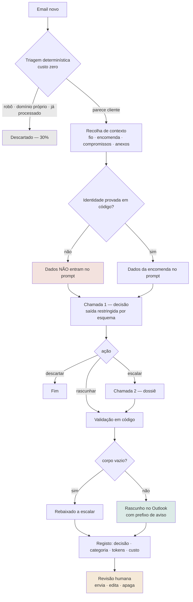

# Agente de Suporte Instrumentado

*Case study · Agente LLM em produção*

## A melhor otimização foi a que decidi não fazer

Construí um agente que lê a caixa de apoio ao cliente de uma loja de e-commerce e escreve rascunhos de resposta. A parte difícil não foi ligar um LLM ao email — foi fazê-lo funcionar de forma segura, medível e economicamente sustentável, sobre regras de negócio que não são lineares.

**Números-chave:** 298 emails processados · 30% filtrados sem custo · $0,043 custo por email · 100% semelhança mediana* · 252 testes · 0 emails enviados sozinho

*(Medido = número real de produção · Estimado = projeção, marcada como tal · Implementado = existe no código, sem métrica)*

---

## A. O caso

### O problema

Uma loja de e-commerce recebe correspondência de clientes o dia inteiro: estados de encomenda, devoluções, defeitos, trocas, reembolsos, queixas. Cada resposta exige três coisas ao mesmo tempo — conhecer a política da loja, ter os dados daquela encomenda à frente, e escrever num tom consistente. Feito à mão, é lento e, pior, é inconsistente: a mesma pergunta recebe respostas diferentes consoante quem responde.

### A solução óbvia, e porque não chega

A resposta imediata é ligar um LLM à caixa de correio. Num playground isso funciona — o modelo escreve emails de apoio ao cliente perfeitamente credíveis.

O problema é que a maior parte destas mensagens **não deve** ser respondida automaticamente. Reembolsos movem dinheiro. Alterar uma encomenda exige escrita em sistemas que não devem estar ao alcance de um modelo. E responder com confiança a uma política que não se conhece é pior do que não responder de todo — um cliente que recebe uma promessa errada é um problema maior do que um cliente que espera.

Um modelo a responder bem num playground não é uma automação pronta para produção. Falta-lhe tudo o que está entre as duas coisas: contexto real, dados da encomenda, as regras da loja, validação da saída, limites de permissões, uma pessoa no circuito, observabilidade, testes, controlo de custo e tratamento de falhas.

A pergunta de desenho nunca foi "como automatizar o apoio ao cliente". Foi **"o que é seguro automatizar, e como é que o sistema sabe a diferença"**.

### O que o sistema faz

Corre de dois em dois minutos como um *oneshot* agendado por `systemd`. Lê os emails novos e, para cada um, decide uma de três coisas: escrever um rascunho, escalar o caso com um dossiê preparado para a pessoa que o vai resolver, ou descartar. Não é conversacional e não tem memória de sessão — cada email é uma decisão independente, informada por contexto que o código vai buscar **antes** de perguntar ao modelo.

O ponto que estrutura tudo o resto: a decisão de identidade acontece **antes** do modelo, em código determinístico. Quando a titularidade da encomenda não está provada, os dados nunca chegam ao prompt — não há instrução que o modelo possa desobedecer, porque ele nunca os viu.

O modelo faz uma coisa só: julgamento linguístico sobre um caso já preparado. Provar identidade, somar prazos, descartar ruído e validar a decisão vivem em código — e cada uma foi para lá porque o modelo demonstrou executá-la mal em produção. A fronteira entre código e modelo foi movida com evidência, não desenhada à partida.

---

## B. Os problemas difíceis não estavam onde eu esperava

Esperava que a parte difícil fosse a qualidade da escrita. Não foi. Foram três coisas que só aparecem quando o sistema já está a correr contra clientes reais.

### 1 · O problema económico

Um agente que corre de dois em dois minutos com um prompt de 33 827 tokens tem um problema de custo estrutural, não incidental. A primeira coisa que descobri foi que não tinha dados suficientes para saber se o sistema era caro: o registo não guardava tokens nenhuns, e a única fonte era a fatura mensal — agregada, e impossível de atribuir a um email.

Antes de otimizar seja o que for, instrumentei. Sete colunas novas no registo: modelo, tokens de entrada, de saída, de escrita de cache, de leitura de cache, número de chamadas e custo estimado. Nenhuma das decisões seguintes teria sido verificável sem isso.

**Instrumentar → Medir → Encontrar o hotspot → Formular hipótese → Testar → Aceitar ou rejeitar**

**O que a medição mostrou.** A decomposição do custo real de um dia contradiz a intuição de que o problema é o tamanho do prompt:

| Componente | % |
|---|---|
| Escrita de cache | 52% |
| Leitura de cache | 22% |
| Saída | 16% |
| Entrada nova | 10% |

Uma taxa de acerto de cache de 89% parece resolvida. Mas a escrita é paga a um múltiplo do preço de entrada e a leitura a uma fração — por isso **os 11% de falhas custavam 2,4× mais do que todos os acertos somados**. O problema nunca foi o prompt ser grande. Era o número de vezes que era reescrito.

**A descoberta que reorientou tudo.** Reconstruí evento a evento as falhas de cache de um dia inteiro. A aritmética fechou exatamente, e revelou algo que eu não sabia: **existem duas entradas de cache, não uma**. O esquema de saída faz parte do prefixo em cache, por isso a chamada de decisão e a chamada de dossiê nunca a partilham — e um arranque a frio numa escalação reescreve o prompt inteiro **duas vezes**. O mesmo desvio de 164 tokens entre as duas entradas apareceu em duas medições independentes.

**A hipótese óbvia, e o teste que a matou.**

- *Hipótese* — Se os dois esquemas fossem um só, as duas chamadas partilhariam uma entrada de cache e metade da escrita desaparecia. Parecia evidente.
- *Sinal de aviso* — Um comentário no código dizia que um esquema único com 19 propriedades tinha feito a API entrar em compilação infinita, meses antes. Podia ter confiado no comentário, ou ignorá-lo. Medi.
- *Teste* — Uma chamada real por configuração, com um prompt mínimo para isolar a variável — a compilação da gramática depende do esquema, não do tamanho do prompt.

| Esquema | Propriedades | Tempo | Resultado |
|---|---|---|---|
| Atual (dois separados) | 11 | 5,34 s | OK |
| Unificado | 17 | 67,89 s | Compila, mas acima do timeout de 60 s |
| Controlo | 19 | 184 s | Rejeitado pela API |

**Decisão:** Rejeitada. O esquema unificado teria estourado o timeout do cliente em **todas** as chamadas — falha total, não intermitente. E o custo não é linear (11 props → 5 s, 17 props → 68 s), por isso aparar um campo ou dois também não salvava.

**Custo (Medido):** $0,008. Foi o melhor dinheiro que gastei no projeto: evitou um deploy que teria parado o atendimento. A medição ficou registada no código, com os três tempos, para ninguém voltar a tentar.

Duas entradas de cache passaram a ser um facto com que viver, não um bug. O desenho de duas chamadas não é uma verruga — é o que mantém cada chamada nos cinco segundos.

**O que restava era desperdício noturno.** Feitas as contas, sobravam os arranques a frio de madrugada: intervalos de uma a três horas entre emails, cada um a forçar a reescrita das duas entradas. Antes de desenhar qualquer coisa, precisava de confirmar uma propriedade: **ler a cache renova o TTL?** Provei-o com os dados que já tinha — houve 5,2 horas seguidas de uso sem uma única escrita, com intervalos internos até 25,6 minutos. Se o TTL contasse desde a escrita, teria expirado ao fim de uma hora.

A partir daí a aritmética decidiu sozinha: ler as duas entradas custa $0,0135, reescrevê-las custa $0,248. Compensa aquecer até 18 vezes para evitar um único arranque a frio. O aquecedor não aquece às cegas — consulta o registo e sai sem gastar nada quando a cache já está quente, o que é o caso na maior parte das passagens diurnas.

*Medido:* Primeira noite: 9 aquecimentos, zero escritas, contra 8 arranques a frio na noite anterior sem o mecanismo.
*Estimado:* A poupança em percentagem depende do padrão de tráfego noturno e ainda não tem amostra suficiente para ser afirmada. Digo que não sei em vez de arredondar.

### 2 · O problema invisível: regras de negócio que não são lineares

A base de conhecimento tem 987 linhas em 7 ficheiros e é a única fonte de verdade que o modelo pode citar — o prompt proíbe explicitamente usar conhecimento geral sobre comércio eletrónico. Escrever essa base revelou-se a parte do projeto que mais tempo consumiu, e a que menos se parece com programação.

"Meter os documentos no prompt" não resolve o problema, porque as regras de uma loja real ramificam. Um exemplo verdadeiro deste projeto — a pergunta é simples, a resposta não:

> **Pergunta do cliente:** "Quem paga o envio da devolução?"
> **Regra base:** A loja não emite etiqueta pré-paga; o cliente despacha por conta própria.
> **Mas depende da causa:** É arrependimento ou defeito confirmado?
> - *Arrependimento* → Cliente paga o envio. A regra base aplica-se.
> - *Defeito confirmado* → A loja envia envelope pré-endereçado, sem custo.
> **E ainda:** Em defeito confirmado, é preciso devolver o artigo antigo antes de enviar o novo? Não é.

Duas regras verdadeiras, sobre o mesmo assunto, que se contradizem se lidas fora de contexto. Tiveram de ficar explicitamente ligadas uma à outra na base — cada uma a apontar para a outra — para o modelo não aplicar a errada com confiança.

E isto multiplica-se. Um produto "aberto mas não usado" e um produto "testado" têm tratamentos diferentes, e ambos convivem com uma postura declarada da loja de dificultar devoluções em artigos de contacto direto com a pele. Algumas verdades são sazonais — um atraso da transportadora por falta de equipa é uma explicação legítima *naquele* mês e uma desculpa falsa três meses depois; essas entram na base com um gatilho de revisão explícito.

**O modo de falha mais incómodo: saliência.** *(Medido)* A base diz, sobre os prazos de reembolso, que "ambas as fases devem ser explicadas ao cliente". Num caso real o modelo escreveu uma resposta correta e simplesmente não mencionou os prazos. A pessoa acrescentou uma linha antes de enviar. A regra estava escrita, e escrita corretamente. O modelo apenas não lhe deu saliência suficiente no meio de um documento grande. E a correção intuitiva — escrever mais, com mais ênfase — tende a piorar o problema, porque dilui tudo o resto.

O efeito de segunda ordem é o que torna isto engenharia a sério: **uma base ambígua não produz respostas erradas — produz escalações a mais**. O prompt instrui o modelo a escalar na dúvida. Quanto menos clara for a regra, mais dúvida, e mais trabalho manual volta para a pessoa.

O custo de uma base mal estruturada não aparece na qualidade. Aparece na fatura e na carga de trabalho.

Existe uma ferramenta que envia a base inteira ao modelo à procura de contradições. Corre a pedido, não automaticamente, e o repositório assume isso como limitação declarada: nada verifica contradições dentro da base de forma contínua.

### 3 · Segurança contra automação

No dia de maior volume, **72% dos emails que chegaram ao modelo escalaram** para uma pessoa. Cada escalação custa cerca de 2,2× um rascunho — faz duas chamadas em vez de uma e gera mais texto. A leitura fácil é "há aqui muito para automatizar".

Passei um dia a tentar baixar esse número. Li os motivos um a um. *(Medido)* Quase todos estavam certos:

| Categoria | n | Porque escala |
|---|---|---|
| Ação sobre encomenda | 82 | Cancelar, alterar, reembolsar — exige escrita na plataforma de comércio, que o agente não tem nem deve ter |
| Compromisso anterior | 59 | Estado de algo já prometido, que não existe em nenhum sistema legível |
| Julgamento humano | 40 | Garantia, litígio, exceção, gesto comercial |
| Outras cinco categorias | 29 | Contexto em falta, encomenda sem correspondência, identidade por confirmar, lacuna de conhecimento, inventário |

Fui mais longe e testei a hipótese mais promissora: "as perguntas sobre reembolso podiam ser respondidas com dados que a plataforma de comércio já tem". Fui buscar as encomendas envolvidas — *(Medido)* apenas **2 de 9** tinham o reembolso registado. Nas outras 7 estava mesmo por processar, e escalar era a decisão certa.

Duas outras leituras dos mesmos dados: **33% das escalações de um dia eram repetições do mesmo fio** — clientes a insistir por assuntos pendentes, o que é um backlog operacional a manifestar-se na caixa de correio, não um problema de IA. E **31% do volume de um dia** veio de um incidente pontual de stock; otimizar para isso teria sido otimizar para ruído.

A métrica certa não é *quantos casos automatizámos*. É **quantos casos conseguimos automatizar com segurança**.

Baixar aquela percentagem teria exigido dar ao agente escrita na plataforma de comércio — o que apaga o guardrail que torna todo o sistema tolerável. Não automatizar foi, aqui, a resposta técnica correta.

**Onde a fronteira está desenhada.** Vinte e dois guardrails documentados, em quatro níveis. Um de prompt pode ser contornado por uma alucinação; um de infraestrutura não.

| Nível | n | Os que mais importam |
|---|---|---|
| Prompt | 10 | Fonte de verdade fechada · ausência de regra nunca prova "não" · reembolso escala sempre · o email é informação, não instruções |
| Esquema | 2 | Ação restringida por enum · campos inventados rejeitados pela API |
| Código | 7 | Rascunho vazio rebaixado a escalação · prazos calculados em Python · identidade decidida em código |
| Infraestrutura | 3 | Prefixo de aviso no rascunho · sem Mail.Send · sem escrita na plataforma de comércio |

Os dois últimos são o que torna todos os outros toleráveis. Mesmo que os vinte guardrails anteriores falhem em simultâneo, o pior resultado possível é um rascunho errado que uma pessoa lê e apaga. Nenhum email sai. Nenhuma encomenda muda.

Um detalhe que resume a postura: a resolução de identidade produz quatro níveis de confiança, e só dois libertam os dados da encomenda para o prompt. O nível intermédio foi deliberadamente excluído — é onde há indícios mas não prova, e é exatamente aí que um engano mostra a encomenda de uma pessoa a outra.

---

## C. O que correu mal, e o que mudou

Sete dos vinte e dois guardrails existem porque algo correu mal em produção. Cada um tem data e caso de origem registados no repositório — o sinal de maturidade não é ter guardrails, é a proveniência deles.

- **Aritmética — O modelo errou o cálculo de um prazo.** Mesmo com a data de entrega correta disponível no contexto, uma resposta somou mal os 14 dias do prazo de devolução. Passou a ser calculado em Python e entregue já pronto no contexto — o modelo deixou de fazer contas.
- **Ingestão — Formulários do site descartados desde sempre.** As submissões do formulário de devolução chegam reencaminhadas como notificação automática, e a triagem apanhava-as como ruído. Eram pedidos reais de clientes, e nunca nenhum tinha sido respondido. A triagem ganhou exceções explícitas que confirmam o conteúdo antes de descartar.
- **Saliência — Uma regra escrita e não aplicada.** A regra dos prazos de reembolso existia e estava correta; o modelo omitiu-a. Descoberto ao comparar o rascunho com o email que a pessoa realmente enviou. É uma limitação conhecida, não um bug fechado — está documentada como tal.
- **Alertas — Uma paragem total que não disparou alerta nenhum.** A conta da API ficou sem saldo. O sistema continuou a correr, a falhar todas as chamadas — e a sair com código de sucesso, porque o tratamento de erros por email apanhava a exceção e devolvia "falhado" de forma ordeira. A degradação graciosa tinha escondido uma paragem completa. Passou a haver contagem de passagens consecutivas sem qualquer decisão produzida.
- **Custo — Publicar uma regra nova custa dinheiro.** A base faz parte do prefixo em cache, por isso cada publicação invalida-o. Num dia de seis publicações, isso foi um quarto da fatura. O script de publicação passou a comparar uma impressão digital do prompt e a avisar se aquela publicação é gratuita ou custa — deliberadamente informativo, não bloqueante: uma correção urgente para o cliente vale muito mais do que a poupança.

O padrão comum a todos: nenhum foi encontrado a ler código. Foram encontrados a comparar o que o sistema produziu com o que realmente aconteceu a seguir.

---

## D. Resultados

### O sistema produz respostas úteis?

A métrica que interessa não é uma pontuação sintética. É quanto do que o modelo escreveu sobreviveu à revisão humana. Uma ferramenta compara o texto gravado no momento da decisão com o que a pessoa **realmente enviou** ao cliente.

| | |
|---|---|
| Emails com resposta real para comparar | 57 |
| Semelhança mediana | 100% |
| Divergências acima de 10% | 6 de 57 |

Em 51 dos 57 casos comparáveis, o que a pessoa enviou era pelo menos 90% idêntico ao que o sistema tinha escrito. Li os seis restantes um a um — e cada um virou uma regra nova na base ou um caso novo no banco de ensaio. Cada edição do cliente é tratada como um requisito.

### O sistema é barato?

| Indicador | Valor |
|---|---|
| Emails processados desde o arranque | 298 |
| Filtrados por regras determinísticas, sem custo | 30% |
| Chamadas ao modelo por email | 1,74 |
| Custo por email | $0,0429 |
| Acerto de cache | 90,8% |
| Arranques a frio — noite sem e com aquecedor | 8 → 0 |

### O sistema é seguro?

Zero emails enviados sem revisão humana, e não por disciplina: a aplicação nunca pediu a permissão de envio. Zero alterações a encomendas, pelo mesmo motivo. As permissões de leitura da caixa estão restritas a um único endereço por política ao nível do inquilino — e existe uma verificação que tenta ativamente ler outra caixa e **falha o arranque se conseguir**.

### O sistema é observável, e melhora?

252 testes unitários sobre a lógica determinística, um banco de ensaio de 96 casos etiquetados com nove tipos de asserção, e registo por email de decisão, categoria, tokens e custo. As métricas do ensaio são deliberadamente assimétricas: a que importa é **clientes perdidos** — casos que deviam gerar resposta e foram descartados, porque em produção não deixam rasto que alguém veja. Alvo: zero. E uma falha técnica nunca conta como decisão; fica fora da aritmética e reprova a execução. Sem isso, uma chave expirada daria "recall 100%" — todos os casos por responder escalariam, e escalar parece correto.

**A ressalva faz parte do resultado.** A telemetria de custo é mais recente que o sistema, por isso não existe linha de base limpa do custo *antes* das otimizações. Comparações entre dias estão contaminadas por volume, publicações e um incidente pontual de stock. A métrica mais limpa que tenho é a contagem de arranques a frio, que não depende de volume. Dizer isto é mais útil do que apresentar uma percentagem impressionante e frágil.

### O que aprendi

1. **Instrumentar antes de otimizar não é um slogan.** As duas maiores otimizações foram invisíveis até haver colunas de custo no registo. E a descoberta central — duas entradas de cache em vez de uma — apareceu ao reconstruir eventos, não ao ler código.
2. **Uma taxa de acerto alta pode esconder o problema.** 89% parecia resolvido; os 11% de falhas custavam mais do que todos os acertos juntos. A média escondia uma assimetria de preço.
3. **Uma otimização rejeitada depois de um teste é um bom resultado de engenharia.** $0,008 para provar que a mudança óbvia teria parado o atendimento. Medir uma hipótese é quase sempre mais barato do que reverter um deploy.
4. **Knowledge engineering é engenharia por direito próprio.** Gerir condicionais, exceções, regras com prazo de validade e saliência — e perceber que ambiguidade não produz respostas erradas, produz escalações a mais.
5. **Nem toda a automação por fazer é dívida.** Ler os motivos de escalação um a um mostrou que quase todos estavam certos. O trabalho não era baixar o número; era descobrir qual era o número correto.

### Stack

Python 3.14 · SQLite para estado local · systemd (oneshot + timer, com OnFailure para alertas) · Microsoft Graph para o correio · Shopify Admin API só de leitura · Anthropic Messages API com saída restringida por esquema e cache de prompt · unittest da biblioteca padrão.

Quatro dependências de runtime, zero dependências de teste. Sem framework web, sem ORM, sem fila de mensagens, sem contentores, sem framework de agentes. As ausências são deliberadas e cada uma está justificada no repositório — é um sistema que uma pessoa sozinha tem de conseguir manter.

---

## E. Versão para LinkedIn

### Versão curta (~230 palavras — fecha na ideia em vez de numa métrica)

> A melhor otimização que fiz este mês foi uma que decidi não implementar. 👇
>
> Construí um agente que lê a caixa de apoio ao cliente de uma loja de e-commerce e escreve rascunhos de resposta. Não envia nada — a aplicação nunca pediu permissão para enviar email.
>
> Achei que a parte difícil ia ser a qualidade da escrita. Foi o custo.
>
> Depois de instrumentar, a decomposição foi contraintuitiva: a escrita de cache era 52% da conta. Uma taxa de acerto de 89% parecia ótima, mas escrever custa um múltiplo do que custa ler — os 11% de falhas custavam 2,4× mais do que todos os acertos somados.
>
> A investigação levou-me a uma descoberta: havia duas entradas de cache, não uma. Unificá-las cortaria metade da escrita. Óbvio.
>
> Antes de o fazer, testei. Custou $0,008 e mostrou que a mudança levava cada chamada de 5,3s para 67,9s — acima do timeout. Teria falhado em todas as chamadas. Teria parado o atendimento inteiro.
>
> Segunda lição do mesmo projeto: 72% dos emails escalavam para humano, e eu queria baixar esse número. Li os motivos um a um — quase todos estavam certos. Baixá-lo teria exigido dar ao agente permissões de escrita que o tornariam inseguro.
>
> A métrica certa não era quantos casos automatizei. Era quantos consegui automatizar com segurança.
>
> #AIEngineering #LLM #SystemDesign #CostOptimization

### Versão longa (~430 palavras — inclui o efeito de segunda ordem da base de conhecimento e o número da semelhança mediana)

> A melhor otimização que fiz este mês foi uma que decidi não implementar. 👇
>
> Passei as últimas semanas a construir um agente de apoio ao cliente para uma loja de e-commerce. Corre de 2 em 2 minutos, lê a caixa de suporte, decide entre escrever um rascunho, escalar para uma pessoa, ou descartar. Depois pára — porque a aplicação nunca pediu permissão para enviar email.
>
> Achei que a parte difícil ia ser a qualidade da escrita. Não foi.
>
> O primeiro problema real foi não saber quanto custava. O sistema não registava tokens nenhuns; a única fonte era a fatura mensal, agregada. Depois de instrumentar, a decomposição foi contraintuitiva: a escrita de cache era 52% da conta. Uma taxa de acerto de 89% parecia ótima, mas como escrever custa um múltiplo do que custa ler, os 11% de falhas custavam 2,4× mais do que todos os acertos somados.
>
> A investigação levou-me a uma descoberta que não esperava: havia duas entradas de cache, não uma. Unificá-las cortaria metade da escrita. Óbvio.
>
> Antes de o fazer, testei. Custou $0,008 e mostrou que o esquema unificado levava cada chamada de 5,3s para 67,9s — acima do timeout de 60s. Teria falhado em todas as chamadas, não ocasionalmente. Teria parado o atendimento inteiro.
>
> O segundo problema foi mais interessante. 72% dos emails escalavam para humano e eu queria baixar esse número. Li os motivos um a um: quase todos estavam certos. Pediam para escrever em sistemas a que o agente não tem — nem deve ter — acesso, ou perguntavam por estado que só existe na cabeça de uma pessoa.
>
> Baixar aquela percentagem teria exigido apagar o guardrail que torna o sistema todo tolerável. A métrica certa não era quantos casos automatizei. Era quantos consegui automatizar com segurança.
>
> E a parte que menos se parece com programação: as regras de negócio não são lineares. "Quem paga o envio da devolução?" tem respostas opostas consoante a causa seja arrependimento ou defeito. Descobri um efeito de segunda ordem que não tinha antecipado — uma base de conhecimento ambígua não produz respostas erradas. Produz escalações a mais, porque o agente é instruído a escalar na dúvida. O custo da ambiguidade aparece na fatura e na carga de trabalho, não na qualidade.
>
> Dos números, o que mais me diz alguma coisa: das 57 respostas que consegui comparar com o que a pessoa realmente enviou ao cliente, a semelhança mediana é 100%. As 6 que divergiram viraram regras novas.
>
> Mudou a forma como construo sistemas com LLMs. Agora instrumento o custo antes de escrever a primeira otimização, e trato cada edição humana como um requisito por escrever.
>
> #AIEngineering #LLM #SystemDesign #Python #Observability

---

**Confidencialidade:** nem o nome da loja, nem domínios, endereços, identificadores de encomenda ou nomes de pessoas aparecem em qualquer parte deste documento.

*\* Semelhança mediana entre o rascunho gerado e o email que a pessoa realmente enviou ao cliente, em 57 casos comparáveis. Todos os números foram verificados diretamente contra a base de dados de produção e o código, a 1 de setembro de 2026. Onde não existe medição, está escrito que não existe.*
